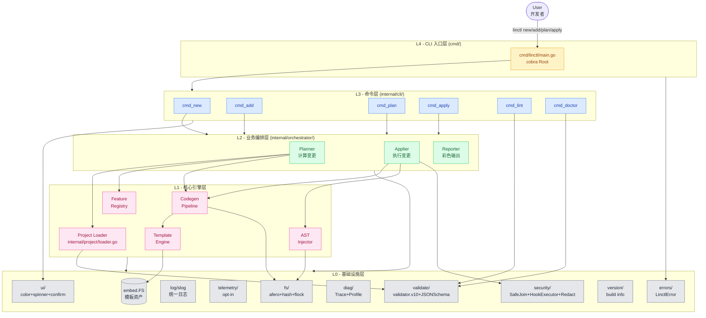
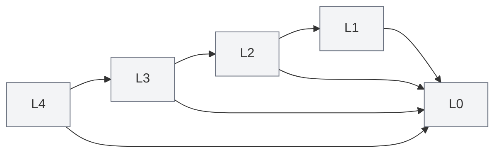
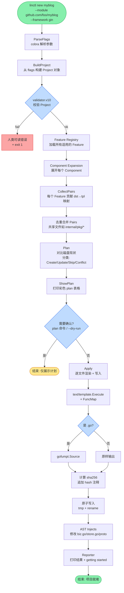

# 01. linctl 系统架构

## 1.1 架构总览

linctl 采用经典的**分层架构 + 插件化扩展**设计。整体遵循"**核心引擎稳定、外围能力可扩展**"的思路。



> 完整源文件见 [diagrams/architecture-overall.mmd](./diagrams/architecture-overall.mmd)。

## 1.2 分层职责详解

### L4 - CLI 入口层（最薄）
- **包**：`cmd/linctl/`
- **职责**：仅做 cobra Root 组装、注册子命令、处理 panic、退出码。
- **代码量**：< 50 行。
- **不做**：任何业务逻辑、配置读取（交给 L3）。

```go
// cmd/linctl/main.go
package main

import (
    "os"

    "github.com/<org>/linctl/internal/cli"
)

func main() {
    if err := cli.NewRootCommand().Execute(); err != nil {
        os.Exit(1) // err 已经在 cli 层被打印 + log
    }
}
```

### L3 - 命令层（cobra 命令实现）
- **包**：`internal/cli/`
- **职责**：每个**变更类**命令实现统一的 5 段式接口 `Complete → Validate → Plan → Apply → Report`（详见 §1.6）。
- **依赖**：L2 编排层。
- **不做**：直接调用 codegen / AST / 文件操作（交给 L2）。

```go
// internal/cli/cmd_new.go (示意)
type NewOptions struct {
    Dir       string
    Module    string
    Framework string
    Storage   string
}

func (o *NewOptions) Complete(ctx context.Context, args []string) error    { /* 填充默认值、加载 Project */ }
func (o *NewOptions) Validate(ctx context.Context) error                    { /* 校验入参 */ }
func (o *NewOptions) Plan(ctx context.Context) (*Plan, error) {
    proj := buildProjectFromOptions(o)
    return orchestrator.Plan(ctx, proj)
}
func (o *NewOptions) Apply(ctx context.Context, plan *Plan) (*Report, error) {
    // Phase 1 退化：默认 --auto-approve（plan/apply CLI 子命令在 Phase 4 才暴露）
    return orchestrator.Apply(ctx, plan, ApplyOptions{Strategy: StrategyOverwrite})
}
func (o *NewOptions) Report(ctx context.Context, rep *Report) error         { /* 打印结果 */ }
```

### L2 - 业务编排层（核心调度）
- **包**：`internal/orchestrator/`
- **职责**：把"用户意图（命令 + 配置）"翻译成"具体的代码生成动作"，并管理生命周期（Plan → Apply → Report）。
- **不做**：实际的模板渲染、AST 修改（交给 L1）；不做配置文件解析/IO（交给 L1 的 `internal/project/`）。

主要类：
- `Planner`：计算 `Plan`（待创建/更新/删除/冲突的文件清单）。
- `Applier`：根据 `Plan` 实际写文件 + AST 注入。
- `Reporter`：打印结果（彩色 + emoji + 表格）。

> `ProjectLoader` 不属于 L2，它是 L1 领域模型 `internal/project/` 的一部分（`internal/project/loader.go`），负责解析 `linctl.yaml` 并返回 `*project.Project`；L2 仅消费已加载的 `Project`，不做 I/O。

### L1 - 核心引擎层（最复杂、最有价值）
- **包**：
  - `internal/feature/` —— Feature 注册中心、内置 Feature 实现
  - `internal/template/` —— `text/template` 封装、自定义 FuncMap
  - `internal/codegen/` —— 代码生成调度、文件清单合并
  - `internal/ast/` —— Go AST 注入（基于 `dave/dst`）、Proto AST 注入（基于 `bufbuild/protocompile`）
- **职责**：可被 L2 复用的核心生成能力。
- **设计要点**：所有这些组件**默认纯计算**（接受输入 → 输出文件内容/AST），可单测；**副作用仅限显式扩展点 `Component.PostProcess(fs)`**，由 L2 的 Applier 统一编排顺序与回滚（实际 IO 由 L0 完成）。

### L0 - 基础设施层（最稳定）
- **包**：
  - `internal/fs/` —— `afero` 抽象 FS + hash 追踪 + 原子写入 + flock 项目锁（详见 [06-codegen-pipeline.md §6.14](./06-codegen-pipeline.md#614-并发与一致性团队-ci-场景)）
  - `internal/validate/` —— `validator/v10` 校验 + JSON Schema 导出
  - `internal/log/` —— `log/slog` 配置（彩色 handler）
  - `internal/telemetry/` —— opt-in 遥测（仅本地，无外发）
  - `internal/security/` —— SafeJoin 路径校验 + HookExecutor（按 Hook 执行策略 restricted/confirm/unrestricted）+ 敏感字段脱敏（详见 [15-security-model.md](./15-security-model.md)）
  - `internal/diag/` —— 内部 trace + Profile（详见 [14-observability.md](./14-observability.md)）
  - `internal/ui/` —— 彩色输出 / spinner / 交互式确认 / 表格
  - `internal/linctlerr/` —— `LinctlError` 类型 + 错误码（详见 [13-coding-standards.md §13.4](./13-coding-standards.md#134-错误处理规范) 与 [META 决策书 §1.1](./META-fix-decisions-2026-04-25.md#11-错误类型)）
  - `internal/version/` —— `gitVersion / gitCommit / buildDate` 注入入口
  - `templates/` —— `//go:embed` 内嵌的模板资产
- **职责**：为上层提供"基础设施服务"，本身不依赖任何上层。

## 1.3 依赖方向（DAG）

严格按层依赖，**绝不允许**反向依赖（L0 不能 import L1，L2 不能 import L3 等）。



> 完整源文件见 [diagrams/architecture-layers.mmd](./diagrams/architecture-layers.mmd)。

### 依赖检查机制

为防止意外的反向依赖，CI 中加入以下检查：

```bash
# .github/workflows/ci.yml 片段
- name: Layer dependency check
  run: |
    # 不允许 L0 (internal/fs/internal/log) 依赖任何 internal/cli 等上层包
    ! grep -rE 'internal/(cli|orchestrator|feature|template|codegen|ast)' internal/fs/ internal/log/ internal/validate/

# 推荐：使用 go-cleanarch 工具（pin per §10.7）
go install github.com/roblaszczak/go-cleanarch@v1.2.0
go-cleanarch -application=internal/orchestrator -domain=internal/feature -infra=internal/fs
```

## 1.4 运行时数据流

下图展示一次 `linctl new myblog` 命令完整的数据流。



> 完整源文件见 [diagrams/architecture-runtime.mmd](./diagrams/architecture-runtime.mmd)。

## 1.5 关键抽象

下面 6 个抽象是 linctl 的**心脏**，理解它们就理解了整个工具。

> **三大公开扩展点**：`Feature` / `Component` / `Generator` 共同构成 linctl 的插件化扩展面。
>
> - `Component`（见 (b)）：组件抽象（WebServer / Worker / CLI）
> - `Feature`（见 (c)）：横切特性的注册式插件
> - `Generator`：「文件/AST 贡献者」视角的别名 —— 在代码层与 `Feature` 共享同一注册接口（`Apply(ctx, c) → []Pair`），仅在文档/CLI 输出中作为同义词使用，不引入新接口
>
> 第三方插件按这套接口扩展任意一种角色；详见 [README §核心设计原则 §4](./README.md#核心设计原则) 与 [08-feature-system.md](./08-feature-system.md)。

### (a) `Project` —— 声明式配置的中心

```go
// internal/project/types.go
type Project struct {
    APIVersion string         `yaml:"apiVersion" validate:"required,oneof=linctl.dev/v1"`
    Kind       string         `yaml:"kind"       validate:"required,oneof=Project"`
    Metadata   ProjectMeta    `yaml:"metadata"`
    Spec       ProjectSpec    `yaml:"spec"`
    Status     ProjectStatus  `yaml:"status,omitempty"` // 由工具维护，用户勿改
}

type ProjectSpec struct {
    Defaults   Defaults     `yaml:"defaults"`
    Components []Component  `yaml:"components" validate:"min=1,dive"`
}

type Component struct {
    Kind     string   `yaml:"kind" validate:"required,oneof=WebServer Worker CLI"`
    Name     string   `yaml:"name" validate:"required,hostname"`
    Features []string `yaml:"features,omitempty"`
    // 其他配置见 04-config-schema.md
}
```

- **特点**：仿 K8s 风格，`apiVersion + kind` 支持 schema 演进。
- **加载**：`ProjectLoader.Load(path)` → 反序列化 → `validator.v10` 校验 → `Defaults` 注入 → 返回 `*Project`。
- **保存**：`Project.Save("PROJECT")` 写出 YAML，附带"禁止人工修改"的 Header 注释。

### (b) `Component` —— 组件抽象（取代 osbuilder 的 WebServer/JobServer/MQServer 三个 struct）

```go
// internal/component/component.go
type Component interface {
    Kind() string
    Name() string
    Pairs(p *Project) Pairs                  // 返回 dst→tpl 映射
    Mutators(p *Project) []ASTMutator        // 需要的 AST 修改
    PostProcess(p *Project, fs FileSystem) error // 生成后的处理
}

// 内置实现
type WebServer struct { /* ... */ }   // 实现 Component 接口
type Worker    struct { /* ... */ }   // Job + MQ 合并
type CLI       struct { /* ... */ }
type Custom    struct { /* 占位，由插件实现 */ }
```

### (c) `Feature` —— 横切特性的插件化抽象

```go
// internal/feature/feature.go
type Feature interface {
    Name() string                                                    // 全局唯一
    AppliesTo() []string                                             // 适用于哪些 Component Kind
    Apply(p *Project, c Component, b *PairBuilder)                   // 追加/剪裁模板对
    Mutators(p *Project, c Component) []ASTMutator                   // 可选 AST 改动
    FuncMap() template.FuncMap                                       // 可选模板函数
    Defaults(p *Project, c Component) map[string]any                 // 默认值贡献
}
```

内置 Feature（Phase 1）：
- `HealthzFeature` —— 健康检查
- `OpenTelemetryFeature` —— OTel 三件套
- `UserFeature` —— 用户/认证/鉴权
- `WebSocketFeature` —— gin 下的 WS
- `PreloaderFeature` —— 数据预加载示例

### (d) `PairBuilder` —— "文件清单"的构建者

```go
// internal/codegen/pair.go
type Pair struct {
    Dst         string // 相对项目根的目标路径，如 "internal/myblog/biz/biz.go"
    TemplateID  string // embed.FS 中的模板 ID，如 "framework/gin/biz/biz.go.tpl"
    Mode        WriteMode // Create / Update / SkipIfExists
    Owner       string    // 由哪个 Feature/Component 贡献，便于 plan 报告
}

type PairBuilder struct {
    pairs map[string]Pair // dst → Pair（自动去重）
}

func (b *PairBuilder) Add(p Pair)                  { /* ... */ }
func (b *PairBuilder) AddMany(ps ...Pair)          { /* ... */ }
func (b *PairBuilder) Has(dst string) bool         { /* ... */ }
func (b *PairBuilder) Build() []Pair               { /* ... */ }
```

> 这是对 osbuilder `map[string]string` 的升级：每个 Pair 都有 mode 和 owner，便于 plan/apply 阶段决策。

### (e) `Plan` —— 待执行变更的清单

```go
// internal/codegen/plan.go
type Plan struct {
    Project   *Project
    Actions   []Action
    Stats     PlanStats
}

type Action struct {
    Kind    ActionKind  // Create / Update / Skip / Conflict / Delete
    Pair    Pair
    Diff    string       // 用于 Update/Conflict，提供给用户 review
    Reason  string       // 例如 "user-modified" / "template-updated"
    HashOld string       // 文件原 hash
    HashNew string       // 渲染后 hash
}

type ActionKind string
const (
    ActionCreate   ActionKind = "create"
    ActionUpdate   ActionKind = "update"
    ActionSkip     ActionKind = "skip"
    ActionConflict ActionKind = "conflict"
    ActionDelete   ActionKind = "delete" // 仅 apply --prune 时
)

type PlanStats struct {
    Create, Update, Skip, Conflict, Delete int
}
```

### (f) `FileManager` —— 幂等 + 原子写入 + hash 追踪

```go
// internal/fs/manager.go
type FileManager struct {
    fs       afero.Fs
    workDir  string
    dryRun   bool
    strategy ConflictStrategy // skip/overwrite/merge/ask
    hashes   map[string]string // path → sha256
}

func (m *FileManager) Read(path string) ([]byte, error)
func (m *FileManager) Write(path string, content []byte) error  // 原子: tmp + rename
func (m *FileManager) Hash(path string) (string, error)
func (m *FileManager) ExtractEmbeddedHash(content []byte) (string, bool)  // 解析 // linctl: hash=xxx
func (m *FileManager) AppendHashComment(content []byte, hash string) []byte
```

## 1.6 命令生命周期统一模式

所有**变更类**子命令统一遵循 **5 段式**：`Complete → Validate → Plan → Apply → Report`（在 osbuilder 三段式上扩展）。

```go
type Command interface {
    Complete(ctx context.Context, args []string) error          // 1. 填充默认值、加载 Project
    Validate(ctx context.Context) error                         // 2. 校验参数
    Plan(ctx context.Context) (*Plan, error)                    // 3. 计算变更
    Apply(ctx context.Context, plan *Plan) (*Report, error)     // 4. 执行变更并产出报告
    Report(ctx context.Context, rep *Report) error              // 5. 打印结果
}
```

好处：
- 用户可以单独跑 `linctl plan` 而不真正修改文件。
- 每个阶段可以单独单测。
- `--dry-run` 自动为所有命令生效（在 Apply 处提前返回）。

> **MVP（Phase 1）退化策略**（详见 [META 决策书 §1.6](./META-fix-decisions-2026-04-25.md#16-cli-生命周期)）：`Plan()` 内部仍然计算，`Apply()` 内部直接执行 plan，命令默认 `--auto-approve`（因为 `linctl plan` / `linctl apply` 子命令在 Phase 4 才正式暴露）；接口契约保持稳定，无需 Phase 4 时再重写。

## 1.7 错误处理统一模式

```go
// internal/linctlerr/error.go
package linctlerr

type Code string  // 错误码字符串类型

const (
    ErrConfigInvalid     Code = "config_invalid"
    ErrComponentNotFound Code = "component_not_found"
    ErrTemplateRender    Code = "template_render"
    ErrFileConflict      Code = "file_conflict"
    ErrASTInjection      Code = "ast_injection"
    ErrNetwork           Code = "network"
    ErrEnvironment       Code = "environment"
    // ...
)

type LinctlError struct {
    Code    Code      // 错误码（类型即上面的 Code）
    Message string    // 用户可读的错误信息
    Hint    string    // 可执行的修复提示
    Cause   error     // 底层 error
}

func (e *LinctlError) Error() string { /* ... */ }
func (e *LinctlError) Unwrap() error { return e.Cause }
```

> **统一规则**（详见 [META 决策书 §1.1](./META-fix-decisions-2026-04-25.md#11-错误类型)）：类型名 `LinctlError`、错误码常量类型名 `Code`（不是 `ErrCode`）、错误码字段名 `Code`。`main` 中通过 `errors.As(err, &lerr)` 后访问 `lerr.Code` 决定退出码。

输出示例：
```
✗ Error [config_invalid]: invalid framework "kratos" for component "myblog"
  → Allowed values: [gin, grpc]
  → Hint: To use kratos, install plugin: linctl plugin install kratos
  → See: https://linctl.dev/docs/components#framework
```

## 1.8 与 osbuilder 架构的关键改进

| osbuilder 痛点 | linctl 解法 |
| --- | --- |
| `Pairs()` 函数 170 行的 if/switch | Feature 系统：每个 Feature 独立 `Apply()` |
| `WriteFile` 只看文件存在与否 | `FileManager` 用 hash 追踪修改，支持冲突检测 |
| AST 注入用 `*ast.Ident{Name: "newPostStore(store)"}` 塞表达式 | `dave/dst` + `parseExpr` 标准做法 |
| Proto 改动靠字符串行扫描 | `bufbuild/protocompile` AST 级 |
| 三段式只到 Run | 5 段式：Plan/Apply 分离，支持 dry-run |
| `cmd_quickstart` 通过 base64 + 调用其他子命令复用 | `Planner` 统一调度，无需"命令调命令" |
| 全局选项靠 viper 隐式注入 | `Context` + 显式参数传递（Go 1.21+ 推荐） |
| 错误打印用 `fmt.Printf` | `LinctlError` + `slog` 统一 |
| 多套日志（klog + apex/log + fmt） | 单一 `log/slog` |
| 遥测无 opt-out | opt-in，环境变量 `LINCTL_TELEMETRY=on` 才开启 |

## 1.9 性能与扩展性目标

| 指标 | osbuilder 现状 | linctl 目标 |
| --- | --- | --- |
| 二进制大小 | ~20 MB | ≤ 10 MB |
| 直接依赖数 | ~45 | ≤ 15 |
| 间接依赖数 | ~160 | ≤ 50 |
| `new` 命令冷启动 | ~3s（含统计上报） | ≤ 1s |
| `add api` 单 kind | ~1s | ≤ 500ms |
| `plan` 全量扫描 1000 文件项目 | N/A | ≤ 2s |
| 模板单测覆盖率 | 0% | ≥ 80% |
| 核心包单测覆盖率 | < 5% | ≥ 70% |

## 1.10 已知风险与缓解

| 风险 | 概率 | 影响 | 缓解 |
| --- | --- | --- | --- |
| `dave/dst` 库的小众性 | 中 | 中 | 抽象 ASTInjector 接口，未来可换实现 |
| `bufbuild/protocompile` API 变化 | 低 | 中 | 锁版本 + 适配层 |
| 3-way merge 复杂度高 | 高 | 高 | Phase 4 才做，Phase 1~3 先用 ask/skip/overwrite 三种策略 |
| 模板规模大（数百文件）维护成本 | 中 | 高 | 先照搬 osbuilder 模板，分批通过 component / template 包内单元测试 + E2E `go build` 双重保障覆盖 |
| 用户旧项目迁移到 linctl | 高 | 中 | 提供 `linctl import` 命令尝试反向生成 `linctl.yaml` |

---

下一步阅读：[02-project-structure.md](./02-project-structure.md)

_Last reviewed: 2026-04-25_
