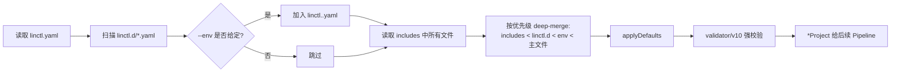

# 04. Project Schema 设计（linctl.yaml / PROJECT）

## 4.1 文件名约定

| 文件 | 用途 | 由谁管 |
| --- | --- | --- |
| `linctl.yaml` | 用户**输入**的项目配置 | 用户 维护，linctl 读取 |
| `PROJECT` | linctl 在项目根目录维护的状态文件 | linctl 写，用户**勿改** |
| `.linctl/lock` | **进程级 flock 文件**（无后缀），互斥保证同时只有一个 linctl 在跑 apply。详见 [06 §6.14](./06-codegen-pipeline.md#614-并发与一致性团队-ci-场景) | linctl 维护，可加 .gitignore |
| `.linctl/lock.yaml` | **文件级 hash 索引**（drift 检测、3-way merge base 元数据） | linctl 维护，**提交到 git** |
| `.linctl/backups/<ts>/` | apply 前的自动备份 | linctl 维护，加 .gitignore |
| `.linctl/cache/<dst>/<hash>` | 历史模板渲染结果缓存（3-way merge 用） | linctl 维护，加 .gitignore |

> ⚠️ **重要区别**：`.linctl/lock`（无后缀）是进程互斥锁；`.linctl/lock.yaml` 是状态索引。前者随时被覆盖、不入 git；后者必须提交到 git，是 linctl 状态的真相源。详见 [99-glossary.md](./99-glossary.md#l) 中 Project Lock vs Lock File 的明确区分。

> 与 osbuilder 的差异：osbuilder 把 `PROJECT` 既作为输入又作为状态，写读耦合；linctl 拆成 `linctl.yaml`（用户写）和 `PROJECT`（工具写）两个文件，职责清晰。

## 4.2 顶层结构（受 K8s API 启发）

```yaml
apiVersion: linctl.dev/v1
kind: Project

metadata:
  name: myblog
  module: github.com/clin211/myblog
  description: A blog service powered by linctl.
  author:
    name: 长林啊
    email: 767425412lin@gmail.com
  labels:                              # 任意键值，传给模板
    team: platform
    domain: content

spec:
  defaults:                            # 项目级默认（可被组件覆盖）
    framework: gin
    storage: gorm-postgres
    deploy: kubernetes
    makefile: structured
    protoVersion: v1                   # proto 文件版本前缀（如 v1/v1alpha1）；与顶层 apiVersion（linctl Schema 版本）无关
    image:
      registryPrefix: docker.io/clin211
      dockerfileMode: multi-stage      # none/runtime-only/multi-stage/combined
      distrolessMode: always           # always/never/auto
    docs:
      languages: [zh-CN, en-US]
    telemetry:
      logging: slog                    # slog/zap
      metrics: prometheus              # prometheus/otlp
      tracing: otlp                    # otlp/jaeger/zipkin

  components:                          # 1..N 个组件
    - kind: WebServer
      name: mb-apiserver
      framework: gin                   # 覆盖 defaults.framework
      storage: gorm-postgres
      features:                        # Feature 列表（顺序无关）
        - healthz
        - opentelemetry
        - user
        - websocket
        - preloader
      port: 5555                       # 自定义端口
      grpcPort: 6666                   # 当 framework=grpc 时
      registry: none                   # 服务注册：none/polaris/nacos/consul
      clients: [fake, oss]             # 内置客户端集合
      resources:                       # 已创建的 REST 资源（由 linctl 维护）
        - name: post
        - name: comment
        - name: tag
        - name: user                   # withUser feature 自动追加

    - kind: Worker
      name: mb-worker
      storage: gorm-postgres           # 共享主库
      features:
        - opentelemetry
        - preloader
      variants:
        - cron                         # 启用 cron 能力
        - kafka                        # 启用 kafka 能力
      cron:
        jobs:
          - name: dailyReport
          - name: dataSync
      kafka:
        brokers: ["kafka:9092"]
        topics:
          - name: order.created
          - name: user.registered
      customized:                      # 自定义 watcher
        - name: llmtrain

    - kind: CLI
      name: mbctl
      commands:
        - name: get
        - name: create
        - name: describe
        - name: version

  hooks:                               # 生命周期钩子（可选）
    preApply:
      - name: format-go
        run: gofumpt -w .
    postApply:
      - name: tidy
        run: go mod tidy
      - name: protoc
        run: make protoc
```

> ⚠️ **重要：`linctl.yaml` 不再包含 `status` 段**（SSOT 1.7 锁定）。
>
> `linctl.yaml` 是**用户编辑、入 git** 的 spec 文件，仅包含 `apiVersion / kind / metadata / spec` 四个顶层字段。
>
> 工具维护的运行时状态（`generatedAt`、`cliVersion`、`schemaMigrations`、`lastApplyHash`）已**迁移到独立的 `PROJECT` 文件**（同样入 git，但用户勿改）。两个文件的职责对照见 [§4.1 文件名约定](#41-文件名约定)；PROJECT 文件结构详见 [§4.3.6 PROJECT 文件结构](#436-project-文件结构工具维护)。
>
> 历史项目升级：旧版 `linctl.yaml` 中的 `status:` 段会在 `linctl upgrade` 命令运行时自动剥离并写入 `PROJECT`，无需手工迁移。

## 4.3 字段详细说明

### 4.3.1 `apiVersion` & `kind`

```go
type APIVersion string
const (
    APIVersionV1Alpha1 APIVersion = "linctl.dev/v1alpha1"
    APIVersionV1       APIVersion = "linctl.dev/v1"  // 当前推荐
)
```

- `kind`：当前固定为 `Project`。未来若引入 `Plugin` / `Module` 等，复用同一个 schema 体系。
- 升级机制：`linctl upgrade` 命令负责把旧 apiVersion 自动迁移到最新版本。

### 4.3.2 `metadata`

| 字段 | 类型 | 必填 | 校验 | 说明 |
| --- | --- | --- | --- | --- |
| `name` | string | ✓ | `^[a-z0-9-]{1,40}$` | 项目名（生成目录时使用） |
| `module` | string | ✓ | Go module 正则 | Go module 路径 |
| `description` | string |   | maxLen=200 | 用于 README 顶部 |
| `author.name` | string |   |   | git 用户名（默认从 `git config user.name` 读） |
| `author.email` | string |   | email | git 邮箱（默认从 `git config user.email` 读） |
| `labels` | map[string]string |   | 键值都是 string | 模板中通过 `.Metadata.Labels.xxx` 访问 |

### 4.3.3 `spec.defaults`

项目级默认值，可被每个 Component 覆盖。

| 字段 | 类型 | 默认 | 可选值 | 说明 |
| --- | --- | --- | --- | --- |
| `framework` | string | `gin` | `gin`/`grpc` | Web 框架 |
| `storage` | string | `memory` | `memory`/`gorm-mysql`/`gorm-postgres`/`gorm-sqlite`/`mongo` | 存储后端 |
| `deploy` | string | `docker` | `none`/`docker`/`kubernetes`/`systemd` | 部署模式 |
| `makefile` | string | `unstructured` | `none`/`unstructured`/`structured` | Makefile 风格 |
| `protoVersion` | string | `v1` | `v1`/`v1alpha1`/`v1beta1`... | **proto 文件版本前缀**（用于生成 `pkg/api/<component>/<protoVersion>/...`）；与顶层 `apiVersion`（linctl Schema 版本）**完全无关**。SSOT 1.18 锁定的命名 |
| `image.registryPrefix` | string | - | URL | 镜像仓库前缀 |
| `image.dockerfileMode` | string | `multi-stage` | `none`/`runtime-only`/`multi-stage`/`combined` | Dockerfile 风格 |
| `image.distrolessMode` | string | `always` | `always`/`never`/`auto` | distroless 镜像策略 |
| `docs.languages` | []string | `[zh-CN]` | `zh-CN`/`en-US`/`ja-JP` | 文档骨架语言 |
| `telemetry.logging` | string | `slog` | `slog`/`zap` | 日志库 |
| `telemetry.metrics` | string | `prometheus` | `prometheus`/`otlp` | metrics 协议 |
| `telemetry.tracing` | string | `otlp` | `otlp`/`jaeger`/`zipkin` | tracing 协议 |

### 4.3.4 `spec.components` —— 组件定义

```go
type Component struct {
    Kind     string         `yaml:"kind" validate:"required,oneof=WebServer Worker CLI"`
    Name     string         `yaml:"name" validate:"required,hostname,max=40"`
    Features []string       `yaml:"features,omitempty" validate:"dive,featurename"`
    
    // 通用覆盖默认
    Framework string         `yaml:"framework,omitempty"`
    Storage   string         `yaml:"storage,omitempty"`
    
    // WebServer 字段
    Port            int      `yaml:"port,omitempty" validate:"omitempty,min=1024,max=65535"`
    GRPCPort        int      `yaml:"grpcPort,omitempty"`
    Registry        string   `yaml:"registry,omitempty"`
    Clients         []string `yaml:"clients,omitempty"`
    Resources       []Resource `yaml:"resources,omitempty"`  // 由 linctl 维护
    
    // Worker 字段
    Variants    []string    `yaml:"variants,omitempty" validate:"dive,oneof=cron kafka customized"`
    Cron        *CronSpec   `yaml:"cron,omitempty"`
    Kafka       *KafkaSpec  `yaml:"kafka,omitempty"`
    Customized  []NamedSpec `yaml:"customized,omitempty"`
    
    // CLI 字段
    Commands []NamedSpec `yaml:"commands,omitempty"`
}

type Resource struct {
    Name      string `yaml:"name" validate:"required,kindname"`
    Path      string `yaml:"path,omitempty"`         // 若需要分组，如 "job/cron_job"
    CreatedAt string `yaml:"createdAt,omitempty"`
}

type CronSpec struct {
    Jobs []NamedSpec `yaml:"jobs"`
}

type KafkaSpec struct {
    Brokers []string    `yaml:"brokers"`
    Topics  []NamedSpec `yaml:"topics"`
}

type NamedSpec struct {
    Name string `yaml:"name" validate:"required"`
}
```

#### `WebServer` 字段约束

- `framework` 仅可为 `gin` 或 `grpc`（其他需插件支持）。
- 当 `framework=grpc` 时，`grpcPort` 必填；当 `framework=gin` 时，`grpcPort` 不能填。
- `clients` 中的元素会触发对应的 Feature（例如 `fake` 客户端会启用 `pkg/clientset/typed/fake/`）。

#### `Worker` 字段约束

- `variants` 至少需要一个。
- 当 `variants` 包含 `cron` 时，`cron.jobs` 至少 1 个。
- 当 `variants` 包含 `kafka` 时，`kafka.brokers` 和 `kafka.topics` 必填。

#### `CLI` 字段约束

- `commands` 数组定义了 CLI 子命令骨架。

### 4.3.5 `spec.hooks`

```yaml
spec:
  hooks:
    preApply:
      - name: format-go
        run: gofumpt -w .
        policy: restricted    # 可选：restricted | confirm | unrestricted
                              # 默认：confirm（本地）；CI 强制 restricted
    postApply:
      - name: tidy-modules
        run: go mod tidy
        policy: restricted
```

```go
type Hook struct {
    Name   string `yaml:"name"`
    Run    string `yaml:"run"`              // shell 命令
    Policy string `yaml:"policy,omitempty"` // restricted | confirm | unrestricted；默认 confirm，CI 强制 restricted
}

type Hooks struct {
    PreApply  []Hook `yaml:"preApply,omitempty"`
    PostApply []Hook `yaml:"postApply,omitempty"`
}
```

- `preApply`：在写文件前执行（适合代码检查）。
- `postApply`：在写文件后执行（适合 `go mod tidy` / `make protoc`）。
- 任何 hook 失败 → 整个 apply 中止。
- **`policy` 字段语义**（详见 [15-security-model.md §15.2.1](./15-security-model.md#1521-hook-执行策略-hook-execution-policy) 与 [META 决策书 §1.10 / §5.2 / §5.3](./META-fix-decisions-2026-04-25.md#52-默认-hook-策略歧义消除)）：
  - `restricted`：仅允许 allowlist 中的命令前缀（gofumpt / go fmt / goimports / buf / make / protoc 等）。
  - `confirm`（**本地默认**）：每条 hook 命令执行前用户独立确认（即使有 `-y`）。
  - `unrestricted`：执行任意 shell 命令；**仅本地可用**，必须二次确认；CI 环境检测到 `unrestricted` 时 `os.Exit(7)`（安全策略违规）。
- 安全：linctl 不会自动 apply hook，必须用户在 `linctl.yaml` 中显式声明。

### 4.3.6 PROJECT 文件结构（工具维护）

> ⚠️ **该结构序列化到独立的 `PROJECT` 文件**，而不是 `linctl.yaml`（SSOT 1.7 锁定）。
>
> `linctl.yaml` 是用户的 spec 输入；`PROJECT` 是 linctl 维护的运行时状态镜像。两者均入 git，但用户**仅编辑** `linctl.yaml`，**永不手动改** `PROJECT`。

```yaml
# PROJECT （由 linctl 维护，用户勿改）
apiVersion: linctl.dev/v1
kind: Project
metadata:
  name: myblog                         # 与 linctl.yaml 同步
status:
  generatedAt: 2026-04-25T10:00:00+08:00
  cliVersion: v1.0.0
  lastApplyHash: sha256:abcd1234...    # 上次 apply 后整体 plan 的 digest
  schemaMigrations:
    - from: linctl.dev/v1alpha1
      to:   linctl.dev/v1
      at:   2026-03-15T00:00:00Z
```

```go
// internal/project/types.go
type ProjectState struct {
    APIVersion string   `yaml:"apiVersion"`            // 与 linctl.yaml 同步
    Kind       string   `yaml:"kind"`                  // 固定 "Project"
    Metadata   Metadata `yaml:"metadata"`              // 仅 name，用于一致性校验
    Status     Status   `yaml:"status"`
}

type Status struct {
    GeneratedAt      string             `yaml:"generatedAt"`
    CLIVersion       string             `yaml:"cliVersion"`
    SchemaMigrations []SchemaMigration  `yaml:"schemaMigrations,omitempty"`
    LastApplyHash    string             `yaml:"lastApplyHash,omitempty"` // 上次 apply 后的整体 hash
}

type SchemaMigration struct {
    From string `yaml:"from"`
    To   string `yaml:"to"`
    At   string `yaml:"at"`
}
```

**职责对照**：

| 字段类别 | linctl.yaml | PROJECT | .linctl/lock.yaml |
| --- | --- | --- | --- |
| `apiVersion` / `kind` | ✅ 用户写 | ✅ 同步 | ❌ |
| `metadata` | ✅ 用户写 | ✅ 仅 name | ❌ |
| `spec` | ✅ 用户写 | ❌ | ❌ |
| `status.generatedAt` | ❌ | ✅ 工具写 | ❌ |
| `status.cliVersion` | ❌ | ✅ 工具写 | ❌ |
| `status.schemaMigrations` | ❌ | ✅ 工具写 | ❌ |
| `status.lastApplyHash` | ❌ | ✅ 工具写 | ❌ |
| 文件级 hash 索引 | ❌ | ❌ | ✅ 工具写 |

## 4.4 完整 Go struct 定义

```go
// internal/project/types.go
package project

// Project 对应用户编辑的 linctl.yaml；不含 Status 字段（运行时状态在独立的 PROJECT 文件，对应 ProjectState）。
type Project struct {
    APIVersion string   `yaml:"apiVersion" json:"apiVersion" validate:"required,oneof=linctl.dev/v1 linctl.dev/v1alpha1"`
    Kind       string   `yaml:"kind"       json:"kind"       validate:"required,oneof=Project"`
    Metadata   Metadata `yaml:"metadata"   json:"metadata"   validate:"required"`
    Spec       Spec     `yaml:"spec"       json:"spec"       validate:"required"`
}

type Metadata struct {
    Name        string            `yaml:"name"        validate:"required,projectname"`
    Module      string            `yaml:"module"      validate:"required,modulepath"`
    Description string            `yaml:"description,omitempty" validate:"max=200"`
    Author      Author            `yaml:"author,omitempty"`
    Labels      map[string]string `yaml:"labels,omitempty"`
}

type Author struct {
    Name  string `yaml:"name,omitempty"`
    Email string `yaml:"email,omitempty" validate:"omitempty,email"`
}

type Spec struct {
    Defaults   Defaults    `yaml:"defaults"`
    Components []Component `yaml:"components" validate:"min=1,dive"`
    Hooks      Hooks       `yaml:"hooks,omitempty"`
}

type Defaults struct {
    Framework    string             `yaml:"framework,omitempty"    validate:"omitempty,oneof=gin grpc"`
    Storage      string             `yaml:"storage,omitempty"      validate:"omitempty,oneof=memory gorm-mysql gorm-postgres gorm-sqlite mongo"`
    Deploy       string             `yaml:"deploy,omitempty"       validate:"omitempty,oneof=none docker kubernetes systemd"`
    Makefile     string             `yaml:"makefile,omitempty"     validate:"omitempty,oneof=none unstructured structured"`
    ProtoVersion string             `yaml:"protoVersion,omitempty" validate:"omitempty,startswith=v"` // proto 版本前缀，如 v1/v1alpha1；与顶层 apiVersion（linctl Schema 版本）无关
    Image        *ImageDefaults     `yaml:"image,omitempty"`
    Docs         *DocsDefaults      `yaml:"docs,omitempty"`
    Telemetry    *TelemetryDefaults `yaml:"telemetry,omitempty"`
}

type ImageDefaults struct {
    RegistryPrefix string `yaml:"registryPrefix,omitempty"`
    DockerfileMode string `yaml:"dockerfileMode,omitempty" validate:"omitempty,oneof=none runtime-only multi-stage combined"`
    DistrolessMode string `yaml:"distrolessMode,omitempty" validate:"omitempty,oneof=always never auto"`
}

type DocsDefaults struct {
    Languages []string `yaml:"languages,omitempty" validate:"dive,oneof=zh-CN en-US ja-JP"`
}

type TelemetryDefaults struct {
    Logging string `yaml:"logging,omitempty" validate:"omitempty,oneof=slog zap"`
    Metrics string `yaml:"metrics,omitempty" validate:"omitempty,oneof=prometheus otlp"`
    Tracing string `yaml:"tracing,omitempty" validate:"omitempty,oneof=otlp jaeger zipkin"`
}

type Component struct {
    Kind     string   `yaml:"kind" validate:"required,oneof=WebServer Worker CLI"`
    Name     string   `yaml:"name" validate:"required,componentname"`
    Features []string `yaml:"features,omitempty" validate:"dive,featurename"`

    Framework string `yaml:"framework,omitempty" validate:"omitempty,oneof=gin grpc"`
    Storage   string `yaml:"storage,omitempty"`

    // WebServer fields
    Port      int        `yaml:"port,omitempty"     validate:"omitempty,min=1024,max=65535"`
    GRPCPort  int        `yaml:"grpcPort,omitempty" validate:"omitempty,min=1024,max=65535"`
    Registry  string     `yaml:"registry,omitempty" validate:"omitempty,oneof=none polaris nacos consul eureka"`
    Clients   []string   `yaml:"clients,omitempty"`
    Resources []Resource `yaml:"resources,omitempty" validate:"dive"`

    // Worker fields
    Variants   []string    `yaml:"variants,omitempty" validate:"dive,oneof=cron kafka customized"`
    Cron       *CronSpec   `yaml:"cron,omitempty"`
    Kafka      *KafkaSpec  `yaml:"kafka,omitempty"`
    Customized []NamedSpec `yaml:"customized,omitempty" validate:"dive"`

    // CLI fields
    Commands []NamedSpec `yaml:"commands,omitempty" validate:"dive"`
}

type Resource struct {
    Name      string `yaml:"name" validate:"required,kindname"`
    Path      string `yaml:"path,omitempty"`
    CreatedAt string `yaml:"createdAt,omitempty"`
}

type CronSpec struct {
    Jobs []NamedSpec `yaml:"jobs" validate:"min=1,dive"`
}

type KafkaSpec struct {
    Brokers []string    `yaml:"brokers" validate:"min=1,dive,hostname_port"`
    Topics  []NamedSpec `yaml:"topics" validate:"min=1,dive"`
}

type NamedSpec struct {
    Name string `yaml:"name" validate:"required,kindname"`
}

type Hooks struct {
    PreApply  []Hook `yaml:"preApply,omitempty"  validate:"dive"`
    PostApply []Hook `yaml:"postApply,omitempty" validate:"dive"`
}

type Hook struct {
    Name string `yaml:"name" validate:"required"`
    Run  string `yaml:"run"  validate:"required"`
}

type Status struct {
    GeneratedAt      string            `yaml:"generatedAt,omitempty"`
    CLIVersion       string            `yaml:"cliVersion,omitempty"`
    SchemaMigrations []SchemaMigration `yaml:"schemaMigrations,omitempty"`
    LastApplyHash    string            `yaml:"lastApplyHash,omitempty"`
}

type SchemaMigration struct {
    From string `yaml:"from" validate:"required"`
    To   string `yaml:"to"   validate:"required"`
    At   string `yaml:"at"   validate:"required"`
}
```

## 4.5 自定义校验规则（custom validators）

```go
// internal/validate/custom_rules.go
package validate

import (
    "regexp"

    "github.com/go-playground/validator/v10"
)

var (
    reModulePath  = regexp.MustCompile(`^([a-zA-Z0-9\-]+\.)+[a-zA-Z0-9\-]+(/[a-zA-Z0-9_\-]+)*$`)
    reProjectName = regexp.MustCompile(`^[a-z][a-z0-9-]{0,39}$`)
    reKindName    = regexp.MustCompile(`^[A-Za-z][A-Za-z0-9_/-]{0,40}$`)
    reFeatureName = regexp.MustCompile(`^[a-z][a-z0-9-]{0,40}$`)
    reCompName    = regexp.MustCompile(`^[a-z][a-z0-9-]{0,40}$`)
)

func RegisterCustomRules(v *validator.Validate) error {
    pairs := []struct{ tag string; fn validator.Func }{
        {"modulepath",    validateModulePath},
        {"projectname",   validateProjectName},
        {"kindname",      validateKindName},
        {"featurename",   validateFeatureName},
        {"componentname", validateComponentName},
    }
    for _, p := range pairs {
        if err := v.RegisterValidation(p.tag, p.fn); err != nil {
            return err
        }
    }
    return nil
}

func validateModulePath(fl validator.FieldLevel) bool {
    return reModulePath.MatchString(fl.Field().String())
}
func validateProjectName(fl validator.FieldLevel) bool {
    return reProjectName.MatchString(fl.Field().String())
}
func validateKindName(fl validator.FieldLevel) bool {
    return reKindName.MatchString(fl.Field().String())
}
func validateFeatureName(fl validator.FieldLevel) bool {
    return reFeatureName.MatchString(fl.Field().String())
}
func validateComponentName(fl validator.FieldLevel) bool {
    return reCompName.MatchString(fl.Field().String())
}
```

> **权威性提醒**：Go validator + 上述自定义规则是 linctl 的**强校验**入口（CLI 内执行）；JSON Schema（[§4.6](#46-json-schema-自动导出ide-弱校验)）仅为 IDE 弱校验，结果不影响 `linctl plan` / `linctl apply` 是否通过。

## 4.6 JSON Schema 自动导出（IDE 弱校验）

> ⚠️ **校验权威性约定（SSOT 1.18 配套）**：
>
> linctl 采用**双轨校验策略**，两者职责严格分离：
>
> | 校验器 | 适用场景 | 权威性 | 失败结果 |
> | --- | --- | --- | --- |
> | **JSON Schema**（`schemas/linctl.schema.json`） | IDE（VSCode / JetBrains）实时弱校验、补全提示 | ❌ **非权威**（仅辅助编辑） | 编辑器弹窗警告，不阻断保存 |
> | **Go validator/v10** + 自定义规则（[§4.5](#45-自定义校验规则custom-validators)） | `linctl lint` / `linctl plan` / `linctl apply` 等 CLI 命令 | ✅ **权威**（决定是否能 apply） | CLI 报错并退出码 ≠ 0 |
>
> **设计原则**：
>
> 1. **Go validator 是单一事实源**：所有 schema 约束（必填、范围、正则、互斥、跨字段依赖）都首先在 Go 端实现；JSON Schema 只覆盖 Go validator 能表达的子集（基本类型、enum、pattern）。
> 2. **JSON Schema 由 Go struct 自动导出**：不允许手写 JSON Schema 字段，避免双轨漂移。生成器（`cmd/jsonschema-gen`）通过反射读取 `validate` tag。
> 3. **跨字段约束（如 `framework=grpc → grpcPort 必填`）**：JSON Schema 表达受限，仅在 Go 端实现；IDE 提示不到，但 `linctl lint` 会报错。
> 4. **CI 验证一致性**：`make verify-schema` 比对 Go 反射出的字段集与 `linctl.schema.json` 中的 `properties`，发现漂移即 fail。
>
> 用户体验：编辑 `linctl.yaml` 时获得 IDE 实时提示（IDE 弱校验）；运行任何 linctl 命令时获得权威校验结果（CLI 强校验）。两者结合提供完整的反馈闭环。

为支持 IDE 自动补全（VSCode / JetBrains），通过 `gen-jsonschema.sh` 自动生成 `linctl.schema.json`。

```bash
#!/usr/bin/env bash
# scripts/gen-jsonschema.sh
set -euo pipefail
go run ./cmd/jsonschema-gen \
  --type "github.com/<org>/linctl/internal/project.Project" \
  --out  "schemas/linctl.schema.json"
```

`schemas/linctl.schema.json` 片段（自动生成的样子）：

```json
{
  "$schema": "https://json-schema.org/draft/2020-12/schema",
  "$id": "https://linctl.dev/schemas/linctl.schema.json",
  "title": "Linctl Project",
  "type": "object",
  "required": ["apiVersion", "kind", "metadata", "spec"],
  "properties": {
    "apiVersion": {
      "type": "string",
      "enum": ["linctl.dev/v1", "linctl.dev/v1alpha1"]
    },
    "kind": { "type": "string", "enum": ["Project"] },
    "metadata": {
      "type": "object",
      "required": ["name", "module"],
      "properties": {
        "name": { "type": "string", "pattern": "^[a-z][a-z0-9-]{0,39}$" },
        "module": { "type": "string", "pattern": "^([a-zA-Z0-9\\-]+\\.)+[a-zA-Z0-9\\-]+(/[a-zA-Z0-9_\\-]+)*$" }
      }
    },
    "spec": {
      "type": "object",
      "required": ["components"],
      "properties": {
        "components": {
          "type": "array",
          "minItems": 1,
          "items": { "$ref": "#/definitions/Component" }
        }
      }
    }
  },
  "definitions": {
    "Component": {
      "type": "object",
      "required": ["kind", "name"],
      "properties": {
        "kind": { "type": "string", "enum": ["WebServer", "Worker", "CLI"] },
        "name": { "type": "string", "pattern": "^[a-z][a-z0-9-]{0,40}$" }
      }
    }
  }
}
```

VSCode 中用户可以加 `# yaml-language-server: $schema=https://linctl.dev/schemas/linctl.schema.json` 到 `linctl.yaml` 顶部触发补全。

## 4.7 Project 加载与默认值流程

```go
// internal/project/loader.go
package project

import (
    "context"
    "fmt"
    "os"

    "gopkg.in/yaml.v3"

    "github.com/<org>/linctl/internal/linctlerr"
    "github.com/<org>/linctl/internal/validate"
)

type Loader struct {
    v *validate.Validator
}

func NewLoader(v *validate.Validator) *Loader { return &Loader{v: v} }

// Load 加载并校验 linctl.yaml
func (l *Loader) Load(ctx context.Context, path string) (*Project, error) {
    data, err := os.ReadFile(path)
    if err != nil {
        return nil, linctlerr.Wrap(linctlerr.ErrConfigInvalid, err, fmt.Sprintf("read %s", path))
    }
    return l.LoadFromBytes(ctx, data)
}

// LoadFromBytes 从字节流加载
func (l *Loader) LoadFromBytes(ctx context.Context, data []byte) (*Project, error) {
    p := &Project{}
    dec := yaml.NewDecoder(bytes.NewReader(data))
    dec.KnownFields(true) // 严格模式：未知字段报错
    if err := dec.Decode(p); err != nil {
        return nil, linctlerr.Wrap(linctlerr.ErrConfigInvalid, err, "yaml decode")
    }
    p.applyDefaults()
    if err := l.v.Struct(p); err != nil {
        return nil, linctlerr.Wrap(linctlerr.ErrConfigInvalid, err, "schema validation")
    }
    return p, nil
}
```

```go
// internal/project/defaults.go
package project

func (p *Project) applyDefaults() {
    if p.APIVersion == "" {
        p.APIVersion = "linctl.dev/v1"
    }
    if p.Kind == "" {
        p.Kind = "Project"
    }
    
    d := &p.Spec.Defaults
    if d.Framework == "" { d.Framework = "gin" }
    if d.Storage == ""   { d.Storage = "memory" }
    if d.Deploy == ""    { d.Deploy = "docker" }
    if d.Makefile == ""  { d.Makefile = "unstructured" }
    if d.ProtoVersion == "" { d.ProtoVersion = "v1" }

    if d.Image == nil { d.Image = &ImageDefaults{} }
    if d.Image.DockerfileMode == "" { d.Image.DockerfileMode = "multi-stage" }
    if d.Image.DistrolessMode == "" { d.Image.DistrolessMode = "always" }

    if d.Docs == nil { d.Docs = &DocsDefaults{Languages: []string{"zh-CN"}} }
    if len(d.Docs.Languages) == 0 { d.Docs.Languages = []string{"zh-CN"} }

    if d.Telemetry == nil { d.Telemetry = &TelemetryDefaults{} }
    if d.Telemetry.Logging == "" { d.Telemetry.Logging = "slog" }
    if d.Telemetry.Metrics == "" { d.Telemetry.Metrics = "prometheus" }
    if d.Telemetry.Tracing == "" { d.Telemetry.Tracing = "otlp" }

    // Inherit defaults to components
    for i := range p.Spec.Components {
        c := &p.Spec.Components[i]
        if c.Framework == "" { c.Framework = d.Framework }
        if c.Storage   == "" { c.Storage   = d.Storage }
    }
}
```

## 4.8 PROJECT 文件保存

> 注意：以下函数写入的是**独立的 `PROJECT` 文件**（运行时状态镜像），不是 `linctl.yaml`。
> SSOT 1.7：linctl.yaml 仅含 spec；status 由 PROJECT 文件承载。

```go
// internal/project/saver.go
package project

import (
    "fmt"
    "os"
    "time"

    "gopkg.in/yaml.v3"
)

const projectHeader = `# DO NOT EDIT MANUALLY.
# This file (PROJECT) is maintained by linctl. To modify project configuration,
# update linctl.yaml and run 'linctl plan' / 'linctl apply'.
#
# Linctl docs: https://linctl.dev/docs/project-file
`

// SaveState 将运行时状态写入 PROJECT 文件（独立于 linctl.yaml）。
//   - p:  当前已加载并校验通过的 spec（用于摘抄 apiVersion/kind/metadata.name）
//   - state: 工具维护的运行时状态
func SaveState(path string, p *Project, state Status, cliVersion string) error {
    state.GeneratedAt = time.Now().Format(time.RFC3339)
    state.CLIVersion = cliVersion

    snapshot := ProjectState{
        APIVersion: p.APIVersion,
        Kind:       p.Kind,
        Metadata:   Metadata{Name: p.Metadata.Name}, // 仅同步 name 用于一致性校验
        Status:     state,
    }
    out, err := yaml.Marshal(&snapshot)
    if err != nil {
        return fmt.Errorf("yaml marshal: %w", err)
    }
    content := []byte(projectHeader + "\n" + string(out))
    return os.WriteFile(path, content, 0o644)
}
```

## 4.9 schema 演进策略

> **重要**（详见 [§4.12](#412-schema-字段重命名记录) 与 [META 决策书 §1.18](./META-fix-decisions-2026-04-25.md#118-apiversion-多义消除)）：v1 中已发生的字段重命名 —— `spec.defaults.apiVersion`（proto 版本含义）→ `spec.defaults.protoVersion`。任何 Migrator 实现必须在 v0/v1alpha1 → v1 迁移路径中处理该字段重命名，否则旧 yaml 加载会因「未知字段」而报错（`KnownFields(true)` 严格模式）。

对于 schema 的破坏性变更（如字段重命名），使用 `linctl upgrade` 命令做迁移：

```go
// internal/project/version.go
package project

import "fmt"

type Migrator interface {
    From() string
    To() string
    Migrate(data []byte) ([]byte, error)
}

var migrators = []Migrator{
    &v1alpha1ToV1{},
    // future: &v1ToV2{}
}

func Upgrade(data []byte) ([]byte, []SchemaMigration, error) {
    p := &Project{}
    if err := yaml.Unmarshal(data, p); err != nil {
        return nil, nil, err
    }
    var migrations []SchemaMigration
    for _, m := range migrators {
        if p.APIVersion == m.From() {
            newData, err := m.Migrate(data)
            if err != nil {
                return nil, nil, fmt.Errorf("migrate %s -> %s: %w", m.From(), m.To(), err)
            }
            migrations = append(migrations, SchemaMigration{
                From: m.From(), To: m.To(),
                At: time.Now().Format(time.RFC3339),
            })
            data = newData
        }
    }
    return data, migrations, nil
}
```

## 4.10 多文件配置（include / overlay / --env）

> SSOT 1.17 锁定的多文件加载规则。除主文件外的所有形态都是**可选增强**，零配置时退化为只读单一 `linctl.yaml`。

### 4.10.1 加载源汇总

| 加载源 | 路径 / 规则 | 自动启用 | 优先级（高 → 低） | 用途 |
| --- | --- | --- | --- | --- |
| **主文件** | `linctl.yaml` | ✅ | 1（最高，主文件覆盖一切） | 项目权威 spec |
| **环境覆盖** | `linctl.<env>.yaml`，通过 `--env <env>` 启用 | ❌（需 `--env`） | 2 | 区分 dev/staging/prod 等 |
| **自动 merge 目录** | `linctl.d/*.yaml`（**按文件名字典序**） | ✅（目录存在时） | 3 | 团队共享 overlay、按 feature 拆分 |
| **显式 include** | 主文件中的 `includes: ["./shared/api.yaml"]` | ❌（需声明） | 4（最低，被一切覆盖） | 跨项目共享配置（如 monorepo 公共默认） |

**统一合并语义**：

- **深合并（deep merge）**：map 同名键递归合并；list 同名 key 元素合并（如 `components[].name` 相同则字段级合并），其余追加。
- **优先级冲突**：高优先级源对同一字段的赋值**完全覆盖**低优先级源（包括对 list 元素中已有字段的覆盖）。
- **删除语义**：高优先级源若需要**删除**低优先级源中的元素，使用专用键 `$delete: [keyName]`（仅在 list 元素或 map 上生效）。

> ⚠️ **关于「主文件覆盖环境」的设计取舍**（与 Helm values / Kustomize 习惯**不同**）：
>
> linctl 把**主文件 `linctl.yaml` 设为最高优先级**（与 Terraform 的 main.tf 心智一致），原因：
> - 主文件是项目权威 spec，应该有「最终决定权」；
> - 环境文件 `linctl.<env>.yaml` 用于补充**未在主文件中固定的字段**（如端口、副本数、镜像 tag），不用于覆盖主文件的核心架构（如 framework / storage 选型）。
>
> **如果你希望环境文件覆盖主文件**（Helm 习惯），有两种方式：
> 1. 把可被环境覆盖的字段从主文件中**移除**，让它仅出现在环境文件中（推荐）；
> 2. 在主文件对应字段上加注释占位 + 环境文件填值（适合「环境必填，主文件提示」场景）。
>
> 这种「主文件最高」的设计避免了「dev 环境改坏了影响 prod」的常见反模式，但**不适合用一套主文件强制 dev/staging/prod 行为差异化**——这种场景请用 [SSOT §1.17 多 yaml + --env](./META-fix-decisions-2026-04-25.md#117-多文件配置) 的方式拆 spec。

### 4.10.2 显式 include（`includes`）

```yaml
# linctl.yaml
apiVersion: linctl.dev/v1
kind: Project

includes:                              # 路径相对当前文件
  - ./shared/defaults.yaml
  - ../org-defaults/security.yaml

metadata:
  name: myblog
  module: github.com/foo/myblog

spec:
  defaults:
    framework: gin
```

```yaml
# shared/defaults.yaml （被 include 的文件）
spec:
  defaults:
    storage: gorm-postgres
    deploy: kubernetes
```

**约束**：

- include 是**单层**的（被 include 的文件不能再 include，禁止递归 include 形成 DAG），保持加载行为可预测。
- 路径必须是相对路径（不允许 `~/`、绝对路径或 URL），保证可移植性。
- 主文件 include 的所有路径在 `linctl plan` 时被打印到 stderr，便于排查。
- include 的文件**不需要**自带 `apiVersion`/`kind`，仅需提供与主 schema 兼容的子树。

### 4.10.3 自动 merge 目录（`linctl.d/*.yaml`）

```text
project-root/
├── linctl.yaml
└── linctl.d/                          # 自动加载（如果存在）
    ├── 00-common.yaml
    ├── 10-features.yaml
    └── 20-team-overrides.yaml
```

- 加载顺序：**字典序**（`00-common.yaml` 先于 `10-features.yaml`）。
- 该目录中的所有 `*.yaml` 都视作 overlay，结构与 `linctl.yaml` 兼容（无需 `apiVersion`/`kind`）。
- 用文件名前缀控制顺序，是常用约定（如 `00-` / `10-` / `20-`）。

### 4.10.4 环境覆盖（`--env`）

```text
project-root/
├── linctl.yaml                        # 通用基线
├── linctl.dev.yaml                    # --env dev 启用
├── linctl.staging.yaml                # --env staging 启用
└── linctl.prod.yaml                   # --env prod 启用
```

```bash
linctl plan --env dev                  # 加载 linctl.yaml + linctl.dev.yaml
linctl apply --env prod                # 加载 linctl.yaml + linctl.prod.yaml
```

**典型用法**：

```yaml
# linctl.dev.yaml （仅 dev 启用）
spec:
  defaults:
    storage: memory                    # dev 用 memory，prod 用 gorm-postgres
    deploy: none
```

环境名校验：`^[a-z][a-z0-9-]{0,15}$`，避免引入路径遍历漏洞。

### 4.10.5 完整加载流程



### 4.10.6 调试与可见性

- `linctl plan --explain-config` 打印每个字段的最终值与**来源文件**（如 `spec.defaults.storage = "gorm-postgres" (from linctl.d/10-features.yaml line 4)`）。
- `linctl lint` 默认会校验合并后的最终 spec；可加 `--per-file` 单独校验每个源（用于发现某个 overlay 自身就违反 schema 的情况）。

## 4.11 完整示例：minimal vs full

### minimal.yaml（最小可用）

```yaml
apiVersion: linctl.dev/v1
kind: Project
metadata:
  name: hello
  module: github.com/foo/hello
spec:
  components:
    - kind: WebServer
      name: hello
```

→ 默认生成：gin + memory + docker + unstructured Makefile + 单 WebServer。

### full.yaml（生产级完整示例）

```yaml
apiVersion: linctl.dev/v1
kind: Project

metadata:
  name: miniblog
  module: github.com/clin211/miniblog
  description: A production-grade blog service.
  author:
    name: 长林啊
    email: 767425412lin@gmail.com
  labels:
    team: platform
    domain: content
    cost-center: bu-content

spec:
  defaults:
    framework: gin
    storage: gorm-postgres
    deploy: kubernetes
    makefile: structured
    protoVersion: v1                   # 旧字段名 `apiVersion`（位于 spec.defaults 下）已重命名为此，避免与顶层 apiVersion 多义
    image:
      registryPrefix: ghcr.io/clin211
      dockerfileMode: combined
      distrolessMode: always
    docs:
      languages: [zh-CN, en-US]
    telemetry:
      logging: slog
      metrics: prometheus
      tracing: otlp

  components:
    - kind: WebServer
      name: mb-apiserver
      features: [healthz, opentelemetry, user, websocket, preloader]
      port: 5555
      registry: nacos
      clients: [fake, oss]

    - kind: WebServer
      name: mb-adminserver
      framework: grpc
      grpcPort: 6666
      features: [healthz, opentelemetry, user]

    - kind: Worker
      name: mb-worker
      features: [opentelemetry, preloader]
      variants: [cron, kafka, customized]
      cron:
        jobs:
          - name: dailyReport
          - name: dataSync
      kafka:
        brokers: ["kafka:9092"]
        topics:
          - name: order.created
          - name: user.registered
      customized:
        - name: llmtrain

    - kind: CLI
      name: mbctl
      commands:
        - name: get
        - name: create
        - name: describe
        - name: version

  hooks:
    postApply:
      - name: tidy
        run: go mod tidy
      - name: protoc
        run: make protoc
      - name: format
        run: gofumpt -w .
```

→ 生成约 350+ 文件。

## 4.12 版本兼容性矩阵

> 本表中的 `apiVersion` 均指**顶层** `apiVersion`（linctl Schema 版本），与 `spec.defaults.protoVersion`（proto 文件版本）完全无关。

| linctl 版本 | 支持的 顶层 `apiVersion` | 默认 |
| --- | --- | --- |
| v1.0.x | `linctl.dev/v1`, `linctl.dev/v1alpha1`(via upgrade) | `linctl.dev/v1` |
| v1.1.x（计划） | `linctl.dev/v1`, `linctl.dev/v1alpha1`(deprecated), `linctl.dev/v1beta1`(new) | `linctl.dev/v1` |
| v2.0.x（远期） | `linctl.dev/v2`, `linctl.dev/v1`(via upgrade) | `linctl.dev/v2` |

**承诺**：
- 在同一 major 版本内，新版 linctl 必须能加载所有旧 minor 版本生成的项目。
- 跨 major 版本时，提供自动 `upgrade` 路径。
- `apiVersion` 失效时（例如远古的 v0），明确报错并指向迁移文档。
- 旧版本中位于 `spec.defaults` 下的 `apiVersion` 字段（proto 版本含义），在 `linctl upgrade` 时自动重命名为 `spec.defaults.protoVersion`（SSOT 1.18）。

---

下一步阅读：[05-template-system.md](./05-template-system.md)

_Last reviewed: 2026-04-25_
