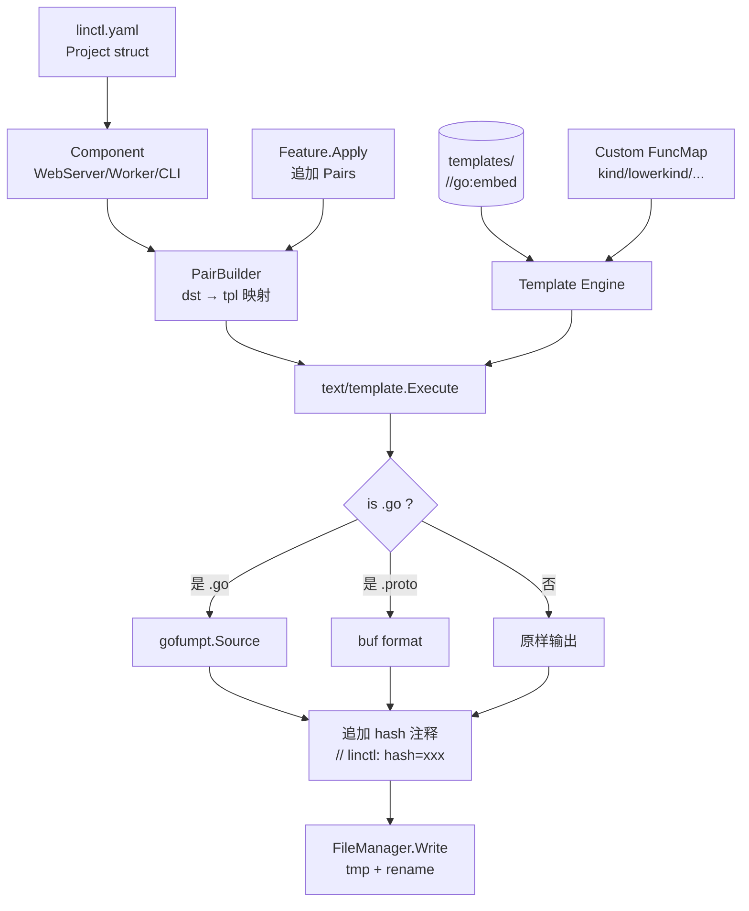

# 05. 模板系统设计

> **注（2026-04-26 修订，0.2.2）**：彻底移除 `partials/` 共享片段机制（包含原 §5.9 partial / include 支持小节、`Engine.WithPartialsDir` Option、`partialsDir` 字段及相关 ParseFS/Clone 逻辑）。
>
> 原因：
> 1. 内置模板已不再注入"DO NOT EDIT"等文件头注释（与 linctl "hash drift + Strategy=ask 让用户安全编辑生成文件" 的设计哲学冲突），唯一示例 `partials/header.tpl` 在 0.2.1 已删除。
> 2. 业务模板里的复用诉求由用户根据自己的业务自行编排，linctl 不再为 partials 提供专门的命名空间共享，避免引入"既要又要"的接缝。
>
> 渲染策略简化为：**每个业务模板独立 Parse + sync.Map 缓存 + missingkey=error 严格模式**。

## 5.1 设计目标

| 目标 | 解释 |
| --- | --- |
| **零外部工具** | 替换 osbuilder 的 `rakyll/statik`（已归档），全部用 `//go:embed` |
| **可组合** | 按 `framework / storage / feature / deploy` 维度独立分层 |
| **可测试** | 每个模板都通过 component / 单元测试 + E2E 真实 `go build` 双重保障 |
| **可扩展** | 通过 `Feature.Apply()` 动态贡献模板对，无需改主路径 |
| **可调试** | 渲染失败时打印模板名 + 行号 + 数据上下文 |
| **保留注释** | 模板里的注释（如 `{{/* explanation */}}`）不污染输出 |
| **格式化** | `.go` 文件自动 `gofumpt`，`.proto` 文件自动 `buf format` |

## 5.2 整体数据流



## 5.3 模板嵌入：`//go:embed`

```go
// internal/template/embed.go
package template

import "embed"

//go:embed all:../../templates
var TemplatesFS embed.FS

// Use:
//   data, err := TemplatesFS.ReadFile("templates/framework/gin/server.go.tpl")
//   fs.WalkDir(TemplatesFS, "templates", fn)
```

**关键约定**：
- 使用 `all:` 前缀确保即使是以 `_` / `.` 开头的文件也被嵌入。
- `templates/` 必须位于 module 根目录或 `internal/template/` 的相对路径里。
- 不嵌入 `*_test.go` 等无关文件（用 `embed` 模式过滤）。

**优点（vs statik）**：
- 标准库，零外部依赖。
- 编辑器（VSCode/Goland）能直接索引 `templates/` 下的源文件。
- 改了模板源 → 重新 `go build` 即可，不需要 `gen-statik.sh`。
- 模板大小直接体现在二进制 size 上，便于优化。

## 5.4 模板分层组织

`templates/` 按 5 个维度组织：

```
templates/
├── common/               # 全部组件共用（go.mod, README, Makefile, ...）
├── component/            # 按组件类型 (WebServer/Worker/CLI) 共用
├── framework/            # 按框架 (gin/grpc) 特化
├── storage/              # 按存储 (memory/gorm-mysql/postgres/sqlite/mongo) 特化
├── deploy/               # 按部署模式 (docker/kubernetes/systemd) 特化
└── feature/              # 按特性 (healthz/otel/user/ws/preloader) 特化
```

每层独立可演进。Pair 的来源由 Component 和 Feature 决定。

### 5.4.1 命名约定

| 文件 | 后缀 | 说明 |
| --- | --- | --- |
| 模板文件 | `.tpl` | 走 `text/template` 渲染 |
| 静态文件 | 原扩展名 | 直接拷贝（如 `.golangci.yaml`） |
| Go 模板 | `.go.tpl` | 渲染后 + gofumpt |
| Proto 模板 | `.proto.tpl` 或 `.proto` | 渲染后 + buf format（如有） |
| Markdown 模板 | `.md.tpl` | 渲染后原样输出 |
| YAML 模板 | `.yaml.tpl` | 渲染后原样输出 |

### 5.4.2 文件路径模板化

模板路径**和**目标路径都支持 `{{...}}` 占位符。例如：

```
templates/component/webserver/cmd/{{.Component.Name}}/main.go.tpl
```

→ 渲染后的目标路径是 `cmd/mb-apiserver/main.go`。

> 这避免了 osbuilder 那种"模板路径硬编码 mb-apiserver，运行时再改名"的违和感。

## 5.5 模板引擎封装

> **关键设计：每个业务模板独立 Parse + sync.Map 缓存**
>
> linctl 不再提供 partials 共享命名空间机制，每个业务模板独立 `text/template.New().Parse()`，渲染流程更直观、无命名空间冲突风险：
>
> 1. **首次渲染**：从 fs 读取模板内容 → `texttemplate.New(base).Funcs(funcMap).Option("missingkey=error").Parse(content)` → 缓存到 `sync.Map`。
> 2. **后续渲染**：直接命中缓存返回独立的 `*Template`。
> 3. **复用诉求**：业务复用由用户自行决定（如直接拼接生成字符串、或在 FuncMap 中提供 helper），linctl 不再托管。

```go
// internal/template/engine.go
package template

import (
    "bytes"
    "fmt"
    "go/format"
    "io/fs"
    "path/filepath"
    "strings"
    "sync"
    texttemplate "text/template"

    "github.com/clin211/linctl/internal/linctlerr"
)

type Engine struct {
    fs          fs.FS
    funcMap     texttemplate.FuncMap
    parsedCache sync.Map // map[string]*texttemplate.Template
}

type Option func(*Engine)

// WithFS 注入自定义 fs.FS（如内存测试 FS）。默认为 TemplatesFS。
func WithFS(f fs.FS) Option {
    return func(e *Engine) { e.fs = f }
}

// WithFuncMap 追加 / 覆盖模板函数（合并到 DefaultFuncMap 之上）。
func WithFuncMap(extra texttemplate.FuncMap) Option {
    return func(e *Engine) {
        if e.funcMap == nil {
            e.funcMap = make(texttemplate.FuncMap, len(extra))
        }
        for k, v := range extra {
            e.funcMap[k] = v
        }
    }
}

// New 构造一个 Engine。返回 error 仅为接口稳定性预留（当前实现不会失败）。
func New(opts ...Option) (*Engine, error) {
    e := &Engine{
        fs:      TemplatesFS,
        funcMap: DefaultFuncMap(),
    }
    for _, opt := range opts {
        opt(e)
    }
    return e, nil
}

// Render 渲染单个业务模板。
func (e *Engine) Render(tplPath string, data any) ([]byte, error) {
    tmpl, err := e.lookupOrParse(tplPath)
    if err != nil {
        return nil, err
    }
    var buf bytes.Buffer
    if err := tmpl.Execute(&buf, data); err != nil {
        return nil, &RenderError{Template: tplPath, Err: err, Data: data}
    }
    return buf.Bytes(), nil
}

// lookupOrParse 命中缓存返回；否则 Parse + 缓存。
func (e *Engine) lookupOrParse(tplPath string) (*texttemplate.Template, error) {
    if cached, ok := e.parsedCache.Load(tplPath); ok {
        return cached.(*texttemplate.Template), nil
    }
    content, err := fs.ReadFile(e.fs, tplPath)
    if err != nil {
        return nil, linctlerr.Wrapf(linctlerr.ErrTemplateRender, err,
            "read template %s", tplPath)
    }
    parsed, err := texttemplate.New(filepath.Base(tplPath)).
        Funcs(e.funcMap).
        Option("missingkey=error").
        Parse(string(content))
    if err != nil {
        return nil, linctlerr.Wrapf(linctlerr.ErrTemplateRender, err,
            "parse template %s", tplPath)
    }
    e.parsedCache.Store(tplPath, parsed)
    return parsed, nil
}

// Format 根据扩展名格式化
func (e *Engine) Format(content []byte, ext string) ([]byte, error) {
    if !strings.EqualFold(ext, ".go") {
        return content, nil
    }
    formatted, err := format.Source(content)
    if err != nil {
        return content, linctlerr.Wrapf(linctlerr.ErrTemplateRender, err, "go format")
    }
    return formatted, nil
}

// RenderPath 渲染目标路径中的占位符。
func (e *Engine) RenderPath(tplPath string, data any) (string, error) {
    tmpl := texttemplate.New("path").Funcs(e.funcMap)
    if _, err := tmpl.Parse(tplPath); err != nil {
        return "", err
    }
    var buf bytes.Buffer
    if err := tmpl.Execute(&buf, data); err != nil {
        return "", err
    }
    return buf.String(), nil
}
```

> 注：MVP 阶段使用标准库 `go/format`；Phase 2+ 可切换到 `mvdan.cc/gofumpt/format`。`.proto` 格式化见 §5.7。

## 5.6 自定义 FuncMap

```go
// internal/template/funcmap.go
package template

import (
    "fmt"
    "strings"
    "text/template"
    "time"

    "github.com/duke-git/lancet/v2/strutil"
    "github.com/gobuffalo/flect"

    "github.com/<org>/linctl/internal/project" // 用于 hasComponent 等强类型判定函数
)

func defaultFuncMap() template.FuncMap {
    return template.FuncMap{
        // === 命名转换 ===
        "kind":         kind,           // "cron_job" → "CronJob"
        "kinds":        kinds,          // "cron_job" → "CronJobs"
        "lowerkind":    lowerkind,      // "CronJob" → "cronjob"
        "lowerkinds":   lowerkinds,
        "snake":        snake,          // "CronJob" → "cron_job"
        "kebab":        kebab,          // "CronJob" → "cron-job"
        "camel":        camel,          // "cron_job" → "cronJob"
        "pascal":       pascal,         // = kind
        "lowerFirst":   strutil.LowerFirst,
        "upperFirst":   strutil.UpperFirst,
        "toupper":      strings.ToUpper,
        "tolower":      strings.ToLower,
        "pluralize":    flect.Pluralize,
        "singularize":  flect.Singularize,

        // === 时间 ===
        "currentYear":  func() int { return time.Now().Year() },
        "currentDate":  func() string { return time.Now().Format("2006-01-02") },
        "currentTime":  func() string { return time.Now().Format(time.RFC3339) },

        // === 字符串处理 ===
        "join":         strings.Join,
        "split":        strings.Split,
        "contains":     strings.Contains,
        "replace":      strings.ReplaceAll,
        "underscore":   func(s string) string { return strings.ReplaceAll(strings.ReplaceAll(s, ".", "_"), "-", "_") },
        "toDot":        func(s string) string { return strings.ReplaceAll(strings.ReplaceAll(s, "_", "."), "-", ".") },
        "extractPrefix": extractPrefix, // "mb-apiserver" → "mb"
        "withoutPrefix": withoutPrefix, // "mb-apiserver" → "apiserver"

        // === 集合判断 ===
        "in":      contains,
        "hasFeature": hasFeature,
        "hasComponent": hasComponent,

        // === 模板控制 ===
        "default": func(def, v any) any {
            if v == nil || v == "" { return def }
            return v
        },
        "indent": indent,
        "comment": commentBlock, // 把字符串包成 // 前缀的多行注释

        // === 调试用 ===
        "debug":  func(v any) string { return fmt.Sprintf("%#v", v) },
    }
}

func kind(s string) string {
    return strutil.UpperFirst(strutil.CamelCase(s))
}
func kinds(s string) string {
    return flect.Pluralize(kind(s))
}
func lowerkind(s string) string {
    return strings.ToLower(strutil.CamelCase(s))
}
func lowerkinds(s string) string {
    return flect.Pluralize(lowerkind(s))
}
func snake(s string) string {
    return strutil.SnakeCase(s)
}
func kebab(s string) string {
    return strutil.KebabCase(s)
}
func camel(s string) string {
    return strutil.LowerFirst(strutil.CamelCase(s))
}
func pascal(s string) string {
    return strutil.UpperFirst(strutil.CamelCase(s))
}

func extractPrefix(binaryName string) string {
    if i := strings.Index(binaryName, "-"); i > 0 {
        return binaryName[:i]
    }
    return binaryName
}

func withoutPrefix(binaryName string) string {
    if i := strings.Index(binaryName, "-"); i > 0 {
        return binaryName[i+1:]
    }
    return binaryName
}

func contains[T comparable](haystack []T, needle T) bool {
    for _, h := range haystack {
        if h == needle {
            return true
        }
    }
    return false
}

func hasFeature(features []string, name string) bool {
    return contains(features, name)
}

// hasComponent 判断 Project 中是否有任意一个 Component 满足条件。
//
// ⚠️ 以下为骨架实现的伪代码示意；模板渲染期实际调用的是强类型版本，
//    完整实现（含按 Kind 精确匹配、按 Name 精确匹配、tag 索引等）在
//    `internal/template/funcmap_helpers.go` 中。
//
// 调用形态（模板侧）：
//   {{- if hasComponent .Project.Spec.Components "Worker" }} ... {{- end }}
//   {{- if hasComponent .Project.Spec.Components "mb-apiserver" }} ... {{- end }}
//
// 匹配规则（按优先级）：
//   1) needle 完全等于 component.Kind（如 "WebServer"/"Worker"/"CLI"）→ 命中
//   2) needle 完全等于 component.Name（如 "mb-apiserver"）→ 命中
//   3) 否则不命中
//
// 不允许用 `string(c.Kind) == needle` 的模糊匹配，避免大小写歧义。
func hasComponent(components []project.Component, needle string) bool {
    for _, c := range components {
        if c.Kind == needle || c.Name == needle {
            return true
        }
    }
    return false
}

func indent(spaces int, s string) string {
    pad := strings.Repeat(" ", spaces)
    lines := strings.Split(s, "\n")
    for i, l := range lines {
        if l != "" {
            lines[i] = pad + l
        }
    }
    return strings.Join(lines, "\n")
}

func commentBlock(prefix, s string) string {
    lines := strings.Split(s, "\n")
    for i, l := range lines {
        lines[i] = prefix + " " + l
    }
    return strings.Join(lines, "\n")
}
```

## 5.7 Proto 格式化

```go
// internal/template/proto_format.go
package template

import (
    "context"
    "os/exec"
)

// formatProto 优先用 buf，未安装则原样返回
func formatProto(content []byte) ([]byte, error) {
    bufBin, err := exec.LookPath("buf")
    if err != nil {
        return content, nil
    }
    cmd := exec.CommandContext(context.Background(), bufBin, "format", "-")
    cmd.Stdin = bytes.NewReader(content)
    var buf bytes.Buffer
    cmd.Stdout = &buf
    if err := cmd.Run(); err != nil {
        return content, nil // 格式化失败不阻塞，返回原内容
    }
    return buf.Bytes(), nil
}
```

> Phase 4 升级：内嵌 `bufbuild/protocompile` 完全替代外部 `buf`。

## 5.8 模板数据契约（TemplateData）

```go
// internal/template/data.go
package template

import (
    "github.com/<org>/linctl/internal/project"
)

// TemplateData 是所有模板可访问的数据
type TemplateData struct {
    Project   *project.Project    // 整个项目配置
    Component *project.Component  // 当前正在渲染的组件
    Feature   string              // 当前 Feature 名（如有）
    Resource  *project.Resource   // 当前 REST 资源（add api 时）
    Helpers   *Helpers            // 衍生字段助手
}

type Helpers struct {
    ModuleName       string  // = Project.Metadata.Module
    InternalPkg      string  // = "<module>/internal/pkg"
    APIDir           string  // = "pkg/api/<component>/v<version>"
    BizDir           string  // = "internal/<component>/biz"
    StoreDir         string
    HandlerDir       string
    ConfigsDir       string
    DocsDir          string
    EnvironmentPrefix string // = "MINIBLOG_APISERVER" (从 binaryName 推导)
}
```

模板访问示例：

```go
// templates/component/webserver/cmd/{{.Component.Name}}/main.go.tpl
package main

import (
    "github.com/spf13/cobra"

    "{{.Helpers.ModuleName}}/cmd/{{.Component.Name}}/app"
)

func main() {
    if err := app.NewCommand().Execute(); err != nil {
        os.Exit(1)
    }
}
```

```go
// templates/framework/gin/handler/api/resource.go.tpl
package handler

import (
    "github.com/gin-gonic/gin"
)

// {{kind .Resource.Name}}Handler handles {{kind .Resource.Name}} HTTP routes.
type {{kind .Resource.Name}}Handler struct {
    biz biz.{{kind .Resource.Name}}V{{.Project.Spec.Defaults.ProtoVersion | upperFirst}}
}

func (h *{{kind .Resource.Name}}Handler) Create(c *gin.Context) {
    var req apiv1.Create{{kind .Resource.Name}}Request
    if err := c.ShouldBindJSON(&req); err != nil {
        c.JSON(400, gin.H{"error": err.Error()})
        return
    }
    {{- if hasFeature .Project.Spec.Features "user" }}
    userID := middleware.UserIDFromContext(c.Request.Context())
    {{- end }}
    // ...
}
```

## 5.9 模板复用策略（无 partial 机制）

linctl **不提供** partial / include 机制。模板复用诉求由用户根据业务自行决定，常见做法：

1. **FuncMap 提供生成函数**：把可复用的代码片段封装为 FuncMap helper（见 §5.6），如 `{{copyrightHeader .Project}}`。
2. **直接复制粘贴**：linctl 的内置模板更倾向于让每个文件自包含（self-contained）以便用户阅读和编辑后保留 hash drift 检测能力。
3. **生成后再人工编辑**：linctl 的设计哲学是"生成 → 人工接管"，复用最好在生成后由用户在自己的代码中通过 Go 的常规手段（函数、struct 嵌入、interface 等）解决，而不是在模板层做命名空间共享。

> **历史背景**：0.2.x 早期曾通过 `templates/partials/*.tpl` 提供命名空间共享（单一根 Template + ParseFS + Clone/Lookup），唯一示例 `partials/header.tpl` 用于注入 "DO NOT EDIT" 头注释。此机制于 0.2.2 移除：
> - `header.tpl` 与 linctl "hash drift + Strategy=ask 让用户安全编辑生成文件" 的设计哲学冲突；
> - 内置模板已不再注入文件头注释，唯一示例失去存在价值；
> - 移除后渲染流程从 "Clone(root) + New + Parse + Lookup" 简化为 "New + Parse"，引擎实现行数减半，命名空间冲突风险归零。

## 5.10 渲染失败的调试体验

osbuilder 的痛点：模板渲染失败时只输出"`format go source: ...`"，找原因要很久。

linctl 的改进：

```go
// internal/template/engine.go (Render 失败分支)
if err := tmpl.Execute(&buf, data); err != nil {
    return nil, &RenderError{
        Template: tplPath,
        Err:      err,
        Data:     data,         // 完整数据（脱敏后）
        Snippet:  contentSnippet, // 模板源附近 5 行
    }
}
```

输出示例：

```
✗ Error [template_render]: render template "framework/gin/handler/api/resource.go.tpl"

  Template: framework/gin/handler/api/resource.go.tpl:42:15
  Error:    template: framework/gin/handler/api/resource.go.tpl:42:15: 
            executing "framework/gin/handler/api/resource.go.tpl" at <.Component.Foo>: 
            map has no entry for key "Foo"

  Source (lines 38-45):
    38 |     // ...
    39 |     biz biz.{{kind .Resource.Name}}V1
    40 | }
    41 |
    42 | func (h *{{kind .Component.Foo}}Handler) Create(c *gin.Context) {
    43 |     // ...
    44 | }
    45 |

  Data: 
    Component:
      Kind: WebServer
      Name: mb-apiserver
      (no Foo field)

  💡 Hint: Component has no field 'Foo'. Available fields: Kind, Name, Framework, ...
```

## 5.11 模板的"绝对零硬编码"承诺

- ❌ 禁止 `tmpl.ParseFiles("/Users/...")` 这种本机绝对路径（osbuilder 有此 bug）。
- ❌ 禁止在模板里写死 `mb-apiserver`/`mb-jobserver`，必须用 `{{.Component.Name}}`。
- ❌ 禁止在模板里写死作者姓名/邮箱，必须用 `{{.Project.Metadata.Author.Name}}`。
- ❌ 禁止假设 module path 必然是 `github.com/onexstack/...`，必须用 `{{.Helpers.ModuleName}}`。

CI 里加规则：

```bash
# scripts/check-templates.sh
#!/usr/bin/env bash
set -euo pipefail

# 禁止硬编码绝对路径
! grep -rE 'ParseFiles\("/' templates/ internal/

# 禁止硬编码作者名
! grep -rE 'colin404@foxmail\.com|Lingfei Kong' templates/ internal/

# 禁止硬编码 mb- 前缀（除注释/示例外）
if grep -rE '"mb-[a-z]+"' templates/ | grep -v '\.md\.tpl' | grep -v '#'; then
    echo "ERROR: templates contain hardcoded 'mb-*' binary names"
    exit 1
fi
```

## 5.12 模板版本号与 statik 兼容期

为支持从 osbuilder 迁移到 linctl 的项目（双工具共存的过渡期），保留对模板路径前缀的兼容映射：

```go
// internal/template/compat.go
var templatePathAliases = map[string]string{
    "/project/cmd/mb-apiserver/main.go": "templates/component/webserver/cmd/{{.Component.Name}}/main.go.tpl",
    // ...
}
```

> 这只是临时方案。正式版应彻底切换到新路径。

## 5.13 性能优化

### 5.13.1 模板预编译

预编译的实现已在 §5.5 `Engine.lookupOrParse` 中给出（`parsedCache sync.Map`）。要点回顾：

- 缓存粒度：`tplPath → *texttemplate.Template`（缓存的是 **Clone(root) + .New(tplPath).Parse(content)** 之后的业务模板）。
- 写入语义：`sync.Map.Store` 单次写入，重复 race 解析时（多 goroutine 同时未命中）允许重复 Clone+Parse，最终保留最后写入的值——业务模板纯函数式，多副本结果一致。
- 失效语义：模板内容随二进制 embed，进程内永不失效；`go test -run -short` 模式下可用专用接口 `Reset()` 清空（用于 golden 更新）。

> 预期 1000 个模板的渲染时间从 ~1s 降到 ~300ms。

### 5.13.2 并发渲染

```go
// internal/codegen/applier.go
func (a *Applier) renderAll(plan *Plan, eng *template.Engine) error {
    g, _ := errgroup.WithContext(ctx)
    g.SetLimit(runtime.NumCPU())
    for _, action := range plan.Actions {
        action := action
        g.Go(func() error {
            content, err := eng.Render(action.Pair.TemplateID, ...)
            if err != nil { return err }
            return a.writeFile(action.Pair.Dst, content)
        })
    }
    return g.Wait()
}
```

> 对 IO 密集（写盘）效果显著。CPU 密集（gofumpt 多核）也有收益。

## 5.14 与 osbuilder 模板系统的对比总结

| 维度 | osbuilder | linctl |
| --- | --- | --- |
| 嵌入方案 | `rakyll/statik`（archived） | `//go:embed` |
| 路径占位符 | 无（运行时拼接） | 模板路径含 `{{...}}` 占位 |
| FuncMap 数量 | ~12 个 | ~40 个（命名/集合/控制 全覆盖） |
| 模板复用 | partial / include（共享命名空间） | 不提供（生成后由用户自行复用，详见 §5.9） |
| 失败提示 | 红色原文 | 模板路径 + 行号 + 数据上下文 + Hint |
| 路径硬编码检查 | 无 | CI 强制 |
| 预编译 | 无 | sync.Map 缓存 Parse 后的 *Template |
| 并发渲染 | 串行 | errgroup 并发（每模板独立 Parse，无共享 root） |
| missing key 行为 | 渲染成 `<no value>` 字符串 | `Option("missingkey=error")` 直接报错 |

---

下一步阅读：[06-codegen-pipeline.md](./06-codegen-pipeline.md)

_Last reviewed: 2026-04-26_
