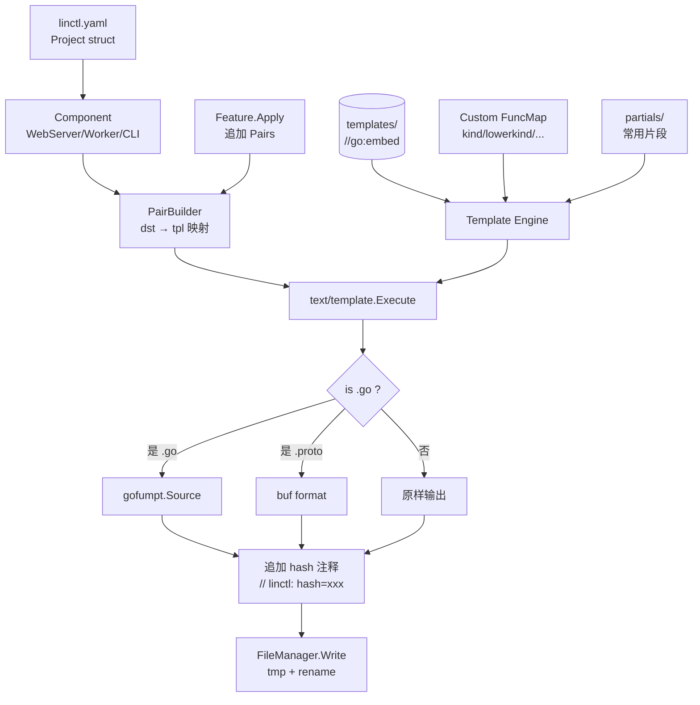

# 05. 模板系统设计

## 5.1 设计目标

| 目标 | 解释 |
| --- | --- |
| **零外部工具** | 替换 osbuilder 的 `rakyll/statik`（已归档），全部用 `//go:embed` |
| **可组合** | 按 `framework / storage / feature / deploy` 维度独立分层 |
| **可测试** | 每个模板都可 snapshot 测试 |
| **可扩展** | 通过 `Feature.Apply()` 动态贡献模板对，无需改主路径 |
| **可调试** | 渲染失败时打印模板名 + 行号 + 数据上下文 |
| **保留注释** | 模板里的注释（如 `{{/* explanation */}}`）不污染输出 |
| **格式化** | `.go` 文件自动 `gofumpt`，`.proto` 文件自动 `buf format` |

## 5.2 整体数据流



## 5.3 模板嵌入：`//go:embed`

```go
// internal/template/embed.go
package template

import "embed"

//go:embed all:../../templates
var TemplatesFS embed.FS

// Use:
//   data, err := TemplatesFS.ReadFile("templates/framework/gin/server.go.tpl")
//   fs.WalkDir(TemplatesFS, "templates", fn)
```

**关键约定**：
- 使用 `all:` 前缀确保即使是以 `_` / `.` 开头的文件也被嵌入。
- `templates/` 必须位于 module 根目录或 `internal/template/` 的相对路径里。
- 不嵌入 `*_test.go` 等无关文件（用 `embed` 模式过滤）。

**优点（vs statik）**：
- 标准库，零外部依赖。
- 编辑器（VSCode/Goland）能直接索引 `templates/` 下的源文件。
- 改了模板源 → 重新 `go build` 即可，不需要 `gen-statik.sh`。
- 模板大小直接体现在二进制 size 上，便于优化。

## 5.4 模板分层组织

`templates/` 按 5 个维度组织：

```
templates/
├── common/               # 全部组件共用（go.mod, README, Makefile, ...）
├── component/            # 按组件类型 (WebServer/Worker/CLI) 共用
├── framework/            # 按框架 (gin/grpc) 特化
├── storage/              # 按存储 (memory/gorm-mysql/postgres/sqlite/mongo) 特化
├── deploy/               # 按部署模式 (docker/kubernetes/systemd) 特化
└── feature/              # 按特性 (healthz/otel/user/ws/preloader) 特化
```

每层独立可演进。Pair 的来源由 Component 和 Feature 决定。

### 5.4.1 命名约定

| 文件 | 后缀 | 说明 |
| --- | --- | --- |
| 模板文件 | `.tpl` | 走 `text/template` 渲染 |
| 静态文件 | 原扩展名 | 直接拷贝（如 `.golangci.yaml`） |
| Go 模板 | `.go.tpl` | 渲染后 + gofumpt |
| Proto 模板 | `.proto.tpl` 或 `.proto` | 渲染后 + buf format（如有） |
| Markdown 模板 | `.md.tpl` | 渲染后原样输出 |
| YAML 模板 | `.yaml.tpl` | 渲染后原样输出 |

### 5.4.2 文件路径模板化

模板路径**和**目标路径都支持 `{{...}}` 占位符。例如：

```
templates/component/webserver/cmd/{{.Component.Name}}/main.go.tpl
```

→ 渲染后的目标路径是 `cmd/mb-apiserver/main.go`。

> 这避免了 osbuilder 那种"模板路径硬编码 mb-apiserver，运行时再改名"的违和感。

## 5.5 模板引擎封装

> **关键设计：单一根 Template 命名空间**
>
> `text/template` 的 `{{template "name" .}}` 调用只能查找**同一棵 template tree** 内的子模板。
> 因此 linctl 强制使用「**单一根 Template + ParseFS 预加载 partials + 渲染时 Clone/New 业务模板**」的模式：
>
> 1. **构造 Engine 时**：用 `texttemplate.New("__root__").Funcs(...).ParseFS(embedded, "templates/partials/*.tpl")` 一次性把所有 partial 解析进同一棵 root 树（每个 partial 文件名作为 template 名）。
> 2. **渲染业务模板时**：`root.Clone()` 出一棵带 partials 的克隆树 → 在克隆上用 `.New(tplPath).Parse(<业务模板内容>)` 注入业务模板 → 业务模板里的 `{{template "partials/header.tpl" .}}` 即可命中 partial。
> 3. **必须 Clone 而不能直接复用**：`.New(...).Parse(...)` 会把业务模板挂到根上，多个业务模板若共享同一根会相互污染（同名 redefine、并发竞态）。Clone 保证每次渲染拿到独立的命名空间。
>
> 这一设计闭合了「主 Render」与「partial 命名空间」的接缝（SSOT 修复点 P0-3）。

```go
// internal/template/engine.go
package template

import (
    "bytes"
    "fmt"
    "io/fs"
    "strings"
    "sync"
    texttemplate "text/template"

    "mvdan.cc/gofumpt/format"
)

type Engine struct {
    embedded   fs.FS
    funcMap    texttemplate.FuncMap
    extraFuncs []texttemplate.FuncMap // Feature 贡献的 funcMap

    // root 是一棵预解析了所有 partials 的根 Template；渲染业务模板时 Clone 出独立副本使用。
    root        *texttemplate.Template
    initOnce    sync.Once
    initErr     error
    parsedCache sync.Map // tplPath → *texttemplate.Template (Clone+业务模板，详见 §5.14.1)
}

func New(embedded fs.FS) *Engine {
    return &Engine{
        embedded: embedded,
        funcMap:  defaultFuncMap(),
    }
}

// AddFuncs 在 init() 之前调用；init 之后再 AddFuncs 不会被 partials 看见。
func (e *Engine) AddFuncs(fm texttemplate.FuncMap) {
    e.extraFuncs = append(e.extraFuncs, fm)
}

// init 懒初始化根模板，预加载所有 partials。线程安全（sync.Once）。
func (e *Engine) init() error {
    e.initOnce.Do(func() {
        funcs := e.mergeFuncs()
        root := texttemplate.New("__root__").
            Option("missingkey=error").
            Funcs(funcs)

        // 预加载所有 partial 到同一棵 root 树；
        // partial 名 = embedded 路径（如 "templates/partials/header.tpl"）。
        parsed, err := root.ParseFS(e.embedded, "templates/partials/*.tpl")
        if err != nil {
            // 允许 partials/ 目录不存在（无 partial 项目仍可工作）
            if !isFSPathErrNotExist(err) {
                e.initErr = fmt.Errorf("preload partials: %w", err)
                return
            }
            parsed = root
        }
        e.root = parsed
    })
    return e.initErr
}

// Render 渲染单个业务模板（自动确保 partials 已加载）。
func (e *Engine) Render(tplPath string, data any) ([]byte, error) {
    if err := e.init(); err != nil {
        return nil, err
    }

    tmpl, err := e.lookupOrParse(tplPath)
    if err != nil {
        return nil, err
    }

    var buf bytes.Buffer
    if err := tmpl.Execute(&buf, data); err != nil {
        return nil, fmt.Errorf("execute template %s: %w\n--- DATA ---\n%+v", tplPath, err, data)
    }
    return buf.Bytes(), nil
}

// lookupOrParse 通过缓存得到「Clone 自 root + 业务模板已 Parse」的可用 *Template。
// Clone 的目的：每个业务模板得到独立的命名空间副本，避免并发渲染时
// .New(tplPath).Parse(...) 互相覆盖 root 上的同名子模板。
func (e *Engine) lookupOrParse(tplPath string) (*texttemplate.Template, error) {
    if cached, ok := e.parsedCache.Load(tplPath); ok {
        return cached.(*texttemplate.Template), nil
    }

    content, err := fs.ReadFile(e.embedded, tplPath)
    if err != nil {
        return nil, fmt.Errorf("read template %s: %w", tplPath, err)
    }

    cloned, err := e.root.Clone()
    if err != nil {
        return nil, fmt.Errorf("clone root: %w", err)
    }

    tmpl, err := cloned.New(tplPath).Parse(string(content))
    if err != nil {
        return nil, fmt.Errorf("parse template %s: %w", tplPath, err)
    }

    // 关键：执行业务模板时必须 Lookup 出 tplPath 名的子模板（而非 root），
    // 否则 Execute 会从 __root__ 开始执行（空内容）。
    business := tmpl.Lookup(tplPath)
    if business == nil {
        return nil, fmt.Errorf("internal: lookup %q after parse returned nil", tplPath)
    }

    e.parsedCache.Store(tplPath, business)
    return business, nil
}

// RenderPath 同时渲染目标路径中的占位符（路径渲染不依赖 partials）。
func (e *Engine) RenderPath(tplPath string, data any) (string, error) {
    tmpl := texttemplate.New("path").Funcs(e.mergeFuncs())
    if _, err := tmpl.Parse(tplPath); err != nil {
        return "", err
    }
    var buf bytes.Buffer
    if err := tmpl.Execute(&buf, data); err != nil {
        return "", err
    }
    return buf.String(), nil
}

// isFSPathErrNotExist 判断 ParseFS 找不到任何匹配文件的错误。
// （go1.22 起 ParseFS 在零匹配时返回 fs.ErrNotExist 包装的错误。）
func isFSPathErrNotExist(err error) bool {
    return err != nil && strings.Contains(err.Error(), "pattern matches no files")
}

// Format 根据扩展名格式化
func (e *Engine) Format(filePath string, content []byte) ([]byte, error) {
    switch {
    case strings.HasSuffix(filePath, ".go"):
        formatted, err := format.Source(content, format.Options{LangVersion: "1.22"})
        if err != nil {
            return nil, fmt.Errorf("gofumpt format %s: %w\n--- raw ---\n%s", filePath, err, content)
        }
        return formatted, nil
    case strings.HasSuffix(filePath, ".proto"):
        return formatProto(content) // 见 5.7
    default:
        return content, nil
    }
}

func (e *Engine) mergeFuncs() texttemplate.FuncMap {
    out := make(texttemplate.FuncMap, len(e.funcMap)+8)
    for k, v := range e.funcMap {
        out[k] = v
    }
    for _, fm := range e.extraFuncs {
        for k, v := range fm {
            out[k] = v
        }
    }
    return out
}
```

## 5.6 自定义 FuncMap

```go
// internal/template/funcmap.go
package template

import (
    "fmt"
    "strings"
    "text/template"
    "time"

    "github.com/duke-git/lancet/v2/strutil"
    "github.com/gobuffalo/flect"

    "github.com/<org>/linctl/internal/project" // 用于 hasComponent 等强类型判定函数
)

func defaultFuncMap() template.FuncMap {
    return template.FuncMap{
        // === 命名转换 ===
        "kind":         kind,           // "cron_job" → "CronJob"
        "kinds":        kinds,          // "cron_job" → "CronJobs"
        "lowerkind":    lowerkind,      // "CronJob" → "cronjob"
        "lowerkinds":   lowerkinds,
        "snake":        snake,          // "CronJob" → "cron_job"
        "kebab":        kebab,          // "CronJob" → "cron-job"
        "camel":        camel,          // "cron_job" → "cronJob"
        "pascal":       pascal,         // = kind
        "lowerFirst":   strutil.LowerFirst,
        "upperFirst":   strutil.UpperFirst,
        "toupper":      strings.ToUpper,
        "tolower":      strings.ToLower,
        "pluralize":    flect.Pluralize,
        "singularize":  flect.Singularize,

        // === 时间 ===
        "currentYear":  func() int { return time.Now().Year() },
        "currentDate":  func() string { return time.Now().Format("2006-01-02") },
        "currentTime":  func() string { return time.Now().Format(time.RFC3339) },

        // === 字符串处理 ===
        "join":         strings.Join,
        "split":        strings.Split,
        "contains":     strings.Contains,
        "replace":      strings.ReplaceAll,
        "underscore":   func(s string) string { return strings.ReplaceAll(strings.ReplaceAll(s, ".", "_"), "-", "_") },
        "toDot":        func(s string) string { return strings.ReplaceAll(strings.ReplaceAll(s, "_", "."), "-", ".") },
        "extractPrefix": extractPrefix, // "mb-apiserver" → "mb"
        "withoutPrefix": withoutPrefix, // "mb-apiserver" → "apiserver"

        // === 集合判断 ===
        "in":      contains,
        "hasFeature": hasFeature,
        "hasComponent": hasComponent,

        // === 模板控制 ===
        "default": func(def, v any) any {
            if v == nil || v == "" { return def }
            return v
        },
        "indent": indent,
        "comment": commentBlock, // 把字符串包成 // 前缀的多行注释

        // === 调试用 ===
        "debug":  func(v any) string { return fmt.Sprintf("%#v", v) },
    }
}

func kind(s string) string {
    return strutil.UpperFirst(strutil.CamelCase(s))
}
func kinds(s string) string {
    return flect.Pluralize(kind(s))
}
func lowerkind(s string) string {
    return strings.ToLower(strutil.CamelCase(s))
}
func lowerkinds(s string) string {
    return flect.Pluralize(lowerkind(s))
}
func snake(s string) string {
    return strutil.SnakeCase(s)
}
func kebab(s string) string {
    return strutil.KebabCase(s)
}
func camel(s string) string {
    return strutil.LowerFirst(strutil.CamelCase(s))
}
func pascal(s string) string {
    return strutil.UpperFirst(strutil.CamelCase(s))
}

func extractPrefix(binaryName string) string {
    if i := strings.Index(binaryName, "-"); i > 0 {
        return binaryName[:i]
    }
    return binaryName
}

func withoutPrefix(binaryName string) string {
    if i := strings.Index(binaryName, "-"); i > 0 {
        return binaryName[i+1:]
    }
    return binaryName
}

func contains[T comparable](haystack []T, needle T) bool {
    for _, h := range haystack {
        if h == needle {
            return true
        }
    }
    return false
}

func hasFeature(features []string, name string) bool {
    return contains(features, name)
}

// hasComponent 判断 Project 中是否有任意一个 Component 满足条件。
//
// ⚠️ 以下为骨架实现的伪代码示意；模板渲染期实际调用的是强类型版本，
//    完整实现（含按 Kind 精确匹配、按 Name 精确匹配、tag 索引等）在
//    `internal/template/funcmap_helpers.go` 中。
//
// 调用形态（模板侧）：
//   {{- if hasComponent .Project.Spec.Components "Worker" }} ... {{- end }}
//   {{- if hasComponent .Project.Spec.Components "mb-apiserver" }} ... {{- end }}
//
// 匹配规则（按优先级）：
//   1) needle 完全等于 component.Kind（如 "WebServer"/"Worker"/"CLI"）→ 命中
//   2) needle 完全等于 component.Name（如 "mb-apiserver"）→ 命中
//   3) 否则不命中
//
// 不允许用 `string(c.Kind) == needle` 的模糊匹配，避免大小写歧义。
func hasComponent(components []project.Component, needle string) bool {
    for _, c := range components {
        if c.Kind == needle || c.Name == needle {
            return true
        }
    }
    return false
}

func indent(spaces int, s string) string {
    pad := strings.Repeat(" ", spaces)
    lines := strings.Split(s, "\n")
    for i, l := range lines {
        if l != "" {
            lines[i] = pad + l
        }
    }
    return strings.Join(lines, "\n")
}

func commentBlock(prefix, s string) string {
    lines := strings.Split(s, "\n")
    for i, l := range lines {
        lines[i] = prefix + " " + l
    }
    return strings.Join(lines, "\n")
}
```

## 5.7 Proto 格式化

```go
// internal/template/proto_format.go
package template

import (
    "context"
    "os/exec"
)

// formatProto 优先用 buf，未安装则原样返回
func formatProto(content []byte) ([]byte, error) {
    bufBin, err := exec.LookPath("buf")
    if err != nil {
        return content, nil
    }
    cmd := exec.CommandContext(context.Background(), bufBin, "format", "-")
    cmd.Stdin = bytes.NewReader(content)
    var buf bytes.Buffer
    cmd.Stdout = &buf
    if err := cmd.Run(); err != nil {
        return content, nil // 格式化失败不阻塞，返回原内容
    }
    return buf.Bytes(), nil
}
```

> Phase 4 升级：内嵌 `bufbuild/protocompile` 完全替代外部 `buf`。

## 5.8 模板数据契约（TemplateData）

```go
// internal/template/data.go
package template

import (
    "github.com/<org>/linctl/internal/project"
)

// TemplateData 是所有模板可访问的数据
type TemplateData struct {
    Project   *project.Project    // 整个项目配置
    Component *project.Component  // 当前正在渲染的组件
    Feature   string              // 当前 Feature 名（如有）
    Resource  *project.Resource   // 当前 REST 资源（add api 时）
    Helpers   *Helpers            // 衍生字段助手
}

type Helpers struct {
    ModuleName       string  // = Project.Metadata.Module
    InternalPkg      string  // = "<module>/internal/pkg"
    APIDir           string  // = "pkg/api/<component>/v<version>"
    BizDir           string  // = "internal/<component>/biz"
    StoreDir         string
    HandlerDir       string
    ConfigsDir       string
    DocsDir          string
    EnvironmentPrefix string // = "MINIBLOG_APISERVER" (从 binaryName 推导)
}
```

模板访问示例：

```go
// templates/component/webserver/cmd/{{.Component.Name}}/main.go.tpl
package main

import (
    "github.com/spf13/cobra"

    "{{.Helpers.ModuleName}}/cmd/{{.Component.Name}}/app"
)

func main() {
    if err := app.NewCommand().Execute(); err != nil {
        os.Exit(1)
    }
}
```

```go
// templates/framework/gin/handler/api/resource.go.tpl
package handler

import (
    "github.com/gin-gonic/gin"
)

// {{kind .Resource.Name}}Handler handles {{kind .Resource.Name}} HTTP routes.
type {{kind .Resource.Name}}Handler struct {
    biz biz.{{kind .Resource.Name}}V{{.Project.Spec.Defaults.ProtoVersion | upperFirst}}
}

func (h *{{kind .Resource.Name}}Handler) Create(c *gin.Context) {
    var req apiv1.Create{{kind .Resource.Name}}Request
    if err := c.ShouldBindJSON(&req); err != nil {
        c.JSON(400, gin.H{"error": err.Error()})
        return
    }
    {{- if hasFeature .Project.Spec.Features "user" }}
    userID := middleware.UserIDFromContext(c.Request.Context())
    {{- end }}
    // ...
}
```

## 5.9 partial / include 支持

支持模板复用（解决 osbuilder 重复代码问题）。partial 加载与业务模板渲染共用**同一棵根 Template**，由 §5.5 中 `Engine.init()` 通过 `ParseFS` 完成预解析；本节只做约定与示例。

### 5.9.1 命名空间约定

- partial 物理路径：`templates/partials/*.tpl`
- partial 在模板树中的注册名 = embedded 路径全名（如 `templates/partials/header.tpl`），等同于 `Engine.init()` 调用 `ParseFS(embedded, "templates/partials/*.tpl")` 后 `text/template` 自动赋予的名字。
- 业务模板必须用**同名**调用 `{{template "templates/partials/header.tpl" .}}`，**不要**写成 `{{template "header" .}}`（会找不到）。

### 5.9.2 加载与命名空间闭合

```go
// 由 §5.5 的 Engine.init() 完成；此处仅作伪代码概念演示
root := texttemplate.New("__root__").
    Option("missingkey=error").
    Funcs(funcMap)

// 1) 一次性把所有 partials 加载到同一棵 root 树
root, _ = root.ParseFS(embedded, "templates/partials/*.tpl")

// 2) 渲染单个业务模板时：Clone root → New(tplPath).Parse(business) → Lookup(tplPath).Execute(data)
//    Clone 保证多业务模板互不污染，Lookup 保证从业务模板入口而非 __root__ 开始执行
cloned, _   := root.Clone()
business, _ := cloned.New(tplPath).Parse(string(content))
_ = business.Lookup(tplPath).Execute(out, data)
```

> **不要再单独写一个 `loadPartials() (*Template, error)` 然后忘记关联**——那会导致业务模板调用 `{{template "partials/..." .}}` 时报 `template not defined` 错误。SSOT P0-3 修复点：partial 与业务模板必须从**同一棵 root Clone** 出发。

### 5.9.3 partial 示例

`templates/partials/header.tpl`：

```text
{{- /* 文件头注释 */ -}}
// Copyright {{currentYear}} {{.Project.Metadata.Author.Name}} <{{.Project.Metadata.Author.Email}}>.
// All rights reserved.
// Use of this source code is governed by a MIT style license.
// Generated by linctl. DO NOT EDIT.
//
// Find more information at: https://linctl.dev/docs
```

业务模板里使用（注意名字必须是 embedded 全路径）：

```text
{{template "templates/partials/header.tpl" .}}
package main

// ...
```

## 5.10 渲染失败的调试体验

osbuilder 的痛点：模板渲染失败时只输出"`format go source: ...`"，找原因要很久。

linctl 的改进：

```go
// internal/template/engine.go (Render 失败分支)
if err := tmpl.Execute(&buf, data); err != nil {
    return nil, &RenderError{
        Template: tplPath,
        Err:      err,
        Data:     data,         // 完整数据（脱敏后）
        Snippet:  contentSnippet, // 模板源附近 5 行
    }
}
```

输出示例：

```
✗ Error [template_render]: render template "framework/gin/handler/api/resource.go.tpl"

  Template: framework/gin/handler/api/resource.go.tpl:42:15
  Error:    template: framework/gin/handler/api/resource.go.tpl:42:15: 
            executing "framework/gin/handler/api/resource.go.tpl" at <.Component.Foo>: 
            map has no entry for key "Foo"

  Source (lines 38-45):
    38 |     // ...
    39 |     biz biz.{{kind .Resource.Name}}V1
    40 | }
    41 |
    42 | func (h *{{kind .Component.Foo}}Handler) Create(c *gin.Context) {
    43 |     // ...
    44 | }
    45 |

  Data: 
    Component:
      Kind: WebServer
      Name: mb-apiserver
      (no Foo field)

  💡 Hint: Component has no field 'Foo'. Available fields: Kind, Name, Framework, ...
```

## 5.11 模板单元测试

每个模板都要有 snapshot 测试：

```go
// tests/snapshot/webserver_gin_test.go
package snapshot_test

import (
    "os"
    "path/filepath"
    "testing"

    "github.com/stretchr/testify/require"

    "github.com/<org>/linctl/internal/project"
    "github.com/<org>/linctl/internal/template"
)

func TestWebServerGin(t *testing.T) {
    proj := loadFixture(t, "fixtures/projects/full.yaml")
    component := proj.Spec.Components[0] // mb-apiserver

    eng := template.New(template.TemplatesFS)

    cases := []struct {
        tpl string
        want string // 相对 golden 路径
    }{
        {"templates/component/webserver/cmd/{{.Component.Name}}/main.go.tpl", "webserver_gin/main.go.golden"},
        {"templates/framework/gin/server.go.tpl",                              "webserver_gin/server.go.golden"},
        {"templates/framework/gin/handler/handler.go.tpl",                     "webserver_gin/handler.go.golden"},
    }

    for _, tc := range cases {
        t.Run(tc.tpl, func(t *testing.T) {
            data := template.NewTemplateData(proj, &component, "", nil)
            content, err := eng.Render(tc.tpl, data)
            require.NoError(t, err)
            content, err = eng.Format(tc.tpl, content)
            require.NoError(t, err)

            goldenPath := filepath.Join("golden", tc.want)
            if updateGolden() {
                require.NoError(t, os.WriteFile(goldenPath, content, 0o644))
                t.Skip("updated golden")
            }
            golden, err := os.ReadFile(goldenPath)
            require.NoError(t, err)
            require.Equal(t, string(golden), string(content))
        })
    }
}
```

通过环境变量更新 golden 文件：

```bash
UPDATE_GOLDEN=1 go test ./tests/snapshot/...
```

## 5.12 模板的"绝对零硬编码"承诺

- ❌ 禁止 `tmpl.ParseFiles("/Users/...")` 这种本机绝对路径（osbuilder 有此 bug）。
- ❌ 禁止在模板里写死 `mb-apiserver`/`mb-jobserver`，必须用 `{{.Component.Name}}`。
- ❌ 禁止在模板里写死作者姓名/邮箱，必须用 `{{.Project.Metadata.Author.Name}}`。
- ❌ 禁止假设 module path 必然是 `github.com/onexstack/...`，必须用 `{{.Helpers.ModuleName}}`。

CI 里加规则：

```bash
# scripts/check-templates.sh
#!/usr/bin/env bash
set -euo pipefail

# 禁止硬编码绝对路径
! grep -rE 'ParseFiles\("/' templates/ internal/

# 禁止硬编码作者名
! grep -rE 'colin404@foxmail\.com|Lingfei Kong' templates/ internal/

# 禁止硬编码 mb- 前缀（除注释/示例外）
if grep -rE '"mb-[a-z]+"' templates/ | grep -v '\.md\.tpl' | grep -v '#'; then
    echo "ERROR: templates contain hardcoded 'mb-*' binary names"
    exit 1
fi
```

## 5.13 模板版本号与 statik 兼容期

为支持从 osbuilder 迁移到 linctl 的项目（双工具共存的过渡期），保留对模板路径前缀的兼容映射：

```go
// internal/template/compat.go
var templatePathAliases = map[string]string{
    "/project/cmd/mb-apiserver/main.go": "templates/component/webserver/cmd/{{.Component.Name}}/main.go.tpl",
    // ...
}
```

> 这只是临时方案。正式版应彻底切换到新路径。

## 5.14 性能优化

### 5.14.1 模板预编译

预编译的实现已在 §5.5 `Engine.lookupOrParse` 中给出（`parsedCache sync.Map`）。要点回顾：

- 缓存粒度：`tplPath → *texttemplate.Template`（缓存的是 **Clone(root) + .New(tplPath).Parse(content)** 之后的业务模板）。
- 写入语义：`sync.Map.Store` 单次写入，重复 race 解析时（多 goroutine 同时未命中）允许重复 Clone+Parse，最终保留最后写入的值——业务模板纯函数式，多副本结果一致。
- 失效语义：模板内容随二进制 embed，进程内永不失效；`go test -run -short` 模式下可用专用接口 `Reset()` 清空（用于 golden 更新）。

> 预期 1000 个模板的渲染时间从 ~1s 降到 ~300ms。

### 5.14.2 并发渲染

```go
// internal/codegen/applier.go
func (a *Applier) renderAll(plan *Plan, eng *template.Engine) error {
    g, _ := errgroup.WithContext(ctx)
    g.SetLimit(runtime.NumCPU())
    for _, action := range plan.Actions {
        action := action
        g.Go(func() error {
            content, err := eng.Render(action.Pair.TemplateID, ...)
            if err != nil { return err }
            return a.writeFile(action.Pair.Dst, content)
        })
    }
    return g.Wait()
}
```

> 对 IO 密集（写盘）效果显著。CPU 密集（gofumpt 多核）也有收益。

## 5.15 与 osbuilder 模板系统的对比总结

| 维度 | osbuilder | linctl |
| --- | --- | --- |
| 嵌入方案 | `rakyll/statik`（archived） | `//go:embed` |
| 路径占位符 | 无（运行时拼接） | 模板路径含 `{{...}}` 占位 |
| FuncMap 数量 | ~12 个 | ~40 个（命名/集合/控制 全覆盖） |
| 包注释 / partial 命名空间 | 无 | 单一根 Template + ParseFS partials + Clone/Lookup 渲染（详见 §5.5 / §5.9） |
| 失败提示 | 红色原文 | 模板路径 + 行号 + 数据上下文 + Hint |
| Snapshot 测试 | 无 | 必有 |
| 路径硬编码检查 | 无 | CI 强制 |
| 预编译 | 无 | sync.Map 缓存 Clone+Parse 后的 *Template |
| 并发渲染 | 串行 | errgroup 并发（每模板独立 Clone，互不污染） |
| missing key 行为 | 渲染成 `<no value>` 字符串 | `Option("missingkey=error")` 直接报错 |

---

下一步阅读：[06-codegen-pipeline.md](./06-codegen-pipeline.md)

_Last reviewed: 2026-04-25_
