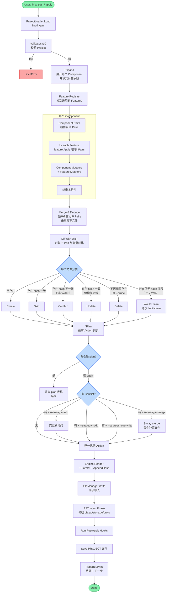
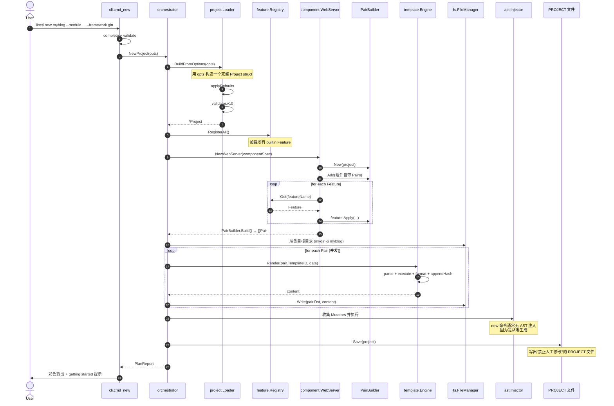
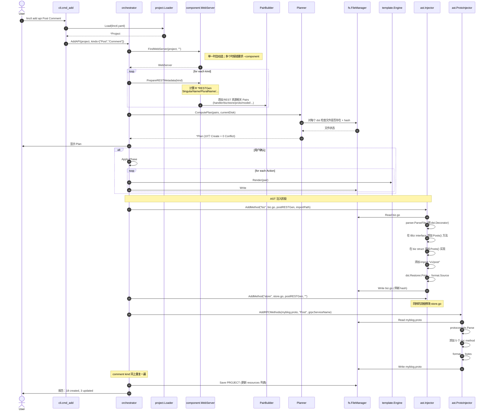
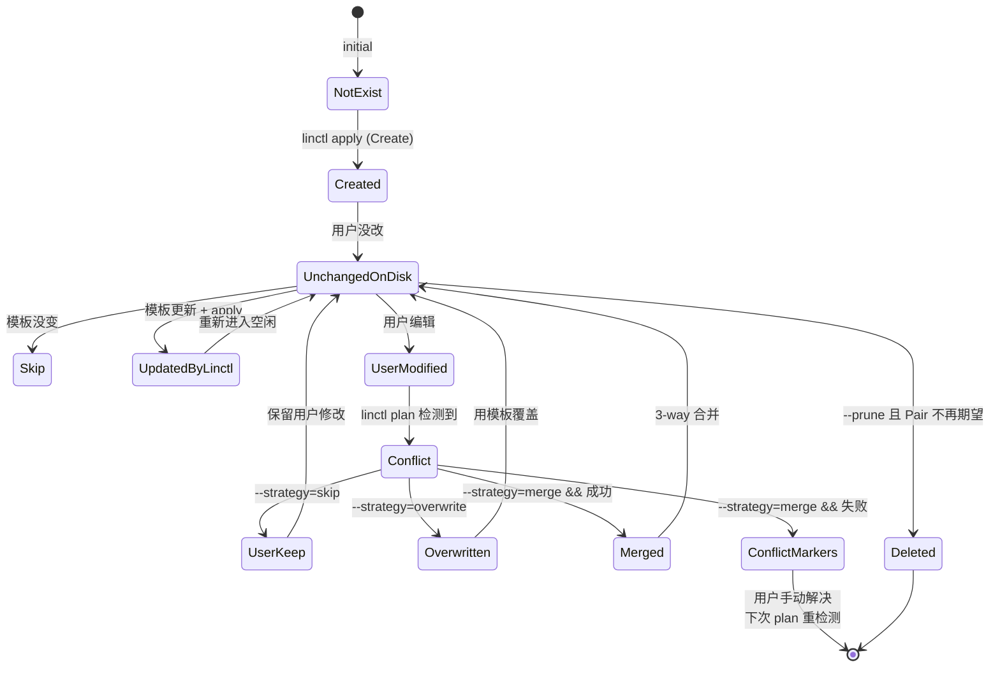
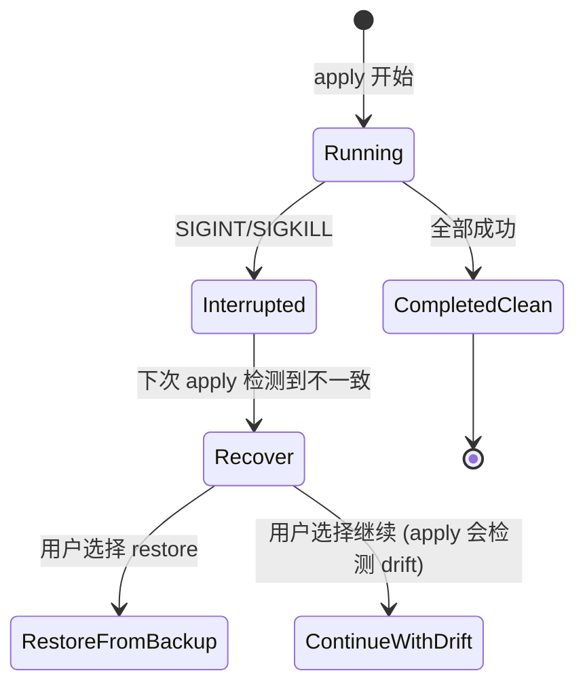

# 06. 代码生成流水线（Plan / Apply）

## 6.1 设计哲学

linctl 借鉴 **Terraform** 的设计：

> "**先看清要做什么，再做。**"

```
declaration → plan → review → apply → reconcile
```

- **plan** 阶段：纯计算，不做副作用，输出 `*Plan` 给用户审阅。
- **apply** 阶段：根据 `Plan` 执行，支持 dry-run、ask、merge 等冲突策略。
- **reconcile**：linctl 始终能从 `linctl.yaml` + 当前代码状态计算出"还需要做什么"。

## 6.2 整体流水线



## 6.3 关键数据结构

### 6.3.1 `Pair`

```go
// internal/codegen/pair.go
package codegen

type WriteMode string
const (
    WriteCreate       WriteMode = "create"        // 不存在则创建
    WriteUpdate       WriteMode = "update"        // 存在则覆盖（带 hash 检查）
    WriteSkipIfExists WriteMode = "skip_if_exists"// 存在则跳过（如 .keep 文件）
    WriteCopy         WriteMode = "copy"          // 不渲染，原样拷贝（如 .golangci.yaml）
)

type Pair struct {
    Dst        string    // 相对项目根的目标路径，如 "internal/myblog/biz/biz.go"
    TemplateID string    // embed.FS 中的模板路径
    Mode       WriteMode
    Owner      string    // 由哪个 Component/Feature 贡献，便于 plan 报告
}
```

### 6.3.2 `PairBuilder`

> **同 dst 后写覆盖策略**（决策见 [META-fix-decisions §1.14](./META-fix-decisions-2026-04-25.md)）：
> - 默认行为：记录为 `Override` 事件（plan 报告中显示），apply 时打印 `[WARN]`
> - `--strict` 模式：plan 直接 fail，列出冲突的 dst 与所有 owner
> - 这是显式契约，不再降级为 Debug 日志

```go
type OverrideEvent struct {
    Dst       string
    FromOwner string
    ToOwner   string
}

type PairBuilder struct {
    pairs     map[string]Pair  // dst → Pair（自动去重，后写覆盖前写）
    overrides []OverrideEvent  // 累计的覆盖事件，由 plan 统一显示
    strict    bool             // 由 --strict flag 注入
    project   *project.Project
}

func NewPairBuilder(p *project.Project, strict bool) *PairBuilder {
    return &PairBuilder{
        pairs:   make(map[string]Pair),
        strict:  strict,
        project: p,
    }
}

func (b *PairBuilder) Add(p Pair) *PairBuilder {
    if existing, ok := b.pairs[p.Dst]; ok {
        ev := OverrideEvent{Dst: p.Dst, FromOwner: existing.Owner, ToOwner: p.Owner}
        b.overrides = append(b.overrides, ev)
        log.L().Warn("pair override", "dst", p.Dst, "from", existing.Owner, "to", p.Owner)
        if b.strict {
            // strict 模式：将事件累计后由调用方在 Build() 时返回 error
            // 这里不直接 panic，便于一次性收集全部冲突
        }
    }
    b.pairs[p.Dst] = p
    return b
}

// Overrides 返回累计的覆盖事件，由 Planner 拷贝到 Plan.Stats / 报告中
func (b *PairBuilder) Overrides() []OverrideEvent { return b.overrides }

func (b *PairBuilder) AddMany(ps ...Pair) *PairBuilder {
    for _, p := range ps {
        b.Add(p)
    }
    return b
}

func (b *PairBuilder) Has(dst string) bool {
    _, ok := b.pairs[dst]
    return ok
}

func (b *PairBuilder) Build() ([]Pair, error) {
    if b.strict && len(b.overrides) > 0 {
        return nil, fmt.Errorf("strict mode: %d pair override(s) detected: %+v",
            len(b.overrides), b.overrides)
    }
    out := make([]Pair, 0, len(b.pairs))
    for _, p := range b.pairs {
        out = append(out, p)
    }
    return out, nil
}
```

### 6.3.3 `Plan` 与 `Action`

```go
// internal/codegen/plan.go
type Plan struct {
    Project   *project.Project
    Actions   []Action
    Stats     PlanStats
    CreatedAt time.Time
    Digest    string // sha256(canonical-json(Actions)); 用于 apply --plan 校验
}

type Action struct {
    Kind         ActionKind
    Pair         Pair
    Reason       string  // "template_updated" / "user_modified" / ...
    DiffPreview  string  // 5 行内的 diff 预览
    DiffFull     string  // 完整 diff（仅 --detailed 时打印）
    HashOld      string  // 文件原 hash
    HashNew      string  // 渲染后 hash
    EmbeddedHash string  // 文件内嵌的 // linctl: hash=xxx
}

type ActionKind string
const (
    ActionCreate     ActionKind = "create"
    ActionUpdate     ActionKind = "update"
    ActionSkip       ActionKind = "skip"
    ActionConflict   ActionKind = "conflict"
    ActionDelete     ActionKind = "delete"
    ActionWouldClaim ActionKind = "would_claim" // 文件存在但无 hash 注释，可执行 `linctl claim` 接管
)

type PlanStats struct {
    Create, Update, Skip, Conflict, Delete, WouldClaim int
    Override                                            int // PairBuilder 同 dst 后写覆盖事件数（见 §6.3.2）
}

func (p *Plan) Summary() string {
    return fmt.Sprintf("%d create, %d update, %d conflict, %d skip, %d delete, %d would_claim, %d override",
        p.Stats.Create, p.Stats.Update, p.Stats.Conflict, p.Stats.Skip,
        p.Stats.Delete, p.Stats.WouldClaim, p.Stats.Override)
}
```

> **`would_claim` 语义**（决策见 [META-fix-decisions §1.9](./META-fix-decisions-2026-04-25.md)）：
> 历史项目接入 linctl 时，已存在的文件没有 `// linctl: hash` 注释。这类文件不应被默默 Skip，而应在 plan 中显式列为 `would_claim`，提示用户：
>
> ```
> linctl claim <component>     # 强制接管所有 would_claim 文件
> linctl claim --pair <dst>    # 仅接管单个文件
> ```
>
> claim 行为：若文件内容与模板渲染**一致** → 仅追加 hash 注释；若**不一致** → 走标准冲突策略（ask/skip/overwrite/merge）。

## 6.4 时序图：`linctl new`



> 完整源文件见 [diagrams/seq-new-project.mmd](./diagrams/seq-new-project.mmd)。

## 6.5 时序图：`linctl add api`（含 AST 注入）



> 完整源文件见 [diagrams/seq-add-api.mmd](./diagrams/seq-add-api.mmd)。

## 6.6 时序图：`linctl plan` + `linctl apply` 完整闭环

```mermaid
sequenceDiagram
    autonumber
    actor User
    participant CLI as cli
    participant Orch as orchestrator
    participant Plan as Planner
    participant FM as fs.FileManager
    participant Apply as Applier
    participant Merger as 3-way merger
    participant UI as ui.Confirm

    Note over User,UI: ============ Plan Phase ============
    User->>CLI: linctl plan
    CLI->>Orch: Plan(project)
    Orch->>Plan: Compute()
    
    loop for each expected Pair
        Plan->>FM: Read(dst)
        alt 文件不存在
            Plan->>Plan: Action = Create
        else 文件存在
            Plan->>FM: Hash(dst)
            FM-->>Plan: diskHash
            Plan->>FM: ExtractEmbeddedHash(content)
            FM-->>Plan: embeddedHash, found
            Plan->>Plan: render content + ComputeHash → newHash
            
            alt found && embeddedHash == diskHash
                Note right of Plan: 文件未被人改过
                alt diskHash == newHash
                    Plan->>Plan: Action = Skip
                else
                    Plan->>Plan: Action = Update<br/>(模板有更新)
                end
            else
                Plan->>Plan: Action = Conflict<br/>(用户改过)
            end
        end
    end
    
    Plan-->>Orch: *Plan
    Orch->>UI: PrintPlan(p)
    UI-->>User: 彩色 plan 表格
    Note right of User: 用户审阅 plan<br/>决定是否 apply

    Note over User,UI: ============ Apply Phase ============
    User->>CLI: linctl apply --plan plan.json --strategy=merge
    CLI->>Orch: Apply(project, opts)

    alt opts.PlanFile != ""
        Orch->>Orch: 加载 plan.json
        Orch->>Plan: Compute() (重算并校验 digest)
        Plan-->>Orch: *Plan (新 digest)
        alt 新 digest == plan.json.digest
            Note right of Orch: ✅ 项目状态未变化，按 plan.json 执行
        else
            Orch->>UI: 报错：plan stale<br/>提示重新 linctl plan
            UI-->>User: ✗ digest mismatch
        end
    else 不带 --plan
        Orch->>Plan: Compute() (再次)
        Plan-->>Orch: *Plan (新 digest)
        Orch->>UI: stderr: [WARN] re-computing plan;<br/>use --plan for guaranteed determinism
    end

    alt Plan 中有 Conflict
        Orch->>UI: 显示冲突清单
        loop for each Conflict Action
            alt strategy = ask
                Orch->>UI: Confirm(file, options)
                UI-->>User: [k]eep [o]verwrite [m]erge [d]iff [s]kip [q]uit
                User-->>UI: 选择
                UI-->>Orch: choice
            else strategy = merge
                Orch->>Merger: Merge3Way(base, current, new)
                Note right of Merger: base = embeddedHash 对应的<br/>历史模板渲染结果<br/>(从 .linctl/cache/ 读)<br/>或重新渲染
                Merger-->>Orch: merged content
                alt 自动 merge 失败
                    Orch->>UI: 显示 conflict markers，让用户选择
                end
            end
        end
    end

    Orch->>FM: Backup current files → .linctl/backups/<ts>/
    
    loop for each Action
        Orch->>Apply: Execute(action)
        Apply->>Apply: Render
        Apply->>Apply: Format
        Apply->>Apply: AppendHash
        Apply->>FM: AtomicWrite
    end

    Orch->>Orch: AST Inject (如有)
    Orch->>Orch: Run PostApply Hooks
    Orch->>FM: Save PROJECT
    Orch->>UI: Report

    UI-->>User: Done. 18 files changed.
```

> 完整源文件见 [diagrams/seq-plan-apply.mmd](./diagrams/seq-plan-apply.mmd)。

### 6.6.1 Plan/Apply 防撕裂（digest 机制）

> 决策见 [META-fix-decisions §1.12](./META-fix-decisions-2026-04-25.md)。

**问题**：`plan` 和 `apply` 是两次独立调用，期间项目源码或 `linctl.yaml` 可能被修改，导致 `apply` 实际执行的动作与用户在 `plan` 阶段看到的清单不一致（撕裂）。

**机制**：

1. `linctl plan` 计算 `Plan.Digest = sha256(canonical-json(Actions))`，并在文本输出末尾打印；`-o json` 时 digest 嵌入根对象。
2. 持久化方式：`linctl plan -o json > plan.json`。
3. `linctl apply --plan plan.json` 时：
   - 重新执行 `Plan.Compute()`，得到新 digest。
   - **新 digest == plan.json.digest** → 按 `plan.json` 中的 actions 执行。
   - **digest 不匹配** → 立即 error 退出，提示用户重新 `linctl plan` 并复核。
4. `linctl apply` 不带 `--plan` 时：
   - 仍会 `Plan.Compute()` 一次后直接执行。
   - 但必须在 stderr 输出 `[WARN] re-computing plan; use --plan for guaranteed determinism`。

**canonical-json 规则**：

- 所有 map 按 key 字典序排序后序列化。
- `Action` 中的浮动字段（如 `DiffPreview`、`CreatedAt` 等）排除在 digest 计算外。
- 仅基于 `Kind`、`Pair.Dst`、`Pair.TemplateID`、`HashNew`、`EmbeddedHash` 等强决定性字段。

```go
// internal/codegen/digest.go
func (p *Plan) computeDigest() string {
    type actionDigest struct {
        Kind         string `json:"kind"`
        Dst          string `json:"dst"`
        TemplateID   string `json:"template_id"`
        HashNew      string `json:"hash_new"`
        EmbeddedHash string `json:"embedded_hash,omitempty"`
    }
    items := make([]actionDigest, len(p.Actions))
    for i, a := range p.Actions {
        items[i] = actionDigest{
            Kind:         string(a.Kind),
            Dst:          a.Pair.Dst,
            TemplateID:   a.Pair.TemplateID,
            HashNew:      a.HashNew,
            EmbeddedHash: a.EmbeddedHash,
        }
    }
    sort.Slice(items, func(i, j int) bool { return items[i].Dst < items[j].Dst })
    buf, _ := json.Marshal(items)
    sum := sha256.Sum256(buf)
    return hex.EncodeToString(sum[:])
}
```

## 6.7 Drift 检测的算法细节

### 6.7.1 文件状态识别算法

```go
// internal/codegen/planner.go
func (p *Planner) classifyFile(pair Pair, fm *fs.FileManager, eng *template.Engine, data any) (*Action, error) {
    a := &Action{Pair: pair}

    // Step 1: 渲染期望内容
    content, err := eng.Render(pair.TemplateID, data)
    if err != nil {
        return nil, err
    }
    content, err = eng.Format(pair.Dst, content)
    if err != nil {
        return nil, err
    }
    newHash := sha256Hex(content)
    a.HashNew = newHash

    // Step 2: 检查目标文件是否存在
    diskBytes, err := fm.Read(pair.Dst)
    if errors.Is(err, fs.ErrNotExist) {
        a.Kind = ActionCreate
        return a, nil
    }
    if err != nil {
        return nil, err
    }

    diskHash := sha256Hex(diskBytes)
    a.HashOld = diskHash

    // Step 3: 提取 embedded hash
    embeddedHash, found := fs.ExtractEmbeddedHash(diskBytes)
    a.EmbeddedHash = embeddedHash

    if !found {
        // 文件存在但无 hash 注释 → 历史代码，可被 linctl 接管
        // 决策见 META-fix-decisions §1.9：不再静默 Skip，而是标记 would_claim
        // 用户可执行 `linctl claim <component>` 或 `linctl claim --pair <dst>` 强制接管
        a.Kind = ActionWouldClaim
        a.Reason = "no_hash_comment_run_linctl_claim_to_take_ownership"
        return a, nil
    }

    // Step 4: 比较 disk hash 与 embedded hash
    diskBodyHash := sha256Hex(stripEmbeddedHash(diskBytes))
    if diskBodyHash != embeddedHash {
        // 用户改过文件
        a.Kind = ActionConflict
        a.Reason = "user_modified"
        return a, nil
    }

    // Step 5: 文件未被改过，与新模板对比
    if newHash == diskHash {
        a.Kind = ActionSkip
        a.Reason = "unchanged"
    } else {
        a.Kind = ActionUpdate
        a.Reason = "template_updated"
    }
    return a, nil
}
```

> 完整状态机见 [diagrams/state-file-lifecycle.mmd](./diagrams/state-file-lifecycle.mmd)。

### 6.7.2 文件生命周期状态图



## 6.8 3-way merge 实现

```go
// internal/codegen/merger.go
package codegen

import (
    "github.com/hexops/gotextdiff"
    "github.com/hexops/gotextdiff/myers"
    "github.com/hexops/gotextdiff/span"
)

// Merge3 执行 3-way merge
//   base:    上次 linctl apply 时的模板渲染结果（从 .linctl/cache/ 读）
//   current: 用户当前的磁盘内容（含用户修改）
//   new:     最新模板的渲染结果
//   dst:     目标文件路径（用于 verifier 选择编译/lint 工具）
// 返回合并后的内容，或 conflict marker 标记的部分合并结果。
//
// 决策见 META-fix-decisions §1.13：仅按行检测无冲突不足以保证可编译，
// 必须在合并完成后执行语言专属的 verify 步骤；verify 失败则降级为 conflict markers。
func Merge3(base, current, new []byte, dst string) (merged []byte, hasConflict bool, err error) {
    // 1) 计算 base→current 的 edit script (用户的修改)
    userEdits := myers.ComputeEdits(span.URI("base"), string(base), string(current))

    // 2) 计算 base→new 的 edit script (模板的更新)
    tplEdits := myers.ComputeEdits(span.URI("base"), string(base), string(new))

    // 3) 检查 edits 是否冲突 (是否操作了同一行)
    conflicts := detectConflicts(userEdits, tplEdits)

    if len(conflicts) == 0 {
        // 行级无冲突：尝试合并
        intermediate := gotextdiff.ApplyEdits(string(base), userEdits)
        result := gotextdiff.ApplyEdits(intermediate, rebaseTo(tplEdits, intermediate))
        candidate := []byte(result)

        // 4) 语义校验：合并后必须能编译/lint 通过；否则降级
        if err := verifyMerged(dst, candidate); err != nil {
            log.L().Warn("merge produced uncompilable result; falling back to conflict markers",
                "dst", dst, "err", err)
            return generateConflictMarkers(base, current, new, allLines(base)), true, nil
        }
        return candidate, false, nil
    }

    // 行级即冲突，直接生成 git-style conflict markers
    return generateConflictMarkers(base, current, new, conflicts), true, nil
}

// verifyMerged 根据文件类型对合并后的内容做强制校验：
//   .go    → 写入临时目录后 `go build -o /dev/null ./...`
//   .proto → `buf lint <tmp>`
//   其他   → 跳过（视为 OK）
func verifyMerged(dst string, content []byte) error {
    switch ext := filepath.Ext(dst); ext {
    case ".go":
        return verifyGoBuild(dst, content)
    case ".proto":
        return verifyBufLint(dst, content)
    default:
        return nil
    }
}

func verifyGoBuild(dst string, content []byte) error {
    tmpDir, err := os.MkdirTemp("", "linctl-merge-verify-*")
    if err != nil {
        return err
    }
    defer os.RemoveAll(tmpDir)

    // 复制项目到临时目录（仅相关 module），覆盖目标文件后执行 go build
    if err := copyModuleSubset(tmpDir, dst, content); err != nil {
        return err
    }
    cmd := exec.Command("go", "build", "-o", os.DevNull, "./...")
    cmd.Dir = tmpDir
    if out, err := cmd.CombinedOutput(); err != nil {
        return fmt.Errorf("go build failed:\n%s", out)
    }
    return nil
}

// generateConflictMarkers 生成类似 git 冲突标记
//   <<<<<<< current
//   user version
//   =======
//   template version
//   >>>>>>> new template
func generateConflictMarkers(base, current, new []byte, conflicts []ConflictRange) []byte {
    // ... 实现细节
    return nil
}
```

> **Phase 节奏**（与 [SSOT §1.13 / §5.4](./META-fix-decisions-2026-04-25.md#54-phase-1-build-校验例外) 对齐）：
> - **Phase 1**：`verifyGoBuild` 仅做 **targeted build**（只编译受影响文件 + 其 import closure，避免大项目 build 全量带来的耗时；该例外明确写入 SSOT §5.4）；`.proto` 跳过。
> - **Phase 2+**：升级为 **全量** `go build ./...`（与 SSOT §1.13 主线一致），并把 verify 结果纳入 plan 报告，便于 CI 提前看到。
> - **Phase 5**：支持插件注册自定义 verifier（如前端 TypeScript `tsc --noEmit`）。
>
> 前期降级策略：verify 失败时**一律**走 conflict marker（绝不写入半成品代码）。

## 6.9 备份策略

每次 `apply` 前自动创建备份：

```go
// internal/orchestrator/applier.go
func (a *Applier) backup(plan *Plan) error {
    if a.opts.NoBackup {
        return nil
    }
    backupDir := filepath.Join(".linctl/backups", time.Now().Format("20060102-150405"))
    if err := os.MkdirAll(backupDir, 0o755); err != nil {
        return err
    }
    
    var toBackup []string
    for _, action := range plan.Actions {
        if action.Kind == ActionUpdate || action.Kind == ActionConflict || action.Kind == ActionDelete {
            toBackup = append(toBackup, action.Pair.Dst)
        }
    }
    
    for _, path := range toBackup {
        src := filepath.Join(a.workDir, path)
        dst := filepath.Join(backupDir, path)
        if err := os.MkdirAll(filepath.Dir(dst), 0o755); err != nil {
            return err
        }
        if err := copyFile(src, dst); err != nil {
            return err
        }
    }
    
    log.L().Info("backup created", "dir", backupDir, "files", len(toBackup))
    return nil
}
```

`.linctl/backups/` 加入 `.gitignore`：

```
# .gitignore
.linctl/
!.linctl/lock.yaml
```

`.linctl/lock.yaml` 是文件级 hash 索引（用于跨进程持久化），保留在 git 里。

## 6.10 .linctl/lock.yaml 设计

```yaml
# .linctl/lock.yaml
apiVersion: linctl.dev/v1
kind: Lock
metadata:
  cliVersion: v1.0.0
  generatedAt: 2026-04-25T10:00:00Z

# 每个 generated 文件的 hash + owner（贡献者）
files:
  internal/myblog/biz/biz.go:
    hash: abc123...
    owner: WebServer:mb-apiserver
    template: framework/gin/biz/biz.go.tpl
  internal/myblog/biz/v1/post/post.go:
    hash: def456...
    owner: WebServer:mb-apiserver:Post
    template: framework/gin/biz/v1/post.go.tpl
  pkg/api/myblog/v1/myblog.proto:
    hash: ghi789...
    owner: WebServer:mb-apiserver
    template: framework/grpc/api/apiserver.proto.tpl
    # 由 AST 注入额外修改的方法记录
    astModifications:
      - kind: rpc_methods
        added:
          - CreatePost
          - UpdatePost
          - DeletePost
          - GetPost
          - ListPost
```

**用途**：
1. **Drift 检测**：lock.yaml 中的 hash 是"上次 apply 后"的快照，与磁盘 hash 对比可知用户是否改过。
2. **Pruning**：当 `linctl.yaml` 中删除了某 Component，lock.yaml 中对应的 owner 文件可被清理（apply --prune）。
3. **审计**：CI 可以校验 lock.yaml 与 linctl.yaml 一致。
4. **3-way merge base**：保存上次模板渲染的内容，作为 merge 的 base。

> 实际实现可以更紧凑：用 `internal/fs/lock.go` 封装。

## 6.11 性能预算

| 阶段 | 1000 文件项目预算 |
| --- | --- |
| Load + validate | < 50ms |
| Expand + collect Pairs | < 100ms |
| Render all (并发) | < 800ms |
| Diff with disk | < 500ms |
| AST inject (5 个文件) | < 200ms |
| Backup + Write | < 300ms |
| Save PROJECT | < 20ms |
| **Total** | **< 2s** |

## 6.12 错误恢复策略

apply 中途失败时的恢复：

1. **写文件失败**：`fs.Write` 用原子 rename，失败时不会留半成品。
2. **AST 注入失败**：当前文件回滚到 `.bak`（apply 前自动备份），之前的修改保留（已经写入磁盘）。
3. **Hook 失败**：postApply hook 失败 → 报警但不回滚（用户可手动修复）。
4. **整体失败**：用户可 `linctl restore --from .linctl/backups/<ts>` 一键回退。

```go
// internal/cli/cmd_restore.go (Phase 4)
func newCmdRestore() *cobra.Command {
    cmd := &cobra.Command{
        Use: "restore",
        RunE: func(cmd *cobra.Command, args []string) error {
            backupDir := mustNonEmpty(cmd.Flags().GetString("from"))
            if err := orchestrator.Restore(cmd.Context(), backupDir); err != nil {
                return err
            }
            return nil
        },
    }
    cmd.Flags().String("from", "", "Backup directory to restore from")
    cmd.Flags().Bool("latest", false, "Restore from latest backup")
    return cmd
}
```

## 6.13 并发与一致性（团队 / CI 场景）

> 当多人/CI 同时对同一个项目跑 `linctl apply` 时，必须避免文件损坏 / lock.yaml 错乱 / 备份覆盖。本节描述并发场景的设计契约。

### 6.13.1 并发风险场景

| # | 场景 | 风险 |
| --- | --- | --- |
| C1 | 开发者 A 跑 `apply`，同时 CI 触发 `apply` | 两个进程同时写 `lock.yaml`，最终版本未定义 |
| C2 | 同一 CI runner 上多个 job 并行跑 `linctl plan` | hash 缓存 / .linctl/cache/ 互相覆盖 |
| C3 | 用户开两个 shell，同时跑 `linctl add api` 和 `linctl add worker` | biz.go 两次 AST 注入，可能重复字段 |
| C4 | `apply` 中途用户 Ctrl-C 退出 | 半成品文件 + 不一致的 lock.yaml |

### 6.13.2 文件锁策略

> **⚠️ 命名澄清**：本节涉及两个易混淆的文件：
> - `.linctl/lock` —— **本节**讨论的进程互斥锁（flock 文件，无后缀，不入 git）
> - `.linctl/lock.yaml` —— [§6.10](#610-linctllockyaml-设计) 中讨论的文件级 hash 索引（YAML 文件，**入 git**）
>
> 这是 linctl 中**两个独立机制**：lock 解决"并发互斥"，lock.yaml 解决"drift 追踪"。

linctl 在 `.linctl/lock` 上使用 **flock** 保护，确保任何 `apply` 操作互斥。

> **关键语义**（决策见 [META-fix-decisions §1.11 / §5.5](./META-fix-decisions-2026-04-25.md#55-flock-跨平台-timeout-语义)）：
> - 默认行为：**阻塞 + 30 秒超时**，期间允许其他进程持锁的工作完成
> - 可调超时：`linctl <cmd> --lock-timeout 60s`
> - 实现：`syscall.Flock(LOCK_EX)` 在 goroutine 中阻塞调用 + 主 goroutine 用 `select + time.After` 超时
> - **不使用 `LOCK_NB`**（非阻塞）—— 如此才能在团队/CI 场景"短暂等待"，而不是立刻 fail
>
> ⚠️ **timeout 的真实含义与跨平台限制**（详见 SSOT §5.5）：
> - **timeout 仅意味着「主调用返回错误」**，不保证立即解锁——子 goroutine 可能仍卡在内核 `Flock(LOCK_EX)` 系统调用中。
> - **OS 释放保证**：当进程退出时，OS 会自动释放该进程所有 fd 与对应的 flock。因此**超时后调用方应退出进程**（`os.Exit`），避免子 goroutine 长期卡在内核态。
> - **跨平台支持**：MVP 仅支持 **Linux / macOS**（POSIX flock）。Windows 实现在 Tier 2（参考 ADR：使用 `LockFileEx` + `LOCKFILE_FAIL_IMMEDIATELY`）。
> - **未来优化**：Tier 2+ 可改为 `LOCK_NB + 100ms 重试循环`（避免 goroutine 卡内核），但需评估对 CI 场景的延迟影响。

```go
// internal/fs/lock.go
package fs

import (
    "context"
    "fmt"
    "os"
    "path/filepath"
    "syscall"
    "time"
)

const DefaultLockTimeout = 30 * time.Second

type ProjectLock struct {
    file *os.File
}

// AcquireLock 获取项目级排他锁。
//   timeout == 0 时使用 DefaultLockTimeout（30s）。
//   阻塞 + 超时语义：goroutine 内执行阻塞 LOCK_EX，主线程 select 等待 done 或超时。
func AcquireLock(ctx context.Context, rootDir string, timeout time.Duration) (*ProjectLock, error) {
    if timeout == 0 {
        timeout = DefaultLockTimeout
    }
    if err := os.MkdirAll(filepath.Join(rootDir, ".linctl"), 0o755); err != nil {
        return nil, err
    }
    lockPath := filepath.Join(rootDir, ".linctl", "lock")
    f, err := os.OpenFile(lockPath, os.O_CREATE|os.O_RDWR, 0o644)
    if err != nil {
        return nil, err
    }

    done := make(chan error, 1)
    go func() {
        // 阻塞调用：syscall.Flock(LOCK_EX) 会一直等到锁可用
        done <- syscall.Flock(int(f.Fd()), syscall.LOCK_EX)
    }()

    select {
    case err := <-done:
        if err != nil {
            f.Close()
            return nil, fmt.Errorf("flock %s: %w", lockPath, err)
        }
        // 锁已获得，写入当前 pid 便于诊断
        f.Truncate(0)
        f.Seek(0, 0)
        fmt.Fprintf(f, "%d\n", os.Getpid())
        return &ProjectLock{file: f}, nil

    case <-time.After(timeout):
        // ⚠️ Flock 系统调用本身阻塞且**不可中断**：
        // 即使主 goroutine 通过 select 返回了 timeout 错误，
        // 另一个 goroutine 仍可能卡在 syscall.Flock(LOCK_EX) 内核态。
        // f.Close() 在 Linux/macOS 上**通常**会让阻塞的 Flock 返回 EBADF（释放 fd），
        // 但这不是 POSIX 保证的行为，跨平台不可移植。
        // 推荐策略：超时返回错误后，**调用方应该退出进程**（让 OS 在进程终止时
        // 自动释放该子 goroutine 持有的所有 fd 与 flock）。
        f.Close()
        return nil, fmt.Errorf(
            "timed out (%s) waiting for project lock on %s; "+
                "another linctl process may be running. Use --lock-timeout to wait longer. "+
                "Note: this process should exit to release internal resources",
            timeout, lockPath)

    case <-ctx.Done():
        f.Close()
        return nil, ctx.Err()
    }
}

func (l *ProjectLock) Release() error {
    if err := syscall.Flock(int(l.file.Fd()), syscall.LOCK_UN); err != nil {
        return err
    }
    return l.file.Close()
}
```

**使用方式**：

```go
// 所有"会写文件"的命令（apply / add / new）开始时
lock, err := fs.AcquireLock(ctx, rootDir, opts.LockTimeout)
if err != nil {
    return err  // 报错给用户：超时 / context 取消 / flock 系统错误
}
defer lock.Release()
```

> Windows 平台用 `golang.org/x/sys/windows.LockFileEx` 实现等价语义（同样以 goroutine + select 包裹阻塞调用，避免 `LOCKFILE_FAIL_IMMEDIATELY`）。

### 6.13.3 lock.yaml 的写入流程

```
1. AcquireLock                                    # flock .linctl/lock
2. 读取当前 lock.yaml （可能不存在）
3. 计算新 lock.yaml （加入本次 apply 的 hash）
4. 原子写：写到 .linctl/lock.yaml.tmp → rename
5. ReleaseLock
```

### 6.13.4 CI 场景的幂等保证

CI 场景要求"重复跑 `linctl apply` 必须产生相同结果"：

```yaml
# .github/workflows/regenerate.yml （示例）
- name: Regenerate code
  run: |
    linctl apply --strategy=overwrite --no-backup
    if ! git diff --quiet; then
      echo "Generated code is out of date"
      git diff
      exit 1
    fi
```

为支持上述 workflow，linctl 必须满足：

1. **确定性输出**：同一份 `linctl.yaml` + 同一份模板产生**字节级**相同的文件。
   - **不能**包含时间戳（如 `// Generated at 2026-04-25 10:00:00`） → 改为 `currentYear` 或省略。
   - **不能**包含 `os.Hostname()` / 进程 PID / random number。
2. **`apply --no-backup`**：CI 不需要 backup，跳过。
3. **`apply --strategy=overwrite`**：CI 不需要交互。

### 6.13.5 中断恢复（Ctrl-C / OOM）



**实现策略**：

1. apply 开始前写入 `.linctl/state` 文件，标记 `in_progress`。
2. 完成后写 `completed`。
3. 下次 apply 检测到 `in_progress`：
   - 提示用户："上次 apply 未完成，是否：[r]estore 上次 backup / [c]ontinue (检测 drift) / [a]bort"
4. backup 默认带 timestamp + `STATUS` 文件，标识 backup 完整性。

### 6.13.6 跨进程 cache 一致性

`.linctl/cache/<file_path>/<hash>` 缓存上次模板渲染结果（用于 3-way merge 的 base）。多进程并发时：

- 每次写入用 `os.CreateTemp + Rename`，原子保证。
- 读时用 sha256 校验文件 vs 文件名 hash，不一致则视为缓存损坏 → 重新生成。

### 6.13.7 测试策略

```go
// tests/integration/concurrent_apply_test.go
func TestConcurrentApplyTimesOut(t *testing.T) {
    rootDir := t.TempDir()
    setupProject(t, rootDir)
    ctx := context.Background()

    // 模拟一个 apply 持有锁
    lock1, err := fs.AcquireLock(ctx, rootDir, fs.DefaultLockTimeout)
    require.NoError(t, err)
    defer lock1.Release()

    // 另一个 apply 应在短超时后失败（不再立刻 fail，验证阻塞+超时语义）
    start := time.Now()
    _, err = fs.AcquireLock(ctx, rootDir, 200*time.Millisecond)
    elapsed := time.Since(start)
    require.Error(t, err)
    require.Contains(t, err.Error(), "timed out")
    require.GreaterOrEqual(t, elapsed, 200*time.Millisecond)
}

func TestApplyIsDeterministic(t *testing.T) {
    rootDir := t.TempDir()
    setupProject(t, rootDir)

    runApply(t, rootDir)
    snapshot1 := hashAllFiles(t, rootDir)

    // 重置 + 再 apply
    cleanProject(t, rootDir)
    runApply(t, rootDir)
    snapshot2 := hashAllFiles(t, rootDir)

    require.Equal(t, snapshot1, snapshot2, "apply is not deterministic")
}
```

### 6.13.8 与安全模型的关系

> 文件锁不解决安全问题，仅解决一致性问题。安全相关（如恶意 hook、路径越界）见 [15-security-model.md](./15-security-model.md)。

## 6.14 与 osbuilder 流水线的对照

| 维度 | osbuilder | linctl |
| --- | --- | --- |
| 流程 | 一遍走到底（Run 一次） | Plan → User Confirm → Apply 两阶段 |
| 幂等保护 | 文件存在则跳过 | 基于 hash 的精确 drift 检测 |
| 冲突处理 | 无（全靠 --force） | 4 种策略：skip/overwrite/merge/ask |
| 备份 | 仅 proto 改动有 .bak | apply 前自动全量备份到 .linctl/backups/ |
| 审计 | 仅 PROJECT | + lock.yaml + backup 历史 |
| Pruning | 不支持 | apply --prune |
| dry-run | 仅 semver 有 | 全命令默认支持 |
| 并发 | 串行渲染 | errgroup 并发 |

---

下一步阅读：[07-ast-injection.md](./07-ast-injection.md)

_Last reviewed: 2026-04-25_
