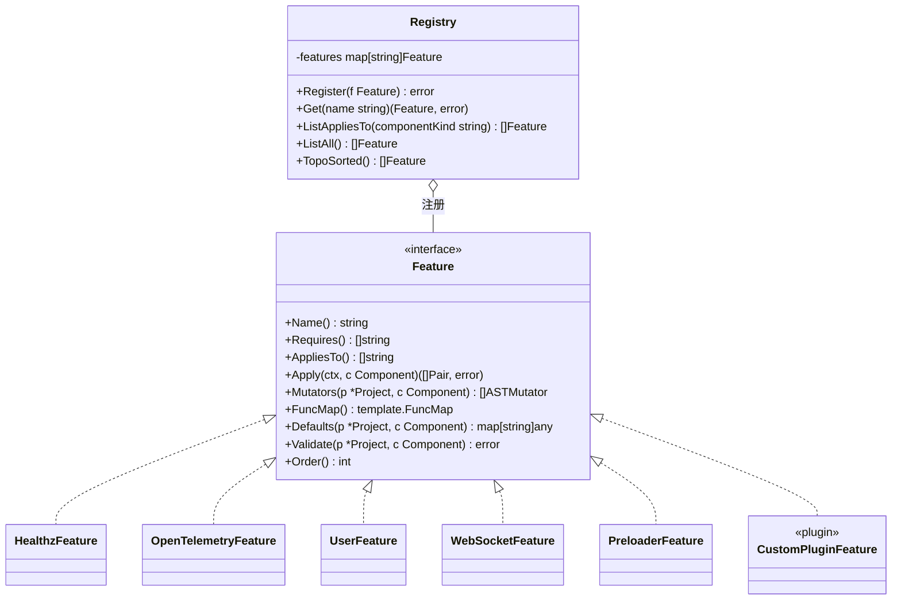
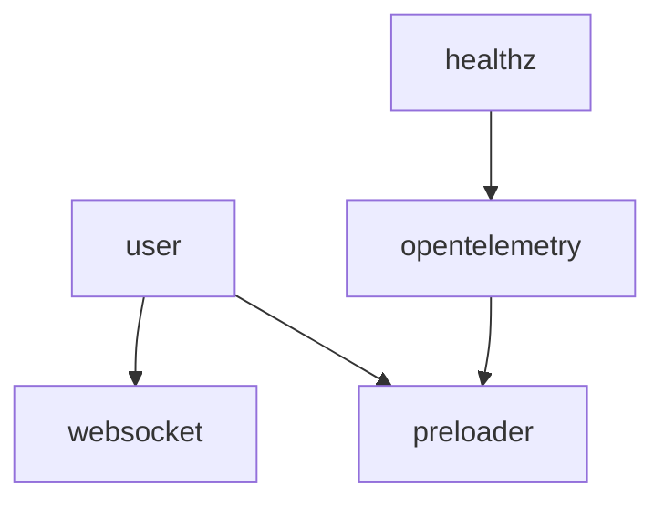
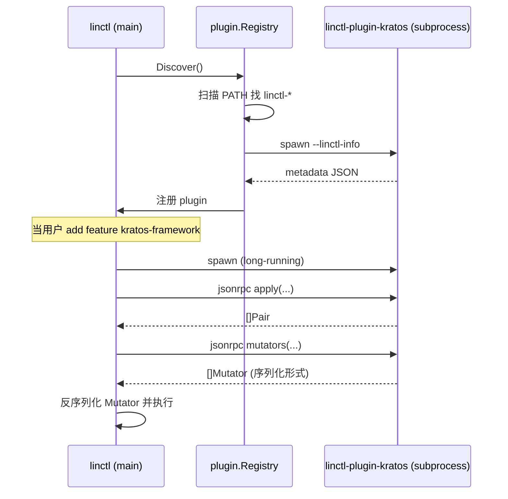

# 08. Feature 系统设计

## 8.1 为什么需要 Feature 系统

osbuilder 的 `WebServer.Pairs()` 函数 ~170 行，混合了：

```go
if ws.WithUser     { /* 加 8~10 个文件 */ }
if ws.WithHealthz  { /* 加 2~3 个文件 */ }
if ws.WithOTel     { /* 加 1~2 个文件 */ }
if ws.WithWS       { /* 加 4~5 个文件 */ }
if ws.WithPreloader{ /* 加 2~3 个文件 */ }
switch ws.WebFramework { /* 5 个分支 */ }
switch ws.ServiceRegistry { /* 4 个分支 */ }
```

**问题**：
- 想加新特性（如 Sentry、Audit Log）必须改这个核心函数。
- 不同特性之间有隐式耦合（user 必须先于 OTel 添加，否则 metrics 配置会丢字段）。
- 无法让第三方贡献者添加特性。
- 测试困难，必须把所有 if 都覆盖一遍。

linctl 的解法：把"特性"提升为一等公民，**Feature** 接口 + **Registry** 注册中心 + **插件机制**。

## 8.2 Feature 类图



> 完整源文件见 [diagrams/architecture-feature.mmd](./diagrams/architecture-feature.mmd)。

## 8.3 Feature 接口完整定义

```go
// internal/feature/feature.go
package feature

import (
    "context"
    "text/template"

    "github.com/<org>/linctl/internal/ast"
    "github.com/<org>/linctl/internal/codegen"
    "github.com/<org>/linctl/internal/project"
)

// Feature 描述一个横切能力（如 OTel / 鉴权 / 缓存）
//
// ⚠️ 接口方法中的 `c project.Component` 是 YAML 反序列化的 struct（来自 04-config-schema.md），
//    不是 component.Component 接口（来自 09-component-design.md）。
//    详见 99-glossary.md 中 Component 条目的明确区分。
//
// 决策见 META-fix-decisions §1.15、§1.16：
//   - 使用 Requires() + 拓扑排序作为执行顺序的主决策
//   - Order() 仅作同层 tie-break
//   - Apply 不再接收 mutable 引用，改为返回 []Pair 让调度器统一聚合
type Feature interface {
    // Name 返回 Feature 的全局唯一名称（小写、kebab-case）
    Name() string

    // Requires 返回本 Feature 直接依赖的其它 Feature 名称列表
    // 调度器使用拓扑排序保证 Requires() 中的 Feature 先于本 Feature 执行
    // 检测到环时启动失败并打印环路（见 §8.6.1）
    Requires() []string

    // AppliesTo 返回该 Feature 适用于哪些 Component 类型
    // 例: ["WebServer"] 仅 web；["WebServer", "Worker"] 多种
    AppliesTo() []string

    // Apply 计算并返回本 Feature 贡献的 Pair 列表（纯函数，不修改入参）
    //   - ctx 用于取消 / 超时
    //   - c 是 YAML 反序列化得到的配置 struct，必须**只读**（不再写 c.Resources 之类字段）
    //   - Resource 注入由调度器在 Apply 之外统一完成（见 ResourceContributions）
    Apply(ctx context.Context, c project.Component) ([]codegen.Pair, error)

    // ResourceContributions 返回本 Feature 要为该 Component 注入的 Resource 集合
    // （替代旧版本中 UserFeature.Apply 直接 append c.Resources 的反模式）
    // 调度器在拓扑排序后聚合所有 Feature 的 ResourceContributions，统一注入到 Project 中
    // 详见 META-fix-decisions §1.16 与 §5.10
    ResourceContributions(c project.Component) []project.Resource

    // Mutators 返回该 Feature 需要执行的 AST 修改
    // 例: OTel feature 需要给 server.go 加 InitTracer/Meter 代码
    Mutators(p *project.Project, c project.Component) []ast.ASTMutator

    // FuncMap 返回该 Feature 提供的模板函数（可选）
    // 注册到全局 FuncMap 后，所有模板都能用
    FuncMap() template.FuncMap

    // Defaults 返回该 Feature 的默认配置贡献
    // 例: OTel feature 贡献 telemetry.tracing="otlp" 默认值
    // ⚠️ 必须返回新的 map，禁止修改 p / c
    Defaults(p *project.Project, c project.Component) map[string]any

    // Validate 校验该 Feature 在当前 Project 上的合法性
    // 例: WebSocket feature 要求 framework=gin
    Validate(p *project.Project, c project.Component) error

    // Order 同层 tie-break 用：当多个 Feature 没有相互 Requires 关系且
    // 拓扑排序仍存在并列时，按 Order 升序执行。默认 0。
    Order() int
}
```

## 8.4 Registry 实现

```go
// internal/feature/registry.go
package feature

import (
    "fmt"
    "sort"
    "sync"
)

type Registry struct {
    mu       sync.RWMutex
    features map[string]Feature
}

func NewRegistry() *Registry {
    return &Registry{features: make(map[string]Feature)}
}

func (r *Registry) Register(f Feature) error {
    r.mu.Lock()
    defer r.mu.Unlock()
    if _, exists := r.features[f.Name()]; exists {
        return fmt.Errorf("feature %q already registered", f.Name())
    }
    r.features[f.Name()] = f
    return nil
}

func (r *Registry) Get(name string) (Feature, error) {
    r.mu.RLock()
    defer r.mu.RUnlock()
    f, ok := r.features[name]
    if !ok {
        return nil, fmt.Errorf("feature %q not registered. Available: %v", name, r.list())
    }
    return f, nil
}

// ListAppliesTo 返回作用于 componentKind 的 Feature，按依赖拓扑排序后输出。
// 同层 tie-break 用 Order() 升序，再用 Name 字典序保证稳定。
//
// 决策见 META-fix-decisions §1.15：依赖关系一律由 Requires() 表达，
// Order() 不再承担"隐式依赖"职责。
func (r *Registry) ListAppliesTo(componentKind string) ([]Feature, error) {
    r.mu.RLock()
    defer r.mu.RUnlock()

    candidates := make(map[string]Feature)
    for _, f := range r.features {
        for _, k := range f.AppliesTo() {
            if k == componentKind || k == "*" {
                candidates[f.Name()] = f
                break
            }
        }
    }
    return topoSort(candidates)
}

// topoSort: Kahn 算法，依赖关系来自 Feature.Requires()。
// 检测到环 → 返回 error（启动失败 + 列出环路），而不是默默丢弃。
// 同层 tie-break: Order() asc, Name asc。
func topoSort(features map[string]Feature) ([]Feature, error) {
    inDegree := map[string]int{}
    edges := map[string][]string{} // from → []to
    for name, f := range features {
        if _, ok := inDegree[name]; !ok {
            inDegree[name] = 0
        }
        for _, dep := range f.Requires() {
            if _, ok := features[dep]; !ok {
                return nil, fmt.Errorf("feature %q requires unknown feature %q", name, dep)
            }
            edges[dep] = append(edges[dep], name)
            inDegree[name]++
        }
    }

    var ready []Feature
    for name, deg := range inDegree {
        if deg == 0 {
            ready = append(ready, features[name])
        }
    }
    sortLayer(ready)

    var out []Feature
    for len(ready) > 0 {
        next := ready[0]
        ready = ready[1:]
        out = append(out, next)
        for _, child := range edges[next.Name()] {
            inDegree[child]--
            if inDegree[child] == 0 {
                ready = append(ready, features[child])
                sortLayer(ready)
            }
        }
    }
    if len(out) != len(features) {
        return nil, fmt.Errorf("feature dependency cycle detected; remaining: %v", remaining(inDegree))
    }
    return out, nil
}

func sortLayer(fs []Feature) {
    sort.Slice(fs, func(i, j int) bool {
        if fs[i].Order() != fs[j].Order() {
            return fs[i].Order() < fs[j].Order()
        }
        return fs[i].Name() < fs[j].Name()
    })
}

func (r *Registry) ListAll() []Feature {
    r.mu.RLock()
    defer r.mu.RUnlock()
    out := make([]Feature, 0, len(r.features))
    for _, f := range r.features {
        out = append(out, f)
    }
    sort.Slice(out, func(i, j int) bool { return out[i].Name() < out[j].Name() })
    return out
}

func (r *Registry) list() []string {
    out := make([]string, 0, len(r.features))
    for n := range r.features {
        out = append(out, n)
    }
    sort.Strings(out)
    return out
}

// 全局 Registry，由 init() 初始化
var Default = NewRegistry()

func MustRegister(f Feature) {
    if err := Default.Register(f); err != nil {
        panic(err)
    }
}
```

## 8.5 内置 Feature 实现示例

### 8.5.1 HealthzFeature

```go
// internal/feature/builtin/healthz.go
package builtin

import (
    "text/template"

    "github.com/<org>/linctl/internal/ast"
    "github.com/<org>/linctl/internal/codegen"
    "github.com/<org>/linctl/internal/feature"
    "github.com/<org>/linctl/internal/project"
)

type HealthzFeature struct{}

func init() { feature.MustRegister(&HealthzFeature{}) }

func (*HealthzFeature) Name() string { return "healthz" }
func (*HealthzFeature) Requires() []string { return nil } // 无依赖，独立基础能力
func (*HealthzFeature) AppliesTo() []string { return []string{"WebServer"} }
func (*HealthzFeature) Order() int { return 200 } // tie-break：晚于 user feature
func (*HealthzFeature) FuncMap() template.FuncMap { return nil }
func (*HealthzFeature) Defaults(*project.Project, project.Component) map[string]any { return nil }

func (*HealthzFeature) Validate(p *project.Project, c project.Component) error {
    if c.Framework != "gin" && c.Framework != "grpc" {
        return fmt.Errorf("healthz only supports gin/grpc framework, got %s", c.Framework)
    }
    return nil
}

func (*HealthzFeature) Apply(ctx context.Context, c project.Component) ([]codegen.Pair, error) {
    apiDir := apiDirOf(c)
    handlerDir := handlerDirOf(c)

    pairs := []codegen.Pair{
        {
            Dst:        filepath.Join(apiDir, "healthz.proto"),
            TemplateID: "templates/feature/healthz/healthz.proto",
            Mode:       codegen.WriteCreate,
            Owner:      ownerKey("healthz", c.Name),
        },
    }

    switch c.Framework {
    case "gin":
        pairs = append(pairs, codegen.Pair{
            Dst:        filepath.Join(handlerDir, "healthz.go"),
            TemplateID: "templates/feature/healthz/handler_gin.go.tpl",
            Mode:       codegen.WriteCreate,
            Owner:      ownerKey("healthz", c.Name),
        })
    case "grpc":
        pairs = append(pairs,
            codegen.Pair{
                Dst:        filepath.Join(handlerDir, "healthz.go"),
                TemplateID: "templates/feature/healthz/handler_grpc.go.tpl",
                Mode:       codegen.WriteCreate,
                Owner:      ownerKey("healthz", c.Name),
            },
            codegen.Pair{
                Dst:        "examples/client/health/main.go",
                TemplateID: "templates/feature/healthz/client_grpc.go.tpl",
                Mode:       codegen.WriteCreate,
                Owner:      ownerKey("healthz", c.Name),
            },
        )
    }
    return pairs, nil
}

func (*HealthzFeature) Mutators(p *project.Project, c project.Component) []ast.ASTMutator {
    if c.Framework != "grpc" {
        return nil
    }
    // 给 grpc 的 .proto 加 Healthz service
    return []ast.ASTMutator{
        &ast.AddProtoRPCMutator{
            File:        protoMainFile(p, c),
            ServiceName: c.GRPCServiceName(),
            Methods: []ast.ProtoRPCMethod{
                {Name: "Healthz", RequestType: "HealthzRequest", ResponseType: "HealthzResponse"},
            },
            Imports: []string{healthzProtoPath(p, c)},
        },
    }
}
```

### 8.5.2 OpenTelemetryFeature

```go
// internal/feature/builtin/opentelemetry.go
package builtin

// ObservabilityFeature（在 §8.5 中以 opentelemetry 为名称呈现）
// 依赖 healthz：探针 endpoint 必须先存在才能挂上 OTel 中间件
type OpenTelemetryFeature struct{}

func init() { feature.MustRegister(&OpenTelemetryFeature{}) }

func (*OpenTelemetryFeature) Name() string { return "opentelemetry" }
func (*OpenTelemetryFeature) Requires() []string { return []string{"healthz"} } // 见 META-fix-decisions §1.15 示例
func (*OpenTelemetryFeature) AppliesTo() []string { return []string{"WebServer", "Worker"} }
func (*OpenTelemetryFeature) Order() int { return 0 } // 拓扑已决定顺序，无需 tie-break

func (*OpenTelemetryFeature) FuncMap() template.FuncMap {
    return template.FuncMap{
        "otelTracerName":  func(c project.Component) string { return c.Name + "-tracer" },
        "otelMeterName":   func(c project.Component) string { return c.Name + "-meter" },
    }
}

// Defaults 必须返回新 map，禁止改 p（决策 §1.16）
func (*OpenTelemetryFeature) Defaults(p *project.Project, c project.Component) map[string]any {
    return map[string]any{
        "spec.defaults.telemetry.tracing": "otlp",
    }
}

func (*OpenTelemetryFeature) Validate(*project.Project, project.Component) error { return nil }

func (*OpenTelemetryFeature) Apply(ctx context.Context, c project.Component) ([]codegen.Pair, error) {
    pkgDir := pkgDirOf(c)

    return []codegen.Pair{
        {
            Dst:        filepath.Join(pkgDir, "observability/otel.go"),
            TemplateID: "templates/feature/opentelemetry/otel.go.tpl",
            Mode:       codegen.WriteCreate,
            Owner:      ownerKey("opentelemetry", c.Name),
        },
        {
            Dst:        filepath.Join(pkgDir, "observability/metrics.go"),
            TemplateID: "templates/feature/opentelemetry/metrics.go.tpl",
            Mode:       codegen.WriteCreate,
            Owner:      ownerKey("opentelemetry", c.Name),
        },
        {
            Dst:        "configs/observability.yaml",
            TemplateID: "templates/feature/opentelemetry/observability.yaml.tpl",
            Mode:       codegen.WriteCreate,
            Owner:      ownerKey("opentelemetry", c.Name),
        },
        {
            Dst:        "docs/zh-CN/operations/otel.md",
            TemplateID: "templates/feature/opentelemetry/otel.md.tpl",
            Mode:       codegen.WriteCreate,
            Owner:      ownerKey("opentelemetry", c.Name),
        },
    }, nil
}

func (*OpenTelemetryFeature) Mutators(p *project.Project, c project.Component) []ast.ASTMutator {
    serverGo := filepath.Join("internal", c.Name, "server.go")
    importPath := p.Metadata.Module + "/internal/" + c.Name + "/pkg/observability"

    return []ast.ASTMutator{
        // 给 server.go 加 import
        &ast.AddImportMutator{
            File:       serverGo,
            ImportPath: importPath,
        },
        // 给 server.go 的 Run 函数加 InitOTel 调用
        &ast.AddStatementToFuncMutator{
            File:           serverGo,
            ReceiverType:   "*Server",
            FuncName:       "Run",
            Position:       ast.PositionAtStart,
            StatementExpr:  "if err := observability.InitOTel(ctx); err != nil { return err }",
        },
    }
}
```

### 8.5.3 UserFeature（最复杂示例）

```go
// internal/feature/builtin/user.go
package builtin

type UserFeature struct{}

func init() { feature.MustRegister(&UserFeature{}) }

func (*UserFeature) Name() string { return "user" }
func (*UserFeature) Requires() []string { return nil } // 基础能力，无依赖
func (*UserFeature) AppliesTo() []string { return []string{"WebServer"} }
func (*UserFeature) Order() int { return 100 } // tie-break：早于 healthz feature

func (*UserFeature) Validate(p *project.Project, c project.Component) error {
    // user feature 需要存储后端
    if c.Storage == "memory" {
        return linctlerr.New(linctlerr.ErrConfigInvalid,
            "user feature requires persistent storage (got memory)",
            "Set component.storage to one of: gorm-mysql, gorm-postgres, gorm-sqlite")
    }
    return nil
}

// Apply 必须是纯函数：不修改入参 c，不写 c.Resources。
// 如需注入 "user" 作为 REST 资源，由 UserFeature.ResourceContributions()（见下）
// 声明，调度器在 Apply 之外统一聚合到 Component。
func (*UserFeature) Apply(ctx context.Context, c project.Component) ([]codegen.Pair, error) {
    apiDir := apiDirOf(c)
    handlerDir := handlerDirOf(c)
    bizDir := bizDirOf(c)
    storeDir := storeDirOf(c)
    modelDir := modelDirOf(c)
    pkgDir := pkgDirOf(c)
    internalPkg := internalPkgOf(c)
    apiVersion := c.APIVersion // 由调度器在传入 c 前预先填充

    pairs := []codegen.Pair{
        // proto + errno
        {Dst: filepath.Join(apiDir, "user.proto"),
            TemplateID: "templates/feature/user/user.proto",
            Mode: codegen.WriteCreate, Owner: ownerKey("user", c.Name)},
        {Dst: filepath.Join(internalPkg, "errno/user.go"),
            TemplateID: "templates/feature/user/errno_user.go.tpl",
            Mode: codegen.WriteCreate, Owner: ownerKey("user", c.Name)},
        {Dst: filepath.Join(internalPkg, "known/role.go"),
            TemplateID: "templates/feature/user/role.go.tpl",
            Mode: codegen.WriteCreate, Owner: ownerKey("user", c.Name)},

        // model
        {Dst: filepath.Join(modelDir, "user.gen.go"),
            TemplateID: "templates/feature/user/model_user.go.tpl",
            Mode: codegen.WriteCreate, Owner: ownerKey("user", c.Name)},
        {Dst: filepath.Join(modelDir, "hook_user.go"),
            TemplateID: "templates/feature/user/hook_user.go.tpl",
            Mode: codegen.WriteCreate, Owner: ownerKey("user", c.Name)},

        // biz + store
        {Dst: filepath.Join(bizDir, apiVersion, "user/user.go"),
            TemplateID: "templates/feature/user/biz_user.go.tpl",
            Mode: codegen.WriteCreate, Owner: ownerKey("user", c.Name)},
        {Dst: filepath.Join(storeDir, "user.go"),
            TemplateID: "templates/feature/user/store_user.go.tpl",
            Mode: codegen.WriteCreate, Owner: ownerKey("user", c.Name)},

        // validation + conversion
        {Dst: filepath.Join(pkgDir, "validation/user.go"),
            TemplateID: "templates/feature/user/validation_user.go.tpl",
            Mode: codegen.WriteCreate, Owner: ownerKey("user", c.Name)},
        {Dst: filepath.Join(pkgDir, "conversion/user.go"),
            TemplateID: "templates/feature/user/conversion_user.go.tpl",
            Mode: codegen.WriteCreate, Owner: ownerKey("user", c.Name)},
    }

    // handler + middleware（依框架而定）
    switch c.Framework {
    case "gin":
        pairs = append(pairs,
            codegen.Pair{Dst: filepath.Join(handlerDir, "user.go"),
                TemplateID: "templates/feature/user/handler_gin_user.go.tpl",
                Mode: codegen.WriteCreate, Owner: ownerKey("user", c.Name)},
            codegen.Pair{Dst: filepath.Join(internalPkg, "middleware/gin/authn.go"),
                TemplateID: "templates/feature/user/middleware_authn_gin.go.tpl",
                Mode: codegen.WriteCreate, Owner: ownerKey("user", c.Name)},
            codegen.Pair{Dst: filepath.Join(internalPkg, "middleware/gin/authz.go"),
                TemplateID: "templates/feature/user/middleware_authz_gin.go.tpl",
                Mode: codegen.WriteCreate, Owner: ownerKey("user", c.Name)},
        )
    case "grpc":
        // 对应的 grpc handler + interceptor
    }

    return pairs, nil
}

// ResourceContributions 由调度器在 Apply 之外调用，聚合 Feature 想注入的 Resource。
// 这样 Apply 仍是只读的纯函数。
func (*UserFeature) ResourceContributions(c project.Component) []project.Resource {
    return []project.Resource{{Name: "user"}}
}

func (*UserFeature) Mutators(p *project.Project, c project.Component) []ast.ASTMutator {
    bizGo := filepath.Join(bizDirOf(c), "biz.go")
    storeGo := filepath.Join(storeDirOf(c), "store.go")
    importPath := p.Metadata.Module + "/internal/" + c.Name + "/biz/" + p.Spec.Defaults.ProtoVersion + "/user"

    return []ast.ASTMutator{
        &ast.AddInterfaceMethodMutator{
            File:          bizGo,
            InterfaceName: "IBiz",
            MethodName:    "UserV1",
            ReturnType:    "userv1.UserBiz",
        },
        &ast.AddImportMutator{
            File:       bizGo,
            Alias:      "userv1",
            ImportPath: importPath,
        },
        &ast.AddStructMethodMutator{
            File: bizGo,
            StructName: "biz",
            MethodName: "UserV1",
            ReceiverName: "b",
            ReceiverType: "*biz",
            ReturnType: "userv1.UserBiz",
            BodyExpr: "userv1.New(b.store, b.clientset)",
        },
        &ast.AddInterfaceMethodMutator{
            File:          storeGo,
            InterfaceName: "IStore",
            MethodName:    "Users",
            ReturnType:    "UserStore",
        },
        &ast.AddStructMethodMutator{
            File: storeGo,
            StructName: "store",
            MethodName: "Users",
            ReceiverName: "s",
            ReceiverType: "*store",
            ReturnType: "UserStore",
            BodyExpr: "newUserStore(s.store)",
        },
    }
}

func (*UserFeature) FuncMap() template.FuncMap { return nil }
```

### 8.5.4 WebSocketFeature

```go
type WebSocketFeature struct{}
func init() { feature.MustRegister(&WebSocketFeature{}) }

func (*WebSocketFeature) Name() string { return "websocket" }
func (*WebSocketFeature) Requires() []string { return []string{"user"} } // 鉴权依赖 user
func (*WebSocketFeature) AppliesTo() []string { return []string{"WebServer"} }
func (*WebSocketFeature) Order() int { return 0 }

func (*WebSocketFeature) Validate(p *project.Project, c project.Component) error {
    if c.Framework != "gin" {
        return linctlerr.New(linctlerr.ErrConfigInvalid,
            "websocket feature only supports gin framework",
            "For grpc, use server-side streaming instead")
    }
    return nil
}

func (*WebSocketFeature) Apply(ctx context.Context, c project.Component) ([]codegen.Pair, error) {
    // 略，模式与 user 相似；纯函数，返回 []Pair
    return nil, nil
}
```

### 8.5.5 PreloaderFeature

```go
type PreloaderFeature struct{}
func init() { feature.MustRegister(&PreloaderFeature{}) }
// ... 略
```

## 8.6 Feature 之间的协作模式

### 8.6.1 依赖关系（通过 `Requires()` 构造 DAG）

> 决策见 [META-fix-decisions §1.15](./META-fix-decisions-2026-04-25.md)：
> 不再用 `Order()` 整数硬编码总序，改用显式 `Requires() []string` 表达依赖。
> 调度器使用 Kahn 拓扑排序；`Order()` 仅在同层 tie-break，默认 0。

| Feature | Requires | Order | 说明 |
| --- | --- | --- | --- |
| `user` | — | 100 | 基础能力，无依赖 |
| `healthz` | — | 200 | 基础能力，无依赖 |
| `opentelemetry` | `["healthz"]` | 0 | 探针 endpoint 必须先存在 |
| `websocket` | `["user"]` | 0 | 鉴权依赖 user |
| `preloader` | `["user", "opentelemetry"]` | 0 | 启动期依赖以上能力 |



**环检测**：当 Feature 的 `Requires()` 直接或间接形成环（如 A 依赖 B、B 依赖 A），调度器在 `ListAppliesTo` 阶段返回错误。环检测算法**先用 Kahn 算法做拓扑排序**，若有节点无法被消费则一定存在环；此时**从任一 remaining 节点用 DFS 沿 Requires 边搜索**，找到一条回到自身的具体环路打印给用户：

```
$ linctl plan
✗ feature dependency cycle detected: foo -> bar -> baz -> foo
hint: 检查 Feature.Requires() 的声明，移除以下边之一：
      - foo.Requires() 中的 "bar"
      - bar.Requires() 中的 "baz"
      - baz.Requires() 中的 "foo"
```

```go
// internal/feature/registry.go
// findCycle 假设 remaining 中的所有 Feature 都仍未被消费（即至少存在一条环）
// 从 start 出发用 DFS 沿 Requires 搜索，找到一条 start → ... → start 的路径
func findCycle(start string, deps map[string][]string, remaining map[string]struct{}) []string {
    visited := map[string]bool{}
    path := []string{}
    var dfs func(node string) bool
    dfs = func(node string) bool {
        if visited[node] {
            return node == start && len(path) > 0
        }
        visited[node] = true
        path = append(path, node)
        for _, next := range deps[node] {
            if _, in := remaining[next]; !in {
                continue
            }
            if dfs(next) {
                return true
            }
        }
        path = path[:len(path)-1]
        return false
    }
    if dfs(start) {
        return append(path, start) // 闭合环
    }
    return nil
}
```

**与 `Order()` 的关系**：

- `Order()` 只在拓扑排序后**仍然存在并列**（同层）的 Feature 之间使用，按 `Order` 升序、再按 `Name` 字典序输出，保证稳定性。
- 严禁用 `Order()` 表达"必须先于另一个 Feature"——这是 `Requires()` 的职责。

### 8.6.2 PairBuilder 的覆盖语义

调度器把每个 Feature `Apply()` 返回的 `[]Pair` **统一汇入** PairBuilder。后写的 Pair 会覆盖同 dst 的前写。例如：

```go
// HealthzFeature 先 Apply（拓扑顺序较早）
healthzPairs, _ := healthz.Apply(ctx, c)
// → []Pair{{Dst: "internal/myblog/server.go", TemplateID: "framework/gin/server.go.tpl"}}

// OpenTelemetryFeature 后 Apply
otelPairs, _ := otel.Apply(ctx, c)
// → []Pair{{Dst: "internal/myblog/server.go", TemplateID: "framework/gin/server-with-otel.go.tpl"}}

builder.AddMany(healthzPairs...)
builder.AddMany(otelPairs...)
```

最终 `server.go` 用 `server-with-otel.go.tpl` 模板渲染。

**默认行为**：每次覆盖记入 `PairBuilder.Overrides()`，apply 时打印 `[WARN]`，plan 报告中以 `Override` 计数显示（见 [06-codegen-pipeline.md §6.3.2](./06-codegen-pipeline.md#632-pairbuilder)）。

**`--strict` 模式**：`Build()` 直接返回 error，列出所有冲突的 dst 与 owner，便于 CI 把"未声明的覆盖"当作失败。

> **更优雅的做法**：用 AST mutator 而非整文件覆盖。OTel feature 应该通过 `AddImportMutator + AddStatementMutator` 增量修改 server.go，而不是替换整个模板。

### 8.6.3 ConfigMutations（Phase 2 引入）

某些 Feature 需要修改其他 Feature 的配置。例如 `audit-log` feature 想给所有 handler 自动加 audit 中间件：

```go
type AuditLogFeature struct{}

func (*AuditLogFeature) ConfigMutations(p *project.Project, c project.Component) []ConfigMutation {
    return []ConfigMutation{
        {
            Path:      "spec.components[].middlewares",
            Operation: "append",
            Value:     "audit",
        },
    }
}
```

这给 Feature 之间的协作提供了"声明式"通道。

## 8.7 第三方插件（Phase 5）

### 8.7.1 插件协议

linctl 支持 **kubectl 风格的插件机制**：可执行文件 `linctl-<name>` 放入 PATH，通过 RPC（stdio JSON-RPC）与主进程通信。

```
linctl
  └─ subprocess
       └─ linctl-plugin-kratos (process)
            └─ JSON-RPC over stdio
                 ├─ register_features() → [Feature metadata]
                 ├─ apply(feature, project, component) → []Pair
                 ├─ mutators(feature, project, component) → []Mutator
                 └─ funcmap() → []TemplateFunc
```

**为什么不用 Go plugin**？
- Go plugin (`plugin/v8`) 限制太多（要求完全相同的 Go 版本、不支持 cross-compile、不支持 Windows）。
- subprocess + JSON-RPC 跨平台通用，且语言无关（理论上可用 Python/Rust 写插件）。

### 8.7.2 插件元数据

插件可执行文件支持 `--linctl-info` flag 返回 JSON 元数据：

```json
{
  "name": "kratos",
  "version": "v1.0.0",
  "author": "kratos community",
  "description": "Kratos framework support for linctl",
  "homepage": "https://github.com/go-kratos/linctl-plugin",
  "linctlMinVersion": "v1.0.0",
  "features": [
    {
      "name": "kratos-framework",
      "appliesTo": ["WebServer"]
    }
  ]
}
```

### 8.7.3 插件加载流程



### 8.7.4 插件 Mutator 序列化

由于 Mutator 是 Go interface，不能直接跨进程传递。设计**序列化 Mutator 协议**：

```go
type SerializedMutator struct {
    Type    string         // "AddInterfaceMethod" / "AddImport" / ...
    Payload map[string]any // 类型特定的字段
}

// 主进程根据 Type 反序列化为对应的 ASTMutator 实现
func DeserializeMutator(s SerializedMutator) (ast.ASTMutator, error) {
    switch s.Type {
    case "AddInterfaceMethod":
        return &ast.AddInterfaceMethodMutator{
            InterfaceName: s.Payload["interfaceName"].(string),
            // ...
        }, nil
    // ...
    }
}
```

> 这样插件只能使用**已知**的 Mutator 类型。如果未来想让插件提供"任意 AST 修改"，需要更复杂的协议（如 WASM）。

### 8.7.5 插件管理命令

```bash
# 列出已发现的插件
linctl plugin list

# 安装插件（通过 go install）
linctl plugin install github.com/go-kratos/linctl-plugin-kratos

# 查看插件信息
linctl plugin info kratos

# 卸载
linctl plugin remove kratos
```

## 8.8 Feature 注册的最佳实践

### 8.8.1 init 函数注册

每个 builtin Feature 通过 `init()` 自动注册：

```go
// internal/feature/builtin/healthz.go
func init() { feature.MustRegister(&HealthzFeature{}) }
```

只要 `internal/feature/builtin` 包被 import，所有 Feature 都自动加载：

```go
// internal/cli/root.go
import _ "github.com/<org>/linctl/internal/feature/builtin"
```

### 8.8.2 测试时禁用某些 Feature

```go
// 在测试里清空 registry
func TestSomething(t *testing.T) {
    reg := feature.NewRegistry()  // 干净的 registry
    reg.Register(&HealthzFeature{})  // 只注册需要的
    // ...
}
```

### 8.8.3 Feature 命名约定

- **kebab-case**：`opentelemetry`、`audit-log`、`rate-limit`
- 避免缩写：用 `opentelemetry` 而非 `otel`，避免歧义
- 描述性：`graceful-shutdown` > `shutdown`
- **唯一性**：注册时报错则改名

## 8.9 特性兼容性矩阵

| Feature ↓ \ Component → | WebServer (gin) | WebServer (grpc) | Worker | CLI |
| --- | --- | --- | --- | --- |
| healthz | ✅ | ✅ | ❌ | ❌ |
| opentelemetry | ✅ | ✅ | ✅ | ❌ |
| user | ✅ | ✅ | ❌ | ❌ |
| websocket | ✅ | ❌ | ❌ | ❌ |
| preloader | ✅ | ✅ | ✅ | ❌ |
| graceful-shutdown | ✅ | ✅ | ✅ | ❌ |
| rate-limit (插件) | ✅ | ✅ | ❌ | ❌ |

## 8.10 与 osbuilder 对比

| 维度 | osbuilder | linctl |
| --- | --- | --- |
| 特性扩展方式 | 改 `Pairs()` + 加 `if WithXxx` 字段 | 实现 `Feature` 接口 + 注册 |
| 第三方贡献 | 必须 fork osbuilder | 单独 repo + `go install` 即可 |
| 特性数量 | ~5 个，硬编码 | 内置 5+，可扩展无上限 |
| 特性间依赖 | 无管理（隐式） | `Requires() []string` + 拓扑排序（DAG）；`Order()` 仅作 tie-break |
| 特性间冲突 | 隐式（最后一个 if 赢） | PairBuilder 后写覆盖 + 警告日志 |
| 配置默认值贡献 | 都在 `correctProjectConfig` 里 | Feature 自己声明 `Defaults()` |
| 特性单测 | 几乎无 | 每个 Feature 必须单测 |
| 启用语法 | bool 字段（如 `withUser: true`） | 字符串列表（如 `features: [user]`） |

---

下一步阅读：[09-component-design.md](./09-component-design.md)

_Last reviewed: 2026-04-25_
