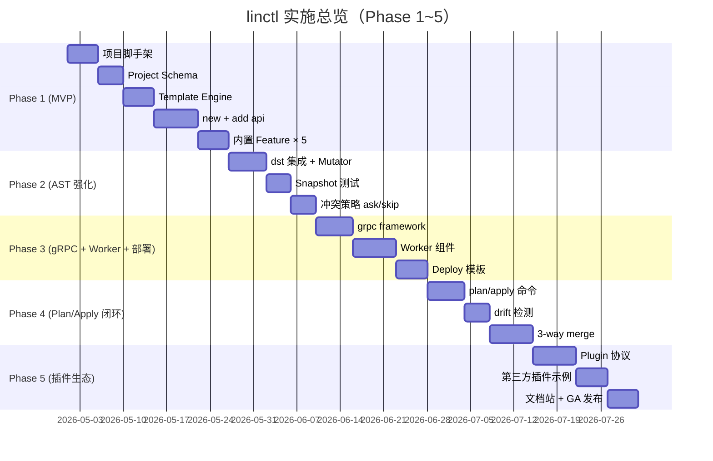

# 11. 实施计划（5 Phase × Story 拆分）

> 本文档把"linctl 从 0 到 v1.0"的工作拆分为 **5 个 Phase × N 个 Story**，每个 Story 都有明确的 DoD（[Definition of Done](./99-glossary.md)）、依赖关系、估算工时与风险评估。

## 11.1 总览



| Phase | 周期 | 主交付 | 关键里程碑 |
| --- | --- | --- | --- |
| Phase 1 (MVP) | 3-4 周 | `linctl new` + `linctl add api` 闭环；gin + memory/postgres；5 个内置 Feature | v0.1 alpha |
| Phase 2 (AST 强化) | 2-3 周 | dst-based AST 注入；snapshot 测试；冲突 ask/skip 策略 | v0.2 alpha |
| Phase 3 (gRPC + Worker + 部署) | 2-3 周 | gRPC 全链路；Worker；docker/k8s/systemd 模板 | v0.3 beta |
| Phase 4 (Plan/Apply 闭环) | 2-3 周 | `linctl plan` + `linctl apply`；drift 检测；3-way merge | v0.9 RC |
| Phase 5 (插件生态) | 长尾 | 插件机制；第三方插件示例；文档站；v1.0 GA | v1.0 GA |

> 工时估算基于 1 名全职开发 + 偶尔 PR review。如果是 2 人协作，整体周期可压缩 30-40%。

## 11.2 Phase 1：MVP（最小可用产品）

> **DoD**：`linctl new myblog --module github.com/foo/myblog --framework gin` 生成的项目可 `go build` + `./_output/bin/myblog server` 启动 + `curl /healthz` 返回 200。

### 11.2.0 Phase 1 范围声明（与 schema 的差异）

`04-config-schema.md` 描述的是 **目标 schema**（v1.0 GA 全集）。Phase 1 故意只实现一个**可运行的最小子集**，剩余在后续 Phase 渐进交付：

| 维度 | Schema 全集 | Phase 1 实现 | 其余 Phase |
| --- | --- | --- | --- |
| `framework` | `gin` / `grpc` | **仅 gin** | grpc → Phase 3 |
| `storage` | `memory` / `gorm-mysql` / `gorm-postgres` / `gorm-sqlite` / `mongo` | **仅 memory + gorm-postgres** | sqlite/mysql/mongo → Phase 3 |
| `deploy` | `none` / `docker` / `kubernetes` / `systemd` | **仅 none + docker(runtime-only)** | k8s/systemd/multi-stage → Phase 3 |
| `Component.kind` | `WebServer` / `Worker` / `CLI` | **仅 WebServer** | Worker/CLI → Phase 3 |
| `features` | `healthz` / `opentelemetry` / `user` / `websocket` / `preloader` | **5 种全部** | - |
| `linctl plan` 命令 | 完整 | **不实现命令**；仅 Plan 数据结构（`Plan{}`/`Action{}`/`PlanStats{}`）在 Story 1.7 引入用于 internal | 命令 → Phase 4 |
| `linctl apply` 冲突策略 | `skip` / `overwrite` / `merge` / `ask` | **仅 skip + overwrite**（隐式，由 `--force` 切换） | ask → Phase 2; merge → Phase 4 |
| `linctl add` 子命令 | `api` / `worker` / `cli` / `webserver` / `feature` / `component` | **仅 `add api`** | 其他 → Phase 3-4 |
| AST 注入 | dst-based + protocompile | **不在 Phase 1**；用户手动加方法 | dst → Phase 2; protocompile → Phase 2 |
| Hook 执行策略 | 三级完整（restricted/confirm/unrestricted） | **基础 restricted**（gofumpt/go mod tidy/make 等白名单） | confirm + unrestricted → Phase 2 |
| i18n | 完整双语 | **仅英文**；中文 → Phase 2 | - |

> **关键提醒**：
> 1. **Plan 数据结构 ≠ `linctl plan` 命令**。Phase 1 把 Plan/Action 类型定义出来供 internal Apply 使用；用户面的 `linctl plan` 命令在 Phase 4 才暴露。
> 2. Phase 1 的 schema validator **必须**接受 schema 全集（避免后续 breaking change），但对 Phase 1 不支持的字段返回 `ErrNotImplementedYet` + 友好 hint：「该 framework 将在 Phase 3 支持，参见 11-implementation-plan.md」。
> 3. 通过 schema 全集 + 渐进实现的方式，未来 Phase 升级**不破坏既有 linctl.yaml**。
> 4. **`Action.Kind = Update` 在 Phase 1 的语义**：与 [ADR-004](./adr/004-plan-apply-pattern.md) Tier 1 一致——「先把模板渲染结果与磁盘文件做整体 sha256 比对，hash 不同即覆盖」。Phase 1 **不依赖** embedded hash / drift detection；这两项与 `Conflict` Action 一起在 Phase 2-4 引入（对应 ADR-004 Tier 2/Tier 3）。

### 11.2.1 Story 列表

#### Story 1.1：仓库初始化（5 PD）

**Tasks**：

- [ ] `git init` linctl 仓库；MIT License；CONTRIBUTING.md 占位
- [ ] `cmd/linctl/main.go`（< 50 行）
- [ ] `internal/cli/root.go` 框架；`internal/cli/cmd_version.go`
- [ ] Makefile：`build` / `test` / `lint` / `tools`
- [ ] `.golangci.yaml`（17 个 linter 启用）
- [ ] `.editorconfig` / `.gitignore` / `tools/tools.go`
- [ ] `.github/workflows/ci.yml`（lint + test + build）
- [ ] README.md（MVP 阶段的简版）

**DoD**：`make build` + `make test` + `make lint` 全部通过；CI 全绿；`./_output/bin/linctl version` 输出正确版本。

#### Story 1.2：Project Schema + Loader（4 PD）

**依赖**：Story 1.1

**Tasks**：

- [ ] `internal/project/types.go`：完整 Project / Component / Resource / Defaults 等类型
- [ ] `internal/project/loader.go`：`Load` / `LoadFromBytes`（KnownFields 严格模式）
- [ ] `internal/project/defaults.go`：默认值注入逻辑
- [ ] `internal/validate/validator.go`：validator/v10 封装
- [ ] `internal/validate/custom_rules.go`：modulePath/projectName/kindName 等正则
- [ ] `internal/linctlerr/error.go`：LinctlError 类型 + 错误码（包名定稿，详见 META §1.1 / §5.1）
- [ ] 单测：覆盖率 ≥ 80%

**DoD**：能加载 `examples/minimal.yaml` + `examples/full.yaml`；非法配置报错带行号 + Hint。

#### Story 1.3：Template Engine（5 PD）

**依赖**：Story 1.2

**Tasks**：

- [ ] `internal/template/embed.go`：`//go:embed all:../../templates`
- [ ] `internal/template/engine.go`：`Render` / `RenderPath` / `Format`（gofumpt）
- [ ] `internal/template/funcmap.go`：~40 个 FuncMap 函数
- [ ] `internal/template/data.go`：TemplateData + Helpers
- [ ] `internal/template/partial.go`：partials/header.tpl 等
- [ ] 单测：每个 funcmap 函数覆盖；render 失败的报错格式
- [ ] `templates/` 初始骨架（common / project / component/webserver/cmd 等）

**DoD**：单测通过；可手工 render `templates/component/webserver/cmd/main.go.tpl` 输出合法 Go 代码。

#### Story 1.4：FileManager（3 PD）

**依赖**：Story 1.3

**Tasks**：

- [ ] `internal/fs/manager.go`：FileManager 完整实现
- [ ] `internal/fs/hash.go`：Append/Extract embedded hash
- [ ] `internal/fs/walker.go`：遍历项目目录，识别 generated 文件
- [ ] 测试：MemMapFs + 真实文件系统两套测试

**DoD**：原子写测试通过（中断时无半成品）；hash 注释能正确追加+提取。

#### Story 1.5：Component 抽象 + WebServer（4 PD）

**依赖**：Story 1.3, 1.4

**Tasks**：

- [ ] `internal/component/component.go`：[Component (interface)](./99-glossary.md#component) 接口（注意与 [project.Component (struct)](./99-glossary.md#component) 区分）
- [ ] `internal/component/registry.go`：Registry
- [ ] `internal/component/webserver.go`：WebServer 完整实现
  - **Phase 1 范围**：仅 `framework=gin` + `storage in [memory, gorm-postgres]`
  - 其他 framework/storage 在 schema 中是合法值，但运行时返回 `ErrNotImplementedYet`（详见 [§11.2.0](#1120-phase-1-范围声明与-schema-的差异)）
- [ ] 单测：BasePairs / Validate / resourcePairs 全覆盖

**DoD**：见 [09-component-design.md §9.4](./09-component-design.md#94-内置组件-1webserver)。

#### Story 1.6：Feature 接口 + 5 个内置 Feature（5 PD）

**依赖**：Story 1.5

**Tasks**：

- [ ] `internal/feature/feature.go` + `registry.go`
- [ ] `internal/feature/builtin/healthz.go`
- [ ] `internal/feature/builtin/opentelemetry.go`
- [ ] `internal/feature/builtin/user.go`
- [ ] `internal/feature/builtin/websocket.go`
- [ ] `internal/feature/builtin/preloader.go`
- [ ] 每个 Feature 的单测（Apply / Mutators / Validate）

**DoD**：见 [08-feature-system.md §8.5](./08-feature-system.md)。

#### Story 1.7：Codegen Pipeline 简版（5 PD）

**依赖**：Story 1.5, 1.6

> **范围说明**：Phase 1 实现 [Plan](./99-glossary.md#plan-名词) **数据结构**（被 internal Apply 使用），但**不暴露** `linctl plan` 子命令。后者在 Phase 4 引入（Story 4.1）。

**Tasks**：

- [ ] `internal/codegen/pair.go` + `pair_builder.go`
- [ ] `internal/codegen/plan.go`：Plan / Action / PlanStats 类型定义
  - **Phase 1 支持 Action.Kind**：`Create` / `Update` / `Skip`（与 [ADR-004](./adr/004-plan-apply-pattern.md) Tier 1 一致）
    - `Create`：磁盘文件不存在
    - `Update`：磁盘文件存在，且 sha256(渲染结果) ≠ sha256(磁盘内容) → 直接覆盖（Phase 1 不识别用户改动）
    - `Skip`：磁盘文件存在，且 sha256(渲染结果) == sha256(磁盘内容) → 跳过写入
  - `Conflict` / `Delete` 在 Phase 2-4 引入（依赖 embedded hash + drift detection，对应 ADR-004 Tier 2/Tier 3）
- [ ] `internal/codegen/planner.go`：仅做「文件存在 + 整体 sha256 比对」，不解析 embedded hash
- [ ] `internal/codegen/applier.go`：renderAll + writeAll（先串行；并发优化 → Phase 2）
- [ ] `internal/orchestrator/orchestrator.go`：拼装 loader → planner → applier → reporter（**注意**：loader 物理位置在 `internal/project/loader.go`，orchestrator 仅做编排不做 I/O，详见 [99-glossary.md](./99-glossary.md#loader-projectloader)）

**DoD**：能跑通"从 linctl.yaml 到磁盘文件"的全流程。  
**注意**：用户视角下 Phase 1 仅有 `linctl new` 和 `linctl add api` 命令，没有 `linctl plan`/`apply` 命令。

#### Story 1.8：`linctl new` 命令（4 PD）

**依赖**：Story 1.7

**Tasks**：

- [ ] `internal/cli/cmd_new.go`：完整 5 段式 + 所有 flag
- [ ] Reporter：彩色输出 + getting started 提示
- [ ] E2E 测试：`linctl new myblog ...` → 真正 `go build`

**DoD**：`linctl new myblog --module github.com/foo/myblog --framework gin` 在干净目录跑完后，`cd myblog && go build ./...` 必须 0 错误。

#### Story 1.9：`linctl add api` 命令（仅模板，无 AST）（4 PD）

**依赖**：Story 1.8

**Tasks**：

- [ ] `internal/cli/cmd_add.go`：仅生成 resource 相关 Pair（暂不做 AST 注入）
- [ ] 写入 PROJECT 文件；更新 `c.Resources`
- [ ] E2E 测试：`linctl new` + `linctl add api Post` → `go build`

**DoD**：能生成 8 个 resource 文件；biz.go/store.go 暂时手动加方法（Phase 2 自动化）。

#### Story 1.10：`linctl version` / `linctl options` / `linctl completion` / `linctl doctor`（3 PD）

**Tasks**：

- [ ] `cmd_version.go`：含 git commit / build date
- [ ] `cmd_options.go`：列出全局 flag
- [ ] `cmd_completion.go`：bash/zsh/fish
- [ ] `cmd_doctor.go`：检测 go/git/protoc

### 11.2.2 Phase 1 总工时与风险

- **总工时**：~42 PD（约 8-9 周如 1 人，4-5 周如 2 人）
- **关键风险**：
  - 模板太多（~250 个文件）→ 优先把 osbuilder 现有模板"搬过来"，再针对性优化
  - gofumpt 在 generated code 上的兼容性 → 提前测试
  - `internal/pkg/*` 共享文件的去重逻辑可能复杂

### 11.2.3 Phase 1 退出标准

| 标准 | 验证方式 |
| --- | --- |
| 5 个内置 Feature 都可启用 | `examples/full.yaml` E2E 测试 |
| gin + (memory \| gorm-postgres) 可生成 | 2 个 fixture |
| 生成的项目能 `go build` + `go test ./...` | E2E 自动化 |
| 单测覆盖率 ≥ 70%（核心包） | CI 报告 |
| 二进制大小 ≤ 12 MB | CI 检查 |
| README + Quickstart 文档完整 | Manual review |

> **storage 矩阵约束**：Phase 1 仅交付 `memory` + `gorm-postgres`，与 [§11.2.0](#1120-phase-1-范围声明与-schema-的差异) 表格一致。`sqlite` / `gorm-mysql` / `mongo` 的 fixture 与 E2E 在 [§11.4.2](#1142-phase-3-退出标准) Phase 3 退出标准中验证。

---

## 11.3 Phase 2：AST 强化

> **DoD**：`linctl add api Post` 自动注入 biz.go/store.go/proto，无需用户手工编辑。

### 11.3.1 Story 列表

#### Story 2.1：Go AST 注入（dst-based）（6 PD）

**依赖**：Phase 1 完成

**Tasks**：

- [ ] `internal/ast/mutator.go`：ASTMutator 接口 + 4 种内置 Mutator
- [ ] `internal/ast/go_inject.go`：dst-based 实现
- [ ] `internal/ast/go_helpers.go`：parser.ParseExpr / recvType / stripPointer
- [ ] `internal/ast/batch.go`：同文件多 mutator 合并
- [ ] 单测：表驱动 + golden file（覆盖 ≥ 90%）

**DoD**：见 [07-ast-injection.md §7.5](./07-ast-injection.md)。

#### Story 2.2：Proto AST 注入（protocompile）（5 PD）

**依赖**：Story 2.1

**Tasks**：

- [ ] `internal/ast/proto_inject.go`：AddProtoRPCMutator
- [ ] Phase 1 策略：保留原始格式 + 文本插入
- [ ] 单测：单 service / 多 service / streaming / annotation 各覆盖

**DoD**：能给 `myblog.proto` 增加 5 个 RPC + import，原文件其他部分不变。

#### Story 2.3：`linctl add api` 集成 AST 注入（3 PD）

**依赖**：Story 2.1, 2.2

**Tasks**：

- [ ] `cmd_add.go` 中 mutators 调用集成
- [ ] PostApply Hook：自动跑 `make protoc` / `go generate`
- [ ] E2E：add api 后直接 go build 通过

#### Story 2.4：Snapshot 测试基础设施（4 PD）

**Tasks**：

- [ ] `tests/snapshot/` 目录结构
- [ ] golden file 管理（UPDATE_GOLDEN=1 更新）
- [ ] 至少覆盖 webserver_gin / webserver_grpc / worker / cli 四套 snapshot
- [ ] CI 集成

#### Story 2.5：冲突策略 ask + skip + overwrite（4 PD）

**依赖**：Story 1.7

**Tasks**：

- [ ] `internal/codegen/applier.go` 引入 strategy 参数
- [ ] `internal/ui/confirm.go`：ask 模式的交互
- [ ] hash comment 解析 + 用户修改检测
- [ ] 单测：每种 strategy 路径覆盖

#### Story 2.6：错误信息升级（3 PD）

**Tasks**：

- [ ] 模板 render 失败：打印模板路径 + 行号 + 数据上下文
- [ ] AST 失败：打印目标文件 + 期望节点
- [ ] LinctlError 输出：`Reason + Hint + Doc-link`
- [ ] 全部 internal 错误链 unwrap 测试

### 11.3.2 Phase 2 退出标准

| 标准 | 验证方式 |
| --- | --- |
| `linctl add api Post Comment` 自动改 biz.go/store.go/proto | E2E |
| 模板渲染/AST 失败错误信息友好 | Manual review |
| Snapshot 测试覆盖 4 套基础组合 | CI 报告 |
| 冲突 ask 模式可交互 | Manual test |

---

## 11.4 Phase 3：gRPC + Worker + 部署模板

> **DoD**：`linctl new myblog --framework grpc` + `linctl add worker DailyReport --variant cron` + 生成 docker / k8s manifests。

### 11.4.1 Story 列表

#### Story 3.1：gRPC framework 模板（6 PD）

**Tasks**：

- [ ] `templates/framework/grpc/server.go.tpl`
- [ ] `templates/framework/grpc/handler/handler.go.tpl`
- [ ] `templates/framework/grpc/handler/api/resource.go.tpl`
- [ ] `templates/framework/grpc/interceptor/`
- [ ] grpc-gateway 选项支持
- [ ] E2E：grpc 项目能编译 + 启动

#### Story 3.2：Worker 组件 + 三种 variant（7 PD）

**依赖**：Story 1.5

**Tasks**：

- [ ] `internal/component/worker.go` 完整实现
- [ ] `templates/component/worker/cron/`、`kafka/`、`customized/`
- [ ] `linctl add worker` 子命令
- [ ] 单测 + E2E

#### Story 3.3：Deploy 模板（5 PD）

**Tasks**：

- [ ] `templates/deploy/docker/`：3 种 Dockerfile（runtime-only / multi-stage / combined）
- [ ] `templates/deploy/kubernetes/`：deployment / service / configmap / ingress
- [ ] `templates/deploy/systemd/`
- [ ] 配置：`defaults.image.dockerfileMode` / `distrolessMode`
- [ ] E2E：生成的 Dockerfile 能 `docker build` 通过

#### Story 3.4：CLI 组件 + add cli 命令（3 PD）

**Tasks**：

- [ ] `internal/component/cli.go` 完整实现
- [ ] `linctl add cli <name>` 子命令
- [ ] AST 注入到 all.go 的逻辑

### 11.4.2 Phase 3 退出标准

| 标准 | 验证方式 |
| --- | --- |
| gin / grpc 双 framework 都可生成 | E2E 矩阵 |
| Worker 三种 variant 都可生成 | E2E |
| Docker 镜像 `docker build` 通过 | E2E |
| K8s manifests `kubectl apply --dry-run` 通过 | E2E |
| storage 全集 `gorm-sqlite` / `gorm-mysql` / `mongo` 可生成 | E2E 矩阵 fixture（与 Phase 1 的 `memory` + `gorm-postgres` 共同覆盖 schema 全集） |

---

## 11.5 Phase 4：Plan/Apply 闭环

> **DoD**：用户可 `linctl plan` 预览所有变更 + `linctl apply` 执行；冲突文件可 3-way merge。

### 11.5.1 Story 列表

#### Story 4.1：`linctl plan` 命令（6 PD）

**依赖**：Phase 1-3 完成

**Tasks**：

- [ ] `internal/codegen/planner.go` 升级：识别 Create/Update/Skip/Conflict
- [ ] `internal/ui/plan_print.go`：彩色 plan 表格 + diff preview
- [ ] `cmd_plan.go`：含 `--output json/yaml`（统一全局 flag，详见 SSOT §1.5）/ `--detailed` / `--filter`
- [ ] 单测：每种 Action 路径覆盖

#### Story 4.2：`linctl apply` 完整版（4 PD）

**依赖**：Story 4.1

**Tasks**：

- [ ] `cmd_apply.go`：含 `--strategy` / `--prune` / `--backup-dir` / `--git-stash`
- [ ] Backup 实现（`.linctl/backups/<ts>/`）
- [ ] PostApply Hooks 执行（按 Hook 执行策略，参考 [15-security-model.md §15.2.1](./15-security-model.md#1521-hook-执行策略-hook-execution-policy)）
- [ ] E2E：plan + apply 完整闭环

#### Story 4.3：Drift 检测（4 PD）

**Tasks**：

- [ ] `.linctl/lock.yaml` 持久化
- [ ] 用户修改文件检测算法（[06-codegen-pipeline.md §6.7](./06-codegen-pipeline.md)）
- [ ] `linctl lint` 命令（hash 完整性检查）
- [ ] 单测：模拟用户修改 → 检测 conflict

#### Story 4.4：3-way merge（7 PD）

**Tasks**：

- [ ] `internal/codegen/merger.go`：基于 hexops/gotextdiff
- [ ] base 来源：从 `.linctl/cache/<dst>/<hash>` 读历史模板渲染结果
- [ ] git-style conflict markers
- [ ] 单测：3 种基础 case + 复杂 case

#### Story 4.5：`linctl import` + `linctl restore`（4 PD）

**Tasks**：

- [ ] `cmd_import.go`：从 go.mod / cmd/ / proto 反推 linctl.yaml
- [ ] `cmd_restore.go`：从 backup 一键恢复
- [ ] E2E

### 11.5.2 Phase 4 退出标准

| 标准 | 验证方式 |
| --- | --- |
| `linctl plan` 输出可读，含 diff | Manual + E2E |
| `linctl apply` 自动 backup | E2E |
| 3-way merge 在简单 case 自动成功 | E2E |
| 复杂 case 生成 git-style conflict markers | E2E |

---

## 11.6 Phase 5：插件生态 + GA

> **DoD**：发布 v1.0 GA；至少有 1 个第三方插件示例（`linctl-plugin-sentry`）；文档站上线。

### 11.6.1 Story 列表

#### Story 5.1：Plugin 协议设计（7 PD）

**Tasks**：

- [ ] `internal/plugin/protocol.go`：JSON-RPC over stdio 协议
- [ ] `internal/plugin/registry.go`：发现 PATH 中的 `linctl-*`
- [ ] `internal/plugin/discovery.go`：`--linctl-info` 元数据获取
- [ ] SerializedMutator 序列化协议
- [ ] 单测 + E2E

#### Story 5.2：`linctl plugin` 命令（4 PD）

**Tasks**：

- [ ] `cmd_plugin_list.go` / `install.go` / `info.go` / `remove.go`
- [ ] 通过 `go install` 安装插件

#### Story 5.3：示例插件（5 PD）

**Tasks**：

- [ ] 独立仓库 `linctl-plugin-sentry`
- [ ] 实现 SentryFeature
- [ ] 集成测试：`linctl plugin install linctl-plugin-sentry` + `linctl new --features sentry` 工作

#### Story 5.4：文档站（5 PD）

**Tasks**：

- [ ] mkdocs-material 选型 + 配置
- [ ] 把 lin/docs/* 自动同步到 docs site
- [ ] 部署到 `linctl.dev`（GitHub Pages 或 Netlify）
- [ ] 搜索（algolia 或 docsearch）
- [ ] versioning

#### Story 5.5：v1.0 GA 准备（4 PD）

**Tasks**：

- [ ] CHANGELOG 整理
- [ ] 升级 SemVer 承诺文档
- [ ] goreleaser 配置完善（含 brew tap / scoop bucket）
- [ ] 发布博客 + Reddit / HN 推广素材

### 11.6.2 Phase 5 退出标准

| 标准 | 验证方式 |
| --- | --- |
| 至少 1 个第三方插件 work | Manual |
| 文档站 linctl.dev 上线 | URL 访问 |
| v1.0 GA tag 发布 | GitHub Release |
| brew install / scoop install 可用 | Manual |

---

## 11.7 风险登记表（Risk Register）

| ID | 风险 | 概率 | 影响 | 缓解措施 |
| --- | --- | --- | --- | --- |
| R1 | dst 库小众 / 维护停滞 | 中 | 中 | 抽象 ASTMutator 接口；CI 监控；预案见 [ADR-001](./adr/001-use-dst-not-goast.md) |
| R2 | protocompile API 变化 | 低 | 中 | 锁版本；适配层 |
| R3 | 3-way merge 复杂度高 | 高 | 高 | Phase 4 才做；MVP 用 ask/skip/overwrite 三种 |
| R4 | 模板规模大（~300 文件）维护成本 | 中 | 高 | 先照搬 osbuilder；snapshot 测试覆盖 |
| R5 | 用户不愿迁移 osbuilder → linctl | 高 | 中 | `linctl import` 一键迁移；写迁移指南 |
| R6 | 插件协议设计仓促 | 中 | 高 | 先做 JSON-RPC + serialized mutator；WASM 留后续 |
| R7 | gofumpt 在 generated code 上 bug | 低 | 中 | E2E 覆盖；保留 gofmt fallback |
| R8 | Windows 平台 hook/ANSI 兼容性 | 中 | 低 | 仅 Tier 2 支持；CI 矩阵 |
| R9 | 单人开发节奏 vs 用户期望 | 高 | 中 | 透明的 roadmap；每月发布 progress |
| R10 | AI 时代竞争（LLM 直接写代码） | 高 | 高 | 走"声明式 + 强约束"差异化；Phase 3+ 引入 MCP（见 [16-ai-integration.md](./16-ai-integration.md)） |

## 11.8 资源与协作

### 11.8.1 角色

| 角色 | 职责 |
| --- | --- |
| **Maintainer** | 设计决策；ADR 评审；最终 merge | 1-2 人 |
| **Core Dev** | 实施 Phase 工作；写测试 | 1-3 人 |
| **Contributor** | 修 bug；写文档；贡献插件 | 不限 |
| **Reviewer** | PR review；测试反馈 | 不限 |

### 11.8.2 沟通

| 场合 | 工具 |
| --- | --- |
| 设计讨论 | GitHub Discussions |
| Bug / Feature 跟踪 | GitHub Issues（含 templates） |
| 代码评审 | GitHub PR |
| 周会 | 仅在 Phase 切换时召开（Async-first） |
| 重大决策 | ADR |

### 11.8.3 节奏

- **每日**：PR review；CI 监控
- **每周**：roadmap 同步（issue 评论或 GitHub Project 更新）
- **每月**：进度博客 + 用户 feedback 整理
- **每 Phase 切换**：发布 alpha/beta；用户调研

## 11.9 与 osbuilder 的迁移并存策略

linctl 与 osbuilder 在生态上**并存**而非"颠覆"：

| 阶段 | 与 osbuilder 关系 |
| --- | --- |
| Phase 1-3 | 模板大量复用 osbuilder；用户可同时用两个工具 |
| Phase 4 | `linctl import` 完成度高；推荐迁移 |
| Phase 5 | 提供 `linctl plugin install osbuilder-compat`；osbuilder 仅维护安全更新 |
| 远期 | osbuilder 进入 maintenance 模式；linctl 主推 |

> **不是**强制迁移；尊重 osbuilder 既有用户的选择。

## 11.10 Phase 内 Story 状态跟踪模板

每个 Story 在 GitHub Issue 中按以下格式跟踪：

```markdown
**Story 1.1: 仓库初始化**

- Phase: 1
- Estimate: 5 PD
- Owner: @username
- Status: in_progress
- Started: 2026-05-01
- DoD:
  - [ ] make build pass
  - [ ] CI green
  - [ ] linctl version works
- Blockers: none
- Notes: ...
```

## 11.11 Open Questions

| 问题 | 待决议 |
| --- | --- |
| Phase 1 是否要把 `linctl plan` 也带上（即使是简化版）？ | 倾向"不"，给用户最简心智 |
| 是否在 Phase 2 引入 `--watch` 模式（文件变化自动 reapply）？ | 用户调研后决定 |
| 是否提供 GitHub Action `uses: linctl/setup-linctl@v1`？ | Phase 4 |

---

## 修订记录

| 日期 | 版本 | 变更 |
| --- | --- | --- |
| 2026-04-25 | 0.1 | 初始版本 |
| 2026-04-25 | 0.1.1 | 按 META-fix-decisions-2026-04-25 修订：Phase 1 Action 集合补齐为 `Create`/`Update`/`Skip`（与 ADR-004 Tier 1 一致）；§11.2.3 sqlite 移到 §11.4.2；新增 Update 语义说明 |

---

下一步阅读：[12-testing-strategy.md](./12-testing-strategy.md)

---

_Last reviewed: 2026-04-25_
