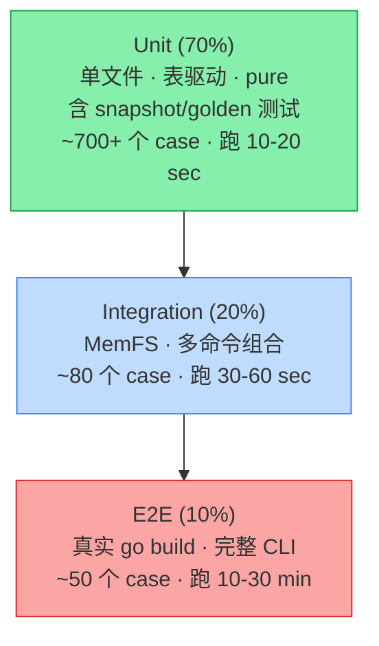

# 12. 测试策略与 CI/CD

> 本文档定义 linctl 自身的测试金字塔、覆盖率目标、CI 矩阵、Flaky 治理、以及 GitHub Actions 工作流详细设计。

## 12.1 测试哲学

linctl 是**会被无数项目依赖**的代码生成工具，**任何 bug 都会被放大成 N 个项目的 bug**。因此测试投入必须高于普通业务项目。

| 信念 | 落地 |
| --- | --- |
| **测试金字塔倒置不可接受** | 单测占 70%；集成 20%；E2E 10% |
| **生成的代码必须 go build 通过** | E2E 强制 `go build ./...` + `go test ./...` |
| **模板必须有 golden file** | snapshot 测试 100% 覆盖核心模板 |
| **AST 操作必须有边界 case 测试** | 表驱动 + 至少覆盖：empty / 已存在 / 含注释 / 含泛型 |
| **失败信息必须 actionable** | 每个 assertion 失败都给出"应该是 X，实际是 Y" |

## 12.2 测试金字塔



> **关于 snapshot 测试的归类**：snapshot/golden 测试本质是「单文件 + 纯函数 + 可重现」的单测，
> 因此**归并入 Unit 70%**，不再单独占比。本节后文 §12.5 描述的实现机制和 golden 文件治理仍然适用，
> 只是不再在金字塔中单独列层。

## 12.3 单元测试（Unit Tests，70%）

### 12.3.1 范围

- **位置**：`internal/<pkg>/*_test.go`，与生产代码同包。
- **风格**：表驱动测试为主；每个 public 函数都有覆盖；私有函数用 `package _test` 写补充。
- **覆盖率目标**：核心包（codegen / template / ast / feature）≥ 80%；其他 ≥ 70%。
- **运行时间**：< 30 秒（开发者本地频繁运行）。

### 12.3.2 表驱动测试范式

```go
func TestApplyDefaults(t *testing.T) {
    cases := []struct {
        name string
        in   *Project
        want *Project
    }{
        {
            name: "empty defaults gets gin/memory",
            in:   &Project{Spec: Spec{Components: []Component{{Kind: "WebServer", Name: "x"}}}},
            want: &Project{
                APIVersion: "linctl.dev/v1",
                Kind:       "Project",
                Spec: Spec{
                    Defaults: Defaults{Framework: "gin", Storage: "memory"},
                    Components: []Component{{Kind: "WebServer", Name: "x", Framework: "gin", Storage: "memory"}},
                },
            },
        },
        {
            name: "component overrides defaults",
            in: &Project{
                Spec: Spec{
                    Defaults: Defaults{Framework: "gin"},
                    Components: []Component{{Kind: "WebServer", Name: "x", Framework: "grpc"}},
                },
            },
            want: nil, // 略
        },
    }
    for _, tc := range cases {
        t.Run(tc.name, func(t *testing.T) {
            got := tc.in
            got.applyDefaults()
            require.Equal(t, tc.want, got)
        })
    }
}
```

### 12.3.3 mock 与依赖隔离

- **文件系统**：用 `afero.NewMemMapFs()` 替代 `os` 直接调用。
- **HTTP**：用 `httptest.NewServer` 启动模拟服务器。
- **时间**：包内 `now func() time.Time` 变量，测试时替换。
- **MockGen**：仅给"interface 边界"生成 mock，不给具体类型。

```bash
# 示例：给 ASTMutator 生成 mock
//go:generate mockgen -source=mutator.go -destination=mock_mutator_test.go -package=ast_test
```

### 12.3.4 单测最佳实践

| 项目 | 规范 |
| --- | --- |
| 命名 | `Test<FuncName>_<Scenario>` 或 `Test<TypeName>_<MethodName>` |
| Setup/Teardown | 用 `t.Cleanup(...)` 替代 defer |
| 并发 | 默认加 `t.Parallel()`，除非依赖共享状态 |
| Subtests | 全部用 `t.Run(name, func(t *testing.T))` |
| 断言 | 优先 `require.X`（终止）+ `assert.X`（继续） |
| Helper | 用 `t.Helper()` 标记，错误栈不混淆 |
| 数据 | testdata/ 目录存大型 fixture |

## 12.4 集成测试（Integration Tests，20%）

### 12.4.1 范围

- **位置**：`tests/integration/*_test.go`，独立 package。
- **特点**：跨多个 internal 包；用 MemMapFs；不调真实 `go build`。
- **目标**：验证"多个命令组合"或"多个组件协作"的正确性。

### 12.4.2 典型场景

```go
// tests/integration/plan_apply_test.go
func TestPlanApplyFullCycle(t *testing.T) {
    fs := afero.NewMemMapFs()
    proj := loadFixture(t, "fixtures/projects/full.yaml")

    // 1. 第一次 apply（全 create）
    plan1, err := orchestrator.Plan(ctx, proj, fs)
    require.NoError(t, err)
    require.Equal(t, 250, plan1.Stats.Create)
    require.Equal(t, 0, plan1.Stats.Update)

    err = orchestrator.Apply(ctx, plan1, fs, ApplyOptions{Strategy: "overwrite"})
    require.NoError(t, err)

    // 2. 第二次 apply 应该全 skip（幂等）
    plan2, err := orchestrator.Plan(ctx, proj, fs)
    require.NoError(t, err)
    require.Equal(t, 0, plan2.Stats.Create)
    require.Equal(t, 250, plan2.Stats.Skip)

    // 3. 模拟用户改一个文件
    err = afero.WriteFile(fs, "internal/myblog/biz/biz.go", []byte("// modified by user"), 0644)
    require.NoError(t, err)

    // 4. 第三次 plan 应该报 conflict
    plan3, err := orchestrator.Plan(ctx, proj, fs)
    require.NoError(t, err)
    require.Equal(t, 1, plan3.Stats.Conflict)
}
```

### 12.4.3 跨命令组合

```go
func TestNewThenAddAPI(t *testing.T) {
    // new
    runCmd(t, "linctl", "new", "myblog", "--module", "github.com/foo/myblog")

    // add api Post
    runCmd(t, "linctl", "add", "api", "Post")

    // verify
    require.True(t, fileExists("myblog/internal/myblog/biz/v1/post/post.go"))
    require.Contains(t, readFile("myblog/internal/myblog/biz/biz.go"), "PostV1()")
}
```

## 12.5 Snapshot 测试（归并入 Unit，单独成节描述实现）

> 按 §12.2 的金字塔，snapshot/golden 测试本身是 Unit 的一种形式（pure / 单文件 / 可重现），
> 不再单独占比。本节描述其实现规范、golden 文件治理与 `UPDATE_GOLDEN` 工作流。

### 12.5.1 范围

- **位置**：`tests/snapshot/`
- **目的**：检测模板渲染输出是否符合预期（防止意外变更）
- **golden 存放**：`tests/snapshot/golden/<scenario>/<file>.golden`
- **更新方式**：`UPDATE_GOLDEN=1 go test ./tests/snapshot/`

### 12.5.2 实现框架

```go
// tests/snapshot/helper.go
package snapshot

import (
    "bytes"
    "os"
    "path/filepath"
    "testing"

    "github.com/stretchr/testify/require"
)

// AssertGolden 比较 got 与 golden file 内容。
//
// UPDATE_GOLDEN=1 模式下：
//   - 写入 golden file（确保父目录存在）
//   - 仍然继续执行后续断言（不调用 t.Skip）
//   - 这样同包内其他与 golden 无关的断言不会被误跳过
//
// 想"只更新 golden 而不跑测试"时，请使用独立 Make 目标：
//
//     make test-snapshot-update    # 通过 -run 'TestGolden_' 的命名约定隔离
func AssertGolden(t *testing.T, goldenPath string, got []byte) {
    t.Helper()
    if os.Getenv("UPDATE_GOLDEN") == "1" {
        require.NoError(t, os.MkdirAll(filepath.Dir(goldenPath), 0o755))
        require.NoError(t, os.WriteFile(goldenPath, got, 0o644))
        // 不调用 t.Skip：避免跳过同测试函数后续与 golden 无关的断言
        t.Logf("UPDATE_GOLDEN: wrote %s", goldenPath)
        return
    }
    want, err := os.ReadFile(goldenPath)
    require.NoError(t, err, "golden file not found: %s", goldenPath)
    require.Equal(t, string(want), string(got),
        "golden mismatch: %s\nrun UPDATE_GOLDEN=1 to update", goldenPath)
}
```

### 12.5.3 golden file 管理规范

- **审查**：第一次创建 golden 必须人工审查（PR review 时仔细看）。
- **更新**：模板变更 → 更新 golden → 检查 diff 是否合理 → 提交。
- **大型文件**：> 1000 行的 golden 拆分（避免 PR diff 难看）。
- **跨平台**：用 `filepath.ToSlash` 统一路径分隔符；CRLF/LF 统一处理。

## 12.6 E2E 测试（10%）

### 12.6.1 范围

- **位置**：`tests/e2e/`
- **特点**：真实文件系统；调用编译好的 `linctl` 二进制；触发真实 `go build`/`go test`。
- **运行时间**：每个 case 30 秒-2 分钟；总 ≤ 30 分钟。
- **频率**：CI 每次 PR；本地手动。

### 12.6.2 典型 E2E

```go
// tests/e2e/new_project_test.go
package e2e_test

import (
    "os/exec"
    "path/filepath"
    "testing"

    "github.com/stretchr/testify/require"
)

func TestNewMinimalProject(t *testing.T) {
    if testing.Short() {
        t.Skip("skip E2E in short mode")
    }

    tmpDir := t.TempDir()

    // 1. linctl new
    cmd := exec.Command(linctlBin(t), "new", "myblog",
        "--module", "github.com/example/myblog",
        "--framework", "gin",
        "--storage", "memory",
    )
    cmd.Dir = tmpDir
    out, err := cmd.CombinedOutput()
    require.NoError(t, err, "linctl new failed: %s", out)

    // 2. go build
    projDir := filepath.Join(tmpDir, "myblog")
    buildCmd := exec.Command("go", "build", "./...")
    buildCmd.Dir = projDir // 关键：必须指定生成目录，否则会在 tests/e2e 目录下假绿
    buildOut, err := buildCmd.CombinedOutput()
    require.NoError(t, err, "go build failed: %s", buildOut)

    // 3. go vet
    vetCmd := exec.Command("go", "vet", "./...")
    vetCmd.Dir = projDir
    vetOut, err := vetCmd.CombinedOutput()
    require.NoError(t, err, "go vet failed: %s", vetOut)

    // 4. go test
    testCmd := exec.Command("go", "test", "./...")
    testCmd.Dir = projDir
    testOut, err := testCmd.CombinedOutput()
    require.NoError(t, err, "go test failed: %s", testOut)
}

func linctlBin(t *testing.T) string {
    t.Helper()
    bin := filepath.Join("..", "..", "_output", "bin", "linctl")
    if _, err := os.Stat(bin); err != nil {
        t.Fatalf("linctl binary not built: %v\nrun `make build` first", err)
    }
    return bin
}
```

### 12.6.3 矩阵测试

E2E 跑一个**配置矩阵**，覆盖关键组合：

| framework | storage | features | deploy | 期望结果 |
| --- | --- | --- | --- | --- |
| gin | memory | none | docker | go build pass |
| gin | gorm-postgres | healthz, otel | k8s | go build + manifests valid |
| grpc | gorm-postgres | healthz, user | docker | go build pass |
| (worker) | gorm-postgres | otel, preloader | systemd | go build pass |
| (cli) | - | - | none | go build pass |
| Multi-component (full.yaml) | - | - | k8s | 全部通过 |

```go
// tests/e2e/matrix_test.go
func TestMatrix(t *testing.T) {
    cases := []struct {
        name string
        args []string
    }{
        {"gin_memory_minimal", []string{"new", "p", "--module", "ex/p", "--framework", "gin"}},
        {"grpc_postgres_user", []string{"new", "p", "--module", "ex/p", "--framework", "grpc", "--storage", "gorm-postgres", "--features", "user,healthz"}},
        // ... 6+ cases
    }
    for _, tc := range cases {
        t.Run(tc.name, func(t *testing.T) {
            t.Parallel()  // 矩阵并发
            tmpDir := t.TempDir()
            cmd := exec.Command(linctlBin(t), tc.args...)
            cmd.Dir = tmpDir
            require.NoError(t, cmd.Run())
            // go build
            buildCmd := exec.Command("go", "build", "./...")
            buildCmd.Dir = filepath.Join(tmpDir, "p")
            require.NoError(t, buildCmd.Run())
        })
    }
}
```

## 12.7 性能测试（Benchmark）

### 12.7.1 关键路径 benchmark

```go
// internal/template/engine_bench_test.go
func BenchmarkEngineRender(b *testing.B) {
    eng := NewEngine(TemplatesFS)
    data := newBenchData()

    b.ResetTimer()
    for i := 0; i < b.N; i++ {
        _, err := eng.Render("templates/component/webserver/cmd/main.go.tpl", data)
        if err != nil {
            b.Fatal(err)
        }
    }
}

// 期望基线：< 1ms / render
// 失败阈值：> 5ms（标记 perf regression）
```

### 12.7.2 Benchmark 跑分

CI 加 `bench-compare`：

```bash
# 与 main 分支对比
go test -bench=. -count=5 -benchmem ./... > new.bench
git checkout main
go test -bench=. -count=5 -benchmem ./... > old.bench
benchstat old.bench new.bench
```

## 12.8 模糊测试（Fuzzing）

针对 parser / validator 等"接受外部输入"的代码：

```go
// internal/project/loader_fuzz_test.go
func FuzzLoadFromBytes(f *testing.F) {
    f.Add([]byte(`apiVersion: linctl.dev/v1
kind: Project
metadata:
  name: test
  module: github.com/foo/bar
spec:
  components:
    - kind: WebServer
      name: x
`))
    f.Fuzz(func(t *testing.T, data []byte) {
        loader := NewLoader(testValidator())
        _, _ = loader.LoadFromBytes(context.Background(), data)
        // 期望：不 panic；不无限循环
    })
}
```

CI 中以低预算运行（`-fuzz=Fuzz -fuzztime=30s`）。

## 12.9 覆盖率目标

| 包 | 目标 | 必须 ≥ |
| --- | --- | --- |
| `internal/codegen/` | 90% | 80% |
| `internal/template/` | 90% | 80% |
| `internal/ast/` | 95% | 85% |
| `internal/feature/` | 90% | 80% |
| `internal/component/` | 85% | 70% |
| `internal/project/` | 90% | 80% |
| `internal/fs/` | 85% | 70% |
| `internal/orchestrator/` | 80% | 65% |
| `internal/cli/` | 60%（其余靠 E2E） | 40% |
| **总和** | 80% | **70%** |

CI 的 `make coverage` 目标会失败（非 warning）如果总覆盖率 < 65%。

```makefile
coverage:
    @go test -race -coverprofile=coverage.out -covermode=atomic ./...
    @go tool cover -func=coverage.out | tail -1 | awk '{ \
        gsub("%","",$$3); \
        if ($$3+0 < 65) { print "ERROR: coverage", $$3"%", "< 65%"; exit 1 } \
        else { print "OK: coverage", $$3"%" } \
    }'
```

## 12.10 Flaky 测试治理

### 12.10.1 识别

- 自动：`go test -count=10` 在 PR CI 跑指定 packages，failure rate > 0 标记。
- 手动：CI failure 列表中"间歇性失败"的 case。

### 12.10.2 处理

| 步骤 | 操作 |
| --- | --- |
| 1. 定位 | 加 `t.Logf("seed=%d", seed)` 打印随机种子 |
| 2. 隔离 | 暂时 `t.Skip("flaky, see #NNN")` + 开 issue |
| 3. 修复 | 通常是：未释放资源 / 时序依赖 / 并发竞争 |
| 4. 加固 | 加 `goleak.VerifyNone(t)` 检测 goroutine 泄漏 |

### 12.10.3 严禁

- ❌ 用 `time.Sleep` 等待 → 改用 `eventually` poll
- ❌ 用绝对时间 → 注入 `now func() time.Time`
- ❌ 用全局变量 → t.TempDir / t.Cleanup
- ❌ 测试间互相影响 → 每个测试独立 fixture

## 12.11 GitHub Actions 工作流

### 12.11.1 文件结构

```
.github/
├── workflows/
│   ├── ci.yml              # PR 触发：lint + unit + integration
│   ├── e2e.yml             # PR 触发：E2E 矩阵
│   ├── nightly.yml         # 每天凌晨：full coverage + benchmark + fuzz
│   ├── release.yml         # tag 触发：goreleaser 发布
│   ├── docs.yml            # main 推送：docs site 部署
│   └── codeql.yml          # 代码安全扫描
└── actions/
    └── setup-linctl-deps/
        └── action.yml      # 复用：安装 protoc / buf / wire
```

### 12.11.2 ci.yml（PR 主流程）

```yaml
name: CI
on:
  pull_request:
    branches: [main]
  push:
    branches: [main]

permissions:
  contents: read

jobs:
  lint:
    runs-on: ubuntu-latest
    steps:
      - uses: actions/checkout@v4
      - uses: actions/setup-go@v5
        with:
          go-version: '1.22'
          cache: true
      - name: Install gofumpt (pinned, per §10.7 / META §5.7)
        run: go install mvdan.cc/gofumpt@v0.7.0
      - name: gofumpt
        run: |
          gofumpt -l . | tee /tmp/gofumpt.out
          test ! -s /tmp/gofumpt.out
      - uses: golangci/golangci-lint-action@v6
        with:
          version: v1.59
          args: --timeout=5m
      - name: Layer dep check
        run: ./scripts/check-layer-deps.sh
      - name: Templates hardcode check
        run: ./scripts/check-templates.sh

  unit:
    runs-on: ubuntu-latest
    steps:
      - uses: actions/checkout@v4
      - uses: actions/setup-go@v5
        with:
          go-version: '1.22'
          cache: true
      - name: Unit tests
        run: |
          go test -race -short -coverprofile=coverage.out -covermode=atomic ./...
      - name: Coverage check
        run: ./scripts/check-coverage.sh 65
      - uses: codecov/codecov-action@v4
        with:
          files: coverage.out
          fail_ci_if_error: false

  integration:
    needs: unit
    runs-on: ubuntu-latest
    steps:
      - uses: actions/checkout@v4
      - uses: actions/setup-go@v5
        with:
          go-version: '1.22'
          cache: true
      - name: Integration tests
        run: go test -race ./tests/integration/...

  build-matrix:
    runs-on: ${{ matrix.os }}
    strategy:
      fail-fast: false
      matrix:
        os: [ubuntu-latest, macos-latest, windows-latest]
        go: ['1.22']
    steps:
      - uses: actions/checkout@v4
      - uses: actions/setup-go@v5
        with:
          go-version: ${{ matrix.go }}
          cache: true
      - name: Build
        run: go build -v ./...
      - name: Binary size check
        if: matrix.os == 'ubuntu-latest'
        run: |
          go build -ldflags="-s -w" -trimpath -o /tmp/linctl ./cmd/linctl
          SIZE=$(stat -c%s /tmp/linctl)
          echo "Binary size: $SIZE bytes"
          test $SIZE -lt 15728640
```

### 12.11.3 e2e.yml（独立工作流，可独立触发）

```yaml
name: E2E
on:
  pull_request:
    paths:
      - 'templates/**'
      - 'internal/codegen/**'
      - 'internal/orchestrator/**'
      - 'tests/e2e/**'
  workflow_dispatch:

jobs:
  e2e:
    runs-on: ubuntu-latest
    timeout-minutes: 30
    strategy:
      fail-fast: false
      matrix:
        scenario: [gin_memory, grpc_postgres, full_yaml, worker_cron]
    steps:
      - uses: actions/checkout@v4
      - uses: actions/setup-go@v5
        with:
          go-version: '1.22'
      - uses: ./.github/actions/setup-linctl-deps
      - name: Build linctl
        run: make build
      - name: Run E2E
        run: go test -v ./tests/e2e/ -run "Test.*${{ matrix.scenario }}" -timeout=10m
```

### 12.11.4 nightly.yml

```yaml
name: Nightly
on:
  schedule:
    - cron: '0 18 * * *'  # 每天 UTC 18:00 (北京 02:00)
  workflow_dispatch:

jobs:
  full-test:
    runs-on: ubuntu-latest
    timeout-minutes: 60
    steps:
      - uses: actions/checkout@v4
      - uses: actions/setup-go@v5
        with:
          go-version: '1.22'
      - name: All tests with race
        run: go test -race -count=3 ./...
      - name: Fuzz tests (enumerate every target explicitly)
        run: |
          # 枚举所有 Fuzz target —— 每个 target 用一行声明，避免 grep+dirname 的脆弱性：
          #   1. grep+dirname 在多 Fuzz 同包时只跑第一个（go test -fuzz 一次只能跑一个）
          #   2. 显式列表便于在 review 时看到新增的 fuzz target
          #   3. 任一 target 失败立即退出（set -e）
          set -e
          targets=(
            "./internal/project::FuzzLoadFromBytes"
            "./internal/security::FuzzSafeJoin"
            "./internal/template::FuzzRender"
            "./internal/ast::FuzzAddInterfaceMethod"
            # 新增 fuzz target 时，在此处追加一行
          )
          for spec in "${targets[@]}"; do
            pkg="${spec%%::*}"
            target="${spec##*::}"
            echo "=== fuzz $pkg / $target ==="
            go test "$pkg" -run='^$' -fuzz="^${target}$" -fuzztime=60s
          done
      - name: Benchmark
        run: |
          go test -bench=. -benchmem -count=3 ./... > /tmp/bench.out
          # TODO: 与基线对比，显著回归则失败
```

### 12.11.5 release.yml

```yaml
name: Release
on:
  push:
    tags:
      - 'v*.*.*'

permissions:
  contents: write
  packages: write

jobs:
  goreleaser:
    runs-on: ubuntu-latest
    steps:
      - uses: actions/checkout@v4
        with:
          fetch-depth: 0
      - uses: actions/setup-go@v5
        with:
          go-version: '1.22'
      - uses: goreleaser/goreleaser-action@v6
        with:
          # 工具链 pin（per §10.7 / META §5.7）：可复现构建优先于追新
          version: v1.24.0
          args: release --clean
        env:
          GITHUB_TOKEN: ${{ secrets.GITHUB_TOKEN }}
          HOMEBREW_TAP_GITHUB_TOKEN: ${{ secrets.HOMEBREW_TAP_TOKEN }}
```

### 12.11.6 codeql.yml

```yaml
name: CodeQL
on:
  pull_request:
    branches: [main]
  schedule:
    - cron: '0 0 * * 0'  # 每周日

jobs:
  analyze:
    runs-on: ubuntu-latest
    steps:
      - uses: actions/checkout@v4
      - uses: github/codeql-action/init@v3
        with:
          languages: go
      - uses: github/codeql-action/autobuild@v3
      - uses: github/codeql-action/analyze@v3
```

## 12.12 本地开发的快速反馈

### 12.12.1 Makefile 目标

```makefile
.PHONY: dev-test
dev-test:  ## 快速反馈循环：仅跑当前包 + race
    @go test -race -short ./internal/<pkg>/...

.PHONY: test
test:  ## 全单测 + integration（< 1 min）
    @go test -race -short ./...

.PHONY: test-snapshot
test-snapshot:
    @go test -v ./tests/snapshot/...

.PHONY: test-snapshot-update
test-snapshot-update:
    @UPDATE_GOLDEN=1 go test ./tests/snapshot/...

.PHONY: test-e2e
test-e2e: build  ## E2E（10-30 min）
    @go test -v ./tests/e2e/... -timeout=30m

.PHONY: test-all
test-all: test test-snapshot test-e2e

.PHONY: coverage
coverage:
    @go test -race -coverprofile=coverage.out -covermode=atomic ./...
    @go tool cover -html=coverage.out -o _output/coverage.html
    @open _output/coverage.html
```

### 12.12.2 git pre-commit hook（lefthook 推荐）

```yaml
# lefthook.yml
pre-commit:
  parallel: true
  commands:
    gofumpt:
      glob: '*.go'
      run: gofumpt -l {staged_files} | tee /tmp/gofumpt.out && test ! -s /tmp/gofumpt.out
    lint:
      run: golangci-lint run --new --new-from-rev=HEAD~1
    unit:
      run: go test -short -race ./...

pre-push:
  commands:
    full-test:
      run: make test
```

## 12.13 测试数据治理

### 12.13.1 fixtures 组织

```
tests/fixtures/
├── projects/              # Project YAML
│   ├── minimal.yaml
│   ├── full.yaml
│   ├── webserver-grpc.yaml
│   ├── worker-cron.yaml
│   └── invalid/
│       ├── missing-module.yaml
│       └── unknown-feature.yaml
├── go-source/             # 用于 AST 测试的 Go 源码
│   ├── biz_empty.go
│   ├── biz_with_methods.go
│   └── biz_with_comments.go
└── proto/                 # 用于 Proto AST 测试
    ├── single_service.proto
    ├── multi_service.proto
    └── streaming.proto
```

### 12.13.2 使用 testdata 目录

Go 标准约定：`testdata/` 目录被 `go test` 工具忽略，专门放测试 fixture：

```go
//go:embed testdata/*.yaml
var testFixtures embed.FS

func loadFixture(t *testing.T, name string) []byte {
    t.Helper()
    data, err := testFixtures.ReadFile("testdata/" + name)
    require.NoError(t, err)
    return data
}
```

## 12.14 测试反模式（禁止）

| 反模式 | 原因 | 替代 |
| --- | --- | --- |
| 测试里调真实网络 | 慢；依赖外部 | `httptest` |
| 用 `time.Sleep(1*time.Second)` | flaky | `assert.Eventually` |
| 测试改全局变量不还原 | 影响其他测试 | `t.Cleanup` |
| `init()` 中初始化重资源 | 测试 import 慢 | `TestMain` 按需初始化 |
| 一个 test 测多个东西 | 失败时难定位 | 拆 subtests |
| 直接打开 `os.Stdout` 验证输出 | 不能并发 | inject `io.Writer` |
| 测试间共享 testdata 路径 | 修改 fixture 互相干扰 | 复制到 `t.TempDir()` |

## 12.15 Open Questions

| 问题 | 待决议 |
| --- | --- |
| 是否引入 mutation testing（`gremlins`）？ | Phase 5 评估，目前不必要 |
| 是否每周自动跑 docker-build 验证 Dockerfile 模板？ | 是，加 `nightly.yml` |
| Windows 平台 E2E 是否在 CI 跑？ | Tier 2，跑 lint+unit；E2E 仅 ubuntu/macos |

---

## 修订记录

| 日期 | 版本 | 变更 |
| --- | --- | --- |
| 2026-04-25 | 0.1 | 初始版本 |
| 2026-04-25 | 0.2 | 按 [META-fix-decisions-2026-04-25 §1.8](./META-fix-decisions-2026-04-25.md) 修订：(1) 测试金字塔统一为 70/20/10，snapshot 归 Unit；(2) §12.6 E2E 示例 `buildCmd.Dir = projDir` 修复假绿；(3) §12.5 `AssertGolden` 移除 `t.Skip`；(4) §12.11 nightly fuzz 改为显式枚举 target |

---

下一步阅读：[13-coding-standards.md](./13-coding-standards.md)

---

_Last reviewed: 2026-04-25_
