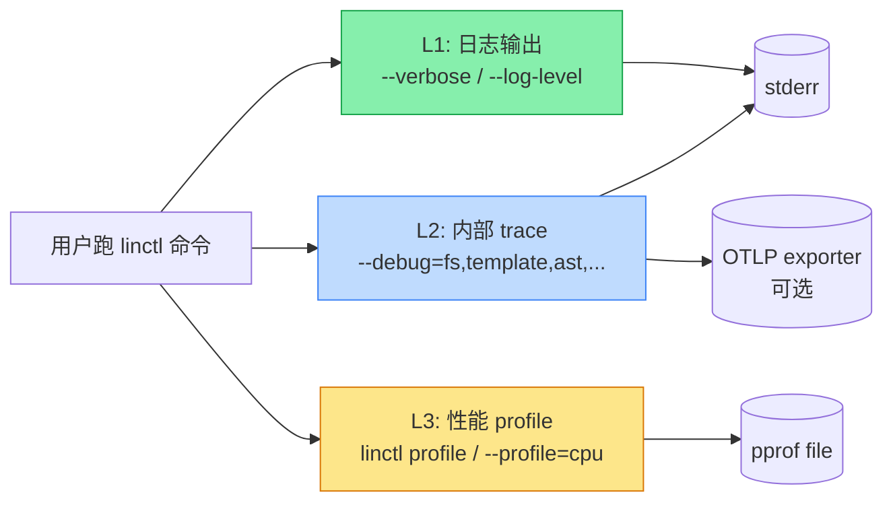

# 14. 可观测性与诊断（Observability & Diagnostics）

> 本文档定义 linctl 自身（**不是它生成的项目**）的可观测能力：怎么打日志、怎么 trace、怎么 profile、用户报"卡住了/慢"时如何定位。

## 14.1 为什么这一章很重要

osbuilder 等同类工具最常见的痛点之一是：**"为什么 add api 卡了 5 秒？"** 没有任何观测手段，只能靠 `fmt.Println` 大法定位。

linctl 是 CLI 工具，不是 server，因此可观测性手段与服务端不同：

| 维度 | 服务端 | CLI 工具 |
| --- | --- | --- |
| Metrics | Prometheus pull | 不需要（命令是 one-shot） |
| Tracing | OTel | **可选 export**：默认不开 |
| Logging | 结构化 + 集中收集 | stderr 输出 + `--verbose` 控制 |
| Profiling | 持续 profiling | **on-demand**：`linctl profile` |
| Debug | 远程 attach | **本地诊断**：`--debug=template,ast,fs` |

## 14.2 三层观测体系



| 层级 | 名称 | 默认状态 | 触发方式 | 代价 |
| --- | --- | --- | --- | --- |
| L1 | 日志 | `info` 级 | 自动 | 极低 |
| L2 | 内部 trace | 关闭 | `--debug=*` flag | 低（仅本进程） |
| L3 | Profile | 关闭 | `linctl profile <cmd>` 或 `--profile=cpu` | 中（写文件） |

## 14.3 L1：日志体系（已完整设计）

### 14.3.1 速览

详见 [13-coding-standards.md §13.5](./13-coding-standards.md)。本节仅补充"用户面"的使用方式。

```bash
# 日志级别
linctl new myblog --log-level=debug   # 详细
linctl new myblog -v                   # 等价 --log-level=debug
linctl new myblog --log-level=warn     # 减少噪音

# JSON 格式（CI/脚本）
linctl plan --log-format=json | jq

# 关闭彩色（CI/管道）
linctl new myblog --no-color
NO_COLOR=1 linctl new myblog           # 等价
```

### 14.3.2 日志输出位置

- **stderr**：所有日志（不污染 stdout）
- **stdout**：仅命令"主输出"（如 `plan` 的 JSON 结果，便于 `| jq` 处理）

```bash
# stdout 仅是 plan JSON，stderr 是日志
linctl plan --output json 2>/dev/null | jq '.actions[].dst'
```

## 14.4 L2：内部 Trace 体系

### 14.4.1 设计目标

回答用户的问题：

- "linctl 在哪一步卡住？"
- "render 慢还是 AST 注入慢？"
- "哪个 Pair 的渲染时间最长？"

### 14.4.2 实现选型

| 选项 | 评估 | 决策 |
| --- | --- | --- |
| OpenTelemetry SDK | 标准；可 export 到 OTLP | ⚠️ 太重（仅 trace 就 ~2 MB） → **作为 Phase 3+ 可选 export 后端** |
| 自研轻量 trace | 简单 | ✅ MVP/Phase 1 选用 |
| `runtime/trace` | 标准库 | 备选（适合 profile，不适合用户层 trace） |

#### 阶段化方案（与 [10-tech-stack.md §10.6](./10-tech-stack.md) 体积预算对齐）

| 阶段 | trace 实现 | 默认状态 | 二进制约束 |
| --- | --- | --- | --- |
| Phase 1 (MVP) | 自研轻量 trace（`internal/diag/trace.go`） | 自动可用，`--debug=*` 启用 | ≤ 12 MB |
| Phase 3+ | 自研 trace + **OTel 可选 export 后端** | OTel 默认**关闭** | 默认 build ≤ 15 MB；`-tags otel` build ≤ 17 MB |

**OTel 集成策略**：

- **build tag 隔离**：OTel 相关代码放在 `internal/diag/otel_export.go`（带 `//go:build otel`）和 `internal/diag/otel_export_stub.go`（带 `//go:build !otel`）。
  默认 build 走 stub（空实现），保证体积 ≤ 15 MB。
- **运行时启用**：`-tags otel` build 出来的二进制在用户显式 `--otlp-endpoint=<url>` 时才会真正连接 OTLP collector，否则仅本地输出。
- **永远不强制依赖 OTel**：自研 trace 是唯一的 first-class trace 体系；OTel 是「桥接到外部生态」的可选 sidecar。

```go
// internal/diag/otel_export.go
//go:build otel

package diag

// 真正的 OTel SDK 接入；仅 -tags otel build 时编入。
func ExportToOTLP(endpoint string, span *Span) error { /* ... */ }

// internal/diag/otel_export_stub.go
//go:build !otel

package diag

// 默认 build 的空实现；保证体积约束。
func ExportToOTLP(endpoint string, span *Span) error { return nil }
```

### 14.4.3 自研 Trace API

```go
// internal/diag/trace.go
package diag

import (
    "context"
    "log/slog"
    "time"
)

type spanCtxKey struct{}

type Span struct {
    Name      string
    StartedAt time.Time
    Attrs     []slog.Attr
    Children  []*Span
    Duration  time.Duration
    parent    *Span
}

// StartSpan 开启一个 span。返回的 done 必须在 defer 中调用。
func StartSpan(ctx context.Context, name string, attrs ...slog.Attr) (context.Context, func()) {
    if !traceEnabled() {
        return ctx, func() {}
    }
    span := &Span{
        Name:      name,
        StartedAt: time.Now(),
        Attrs:     attrs,
    }
    if parent, ok := ctx.Value(spanCtxKey{}).(*Span); ok {
        parent.Children = append(parent.Children, span)
        span.parent = parent
    }
    ctx = context.WithValue(ctx, spanCtxKey{}, span)
    return ctx, func() {
        span.Duration = time.Since(span.StartedAt)
        if span.parent == nil {
            // 根 span，可输出
            outputSpan(span)
        }
    }
}

func traceEnabled() bool {
    return globalConfig.DebugModules != nil
}
```

### 14.4.4 在代码中使用

```go
// internal/codegen/applier.go
func (a *Applier) Apply(ctx context.Context, plan *Plan) error {
    ctx, done := diag.StartSpan(ctx, "codegen.apply",
        slog.Int("actions", len(plan.Actions)),
    )
    defer done()

    for _, action := range plan.Actions {
        ctx, done := diag.StartSpan(ctx, "codegen.action",
            slog.String("dst", action.Pair.Dst),
            slog.String("kind", string(action.Kind)),
        )
        if err := a.execute(ctx, action); err != nil {
            done()
            return err
        }
        done()
    }
    return nil
}

// internal/template/engine.go
//
// 注意：Render 必须接收上层传入的 ctx，从中继承父 span（template.render 通常是
// codegen.action 的子 span）。如果在此处用 context.Background()，会导致 trace
// 树断裂、span 上下文丢失，所有 template.render 都成为孤立根节点。
func (e *Engine) Render(ctx context.Context, tplPath string, data any) ([]byte, error) {
    ctx, done := diag.StartSpan(ctx, "template.render",
        slog.String("template", tplPath),
    )
    defer done()

    // 如需访问当前 span 的属性（例如下游 helper 想读 template name），
    // 用 diag.SpanFromContext(ctx) 获取，与 OTel 的 trace.SpanFromContext 语义一致。
    _ = ctx
    // ...
}
```

### 14.4.5 用户启用方式

```bash
# 启用单一模块 trace
linctl apply --debug=template

# 启用多个
linctl apply --debug=template,ast,fs

# 启用全部
linctl apply --debug=*

# 输出格式
linctl apply --debug=* --debug-out=text   # 默认
linctl apply --debug=* --debug-out=json   # JSON 树
linctl apply --debug=* --debug-out=tree   # 树状显示
```

### 14.4.6 输出示例

```
$ linctl apply --debug=*

🚀 Applying...

[trace] codegen.apply  duration=1.234s  actions=18
├── codegen.action     duration=120ms   dst=cmd/myblog/main.go             kind=Create
│   ├── template.render  duration=85ms  template=templates/component/webserver/cmd/main.go.tpl
│   ├── template.format  duration=30ms  ext=.go
│   └── fs.write          duration=5ms   path=cmd/myblog/main.go
├── codegen.action     duration=240ms   dst=internal/myblog/biz/biz.go     kind=Update
│   ├── ast.batch        duration=200ms  mutators=4
│   │   ├── ast.AddInterfaceMethod  duration=85ms
│   │   ├── ast.AddImport            duration=20ms
│   │   ├── ast.AddStructMethod     duration=80ms
│   │   └── ast.format               duration=15ms
│   └── fs.write          duration=40ms
... (omitted)

✅ Done in 1.234s
```

### 14.4.7 模块化开关

```go
// internal/diag/config.go
package diag

type Config struct {
    DebugModules []string  // ["template", "ast", "fs"] 或 ["*"]
    DebugOutput  string    // "text" / "json" / "tree"
    PProfFile    string    // 非空 → 启用 CPU profile
}

var globalConfig Config

func Init(cfg Config) {
    globalConfig = cfg
}

func moduleEnabled(name string) bool {
    for _, m := range globalConfig.DebugModules {
        if m == "*" || m == name {
            return true
        }
    }
    return false
}
```

模块清单：

| 模块名 | 覆盖范围 |
| --- | --- |
| `cli` | 命令解析、参数补全 |
| `loader` | linctl.yaml 加载、validation |
| `feature` | Feature registry、Apply 调用 |
| `codegen` | Plan 计算、Apply 执行 |
| `template` | 模板渲染、format |
| `ast` | Go/Proto AST 注入 |
| `fs` | 文件读写、hash |
| `hook` | preApply / postApply 执行 |
| `plugin` | 插件 RPC（Phase 5） |

## 14.5 L3：性能 Profile

### 14.5.1 触发方式

#### 方式 A：单命令 profile

```bash
# CPU profile
linctl new myblog --profile=cpu --profile-out=/tmp/linctl.cpu.pb.gz

# Memory profile
linctl new myblog --profile=mem --profile-out=/tmp/linctl.mem.pb.gz

# Block profile
linctl plan --profile=block --profile-out=/tmp/linctl.block.pb.gz
```

#### 方式 B：包装命令

```bash
# 等价于把命令包在 profile 里
linctl profile new myblog --module github.com/foo/myblog
# → 生成 _output/profile/<timestamp>/{cpu,mem,goroutine}.pb.gz
```

### 14.5.2 实现

```go
// internal/diag/profile.go
package diag

import (
    "fmt"
    "os"
    "runtime/pprof"
    "strings"
)

type Profiler struct {
    cpuFile *os.File
    memFile string
    enabled []string
}

func StartProfile(types []string, outPath string) (*Profiler, error) {
    p := &Profiler{enabled: types, memFile: ""}
    for _, t := range types {
        switch t {
        case "cpu":
            f, err := os.Create(strings.Replace(outPath, "{type}", "cpu", 1))
            if err != nil {
                return nil, err
            }
            if err := pprof.StartCPUProfile(f); err != nil {
                return nil, err
            }
            p.cpuFile = f
        case "mem":
            p.memFile = strings.Replace(outPath, "{type}", "mem", 1)
        case "goroutine", "block", "mutex":
            // 类似处理
        }
    }
    return p, nil
}

func (p *Profiler) Stop() error {
    if p.cpuFile != nil {
        pprof.StopCPUProfile()
        p.cpuFile.Close()
    }
    if p.memFile != "" {
        f, err := os.Create(p.memFile)
        if err != nil {
            return err
        }
        defer f.Close()
        return pprof.WriteHeapProfile(f)
    }
    return nil
}
```

### 14.5.3 分析 profile

```bash
# 与标准 pprof 兼容
go tool pprof /tmp/linctl.cpu.pb.gz

# Web UI
go tool pprof -http=:8080 /tmp/linctl.cpu.pb.gz

# 火焰图
go tool pprof -png -output=cpu.png /tmp/linctl.cpu.pb.gz
```

### 14.5.4 用户场景

| 用户报告 | 建议 profile |
| --- | --- |
| "新建项目慢" | `--profile=cpu` |
| "内存爆了" | `--profile=mem` |
| "goroutine 卡住" | `--profile=goroutine,block` |

## 14.6 错误诊断

### 14.6.1 LinctlError 增强信息

每个错误都给出"行动可执行的"修复建议。详见 [13-coding-standards.md §13.4](./13-coding-standards.md)。

### 14.6.2 Diagnostic Bundle（远期）

为了让用户提交 bug 报告时**附带完整上下文**，提供：

```bash
# 把当前命令 + 环境 + 配置打包成可分享的 .tar.gz
linctl bug-report --output linctl-bug-2026-04-25.tar.gz

# 内容：
# - linctl version + go version + OS
# - linctl.yaml + PROJECT
# - 最近的 trace 输出
# - 最近的 .linctl/backups/ 引用（可选 --include-backup）
# - 不包含敏感信息（自动脱敏 author email、git remote URL）
```

实施 Phase：4

### 14.6.3 `linctl doctor` 升级

详见 [03-cli-design.md §3.3.10](./03-cli-design.md)。

升级方向：

```bash
# 不仅检查环境，还检查项目状态
linctl doctor

# 输出：
🩺 Environment:
   ✔ go 1.22.5
   ✔ git 2.42.0
   ✗ protoc not found  → install: brew install protobuf

🩺 Project (linctl.yaml):
   ✔ schema valid
   ✗ Component "mb-worker" features [opentelemetry] requires storage != memory

🩺 Generated files:
   ✔ 250 files have hash comments
   ⚠ 3 files missing hash comments (likely user-created):
     - internal/myblog/biz/v1/post/custom.go
     - ...
   ⚠ 2 files modified by user (will conflict on next apply):
     - internal/myblog/server.go
     - internal/myblog/biz/v1/post/post.go
```

## 14.7 Telemetry（opt-in）

### 14.7.1 严格 opt-in 原则

| 默认 | 关闭 |
| --- | --- |
| 启用方式 | `LINCTL_TELEMETRY=on` 环境变量 |
| 第一次运行提示 | 显示一次"按 ENV 启用 telemetry 帮助我们改进"，**用户不操作不开启** |
| 上传内容 | **绝不**上传项目代码、配置、文件名 |

### 14.7.2 上报内容（极简）

```json
{
  "command": "new",                    // new / add / plan / apply / ...
  "framework": "gin",                  // 仅枚举值，不含具体配置
  "storage": "gorm-postgres",
  "features": ["healthz", "user"],     // 启用的 feature 列表
  "duration_ms": 1234,
  "outcome": "success",                // success / failure
  "linctl_version": "v1.0.0",
  "go_version": "go1.22.5",
  "platform": "darwin/arm64",
  "anonymous_id": "uuid-v4"            // 本机生成，不关联用户身份
}
```

### 14.7.3 上报实现

```go
// internal/telemetry/telemetry.go
package telemetry

import (
    "bytes"               // 必需：bytes.NewReader
    "context"
    "crypto/sha256"       // TLS pinning
    "crypto/tls"
    "crypto/x509"
    "encoding/hex"
    "encoding/json"
    "fmt"
    "net/http"
    "os"
    "time"
)

// 默认 endpoint。**永远不要硬编码线上唯一地址**，允许通过环境变量覆盖：
//   - LINCTL_TELEMETRY_ENDPOINT：自托管 / 离线代理 / 关闭场景
//   - 内嵌的 SPKI pin 仅对默认 endpoint 生效；自定义 endpoint 时 pin 不会强制
const defaultEndpoint = "https://telemetry.linctl.dev/v1/events"

// pinnedSPKISHA256 是 telemetry.linctl.dev 服务证书 SubjectPublicKeyInfo 的
// SHA-256 指纹（hex）。证书轮换时同步更新此常量并在 release notes 中说明。
//
// 设计意图：
//   - 防止公司代理 / 中间人 / 误信任的 root CA 静默劫持遥测流量
//   - 仅当 endpoint == defaultEndpoint 时校验 pin
//   - 自托管场景（用户主动配置 LINCTL_TELEMETRY_ENDPOINT）跳过 pin 校验
const pinnedSPKISHA256 = "REPLACE_WITH_REAL_SPKI_HASH_BEFORE_v1.0"

type Event struct {
    Command       string   `json:"command"`
    Framework     string   `json:"framework,omitempty"`
    Storage       string   `json:"storage,omitempty"`
    Features      []string `json:"features,omitempty"`
    DurationMS    int64    `json:"duration_ms"`
    Outcome       string   `json:"outcome"`
    LinctlVersion string   `json:"linctl_version"`
    GoVersion     string   `json:"go_version"`
    Platform      string   `json:"platform"`
    AnonymousID   string   `json:"anonymous_id"`
}

func ShouldReport() bool {
    return os.Getenv("LINCTL_TELEMETRY") == "on"
}

// resolveEndpoint 返回当前生效的 endpoint，并指示是否应启用 TLS pin 校验。
func resolveEndpoint() (endpoint string, pinned bool) {
    if v := os.Getenv("LINCTL_TELEMETRY_ENDPOINT"); v != "" {
        return v, false // 用户自定义 endpoint：跳过 pin（用户已知后果）
    }
    return defaultEndpoint, true
}

// newPinnedClient 构造启用了 SPKI pinning 的 http.Client（仅用于默认 endpoint）。
func newPinnedClient() *http.Client {
    return &http.Client{
        Timeout: 2 * time.Second,
        Transport: &http.Transport{
            TLSClientConfig: &tls.Config{
                MinVersion: tls.VersionTLS12,
                VerifyPeerCertificate: func(rawCerts [][]byte, _ [][]*x509.Certificate) error {
                    for _, raw := range rawCerts {
                        cert, err := x509.ParseCertificate(raw)
                        if err != nil {
                            continue
                        }
                        sum := sha256.Sum256(cert.RawSubjectPublicKeyInfo)
                        if hex.EncodeToString(sum[:]) == pinnedSPKISHA256 {
                            return nil
                        }
                    }
                    return fmt.Errorf("telemetry: TLS pin mismatch (expected SPKI %s)", pinnedSPKISHA256)
                },
            },
        },
    }
}

func Report(ctx context.Context, evt Event) {
    if !ShouldReport() {
        return
    }
    endpoint, pinned := resolveEndpoint()

    body, _ := json.Marshal(evt)
    req, err := http.NewRequestWithContext(ctx, "POST", endpoint, bytes.NewReader(body))
    if err != nil {
        return
    }
    req.Header.Set("Content-Type", "application/json")

    var client *http.Client
    if pinned {
        client = newPinnedClient()
    } else {
        client = &http.Client{Timeout: 2 * time.Second}
    }

    resp, err := client.Do(req)
    if err != nil {
        return
    }
    defer resp.Body.Close()
    // 不关心 HTTP 状态码；2 秒超时即放弃，不阻塞用户
}
```

#### TLS pinning 注意事项

- `pinnedSPKISHA256` 是 SubjectPublicKeyInfo 的 SHA-256，比叶证书指纹更稳定（证书续期不需要更新 pin，只要不换 keypair）
- 证书 keypair 轮换时**必须同步**：(1) 更新 `pinnedSPKISHA256` 常量；(2) 旧版 linctl 升级前会拒绝上报，可借此渐进迁移
- 用户明确配置 `LINCTL_TELEMETRY_ENDPOINT=https://corp-proxy.example.com/...` 时 pin **不强制**（用户主动信任自己的代理是合理场景）
- pin 校验失败仅静默丢弃事件，**不报错给用户**（遥测优雅降级）

### 14.7.4 向用户的承诺

- ✅ **绝不**上报项目代码 / 文件路径 / 文件名
- ✅ **绝不**上报 author name / email / git remote URL
- ✅ **绝不**关联到用户身份（anonymous_id 是本机随机生成的 UUID）
- ✅ **可一键关闭**：`unset LINCTL_TELEMETRY`
- ✅ **完全开源**：上报逻辑代码完全公开，可审查
- ✅ **可一键销毁本地数据**：`linctl telemetry reset`

## 14.8 监控关键指标（Internal Health）

虽然 linctl 是 CLI 工具，但仍然需要监控**自身**的健康指标用于优化：

| 指标 | 监控方式 | 目标 |
| --- | --- | --- |
| `linctl new` 冷启动时间 | E2E benchmark + telemetry | ≤ 1s |
| `linctl add api` 单 kind | E2E benchmark | ≤ 500ms |
| `linctl plan` (1000 文件) | E2E benchmark | ≤ 2s |
| 二进制大小 | CI 检查 | ≤ 15 MB |
| 模板渲染失败率 | telemetry outcome | < 0.1% |
| Crash 率 | telemetry + Sentry（远期） | < 0.01% |

### 14.8.1 性能基线表（每月更新）

存放于 `_baselines/perf-<date>.md`，CI 自动比对：

```markdown
# Performance Baseline 2026-04-25

| Operation | p50 | p95 | p99 |
| --- | --- | --- | --- |
| linctl new (gin/memory) | 800ms | 1.1s | 1.4s |
| linctl new (grpc/postgres) | 1.2s | 1.8s | 2.5s |
| linctl add api Post | 320ms | 480ms | 700ms |
| linctl plan (250 files) | 600ms | 900ms | 1.3s |
| linctl apply (250 files) | 1.5s | 2.2s | 3.0s |
```

CI 中 `make perf-check` 与基线对比，超过 30% 回归报警。

## 14.9 用户体验：诊断模式速查表

| 用户场景 | 推荐命令 |
| --- | --- |
| 命令"卡住" | `<cmd> --verbose` |
| 想知道哪一步慢 | `<cmd> --debug=*` |
| 想看模板渲染细节 | `<cmd> --debug=template,ast` |
| 想看是不是磁盘问题 | `<cmd> --debug=fs` |
| CPU profiling | `<cmd> --profile=cpu --profile-out=/tmp/cpu.pb.gz` |
| 报 bug | `linctl bug-report` |
| 检查环境 | `linctl doctor` |
| 检查项目状态 | `linctl lint` |

## 14.10 Open Questions

| 问题 | 待决议 |
| --- | --- |
| 是否引入 OTel SDK？ | ✅ 已定：Phase 3+ 通过 `-tags otel` build 提供可选 export 后端；MVP/Phase 1 仅自研轻量 trace；详见 §14.4.2 |
| Crash 自动收集（如 Sentry）？ | 远期评估，必须尊重 opt-in |
| 是否支持把 trace 导出到 chrome://tracing 格式？ | Phase 4 评估 |
| `linctl bug-report` 是否实现自动上传？ | 暂不实现，仅生成本地包 |

---

## 修订记录

| 日期 | 版本 | 变更 |
| --- | --- | --- |
| 2026-04-25 | 0.1 | 初始版本 |
| 2026-04-25 | 0.2 | 按 [META-fix-decisions-2026-04-25](./META-fix-decisions-2026-04-25.md) 修订：(1) §14.4.2 OTel 与自研 trace 关系明确：MVP 自研，Phase 3+ 通过 `-tags otel` 提供可选 export；(2) §14.4.4 `Engine.Render` 改为接收 `ctx context.Context`；(3) §14.7.3 telemetry endpoint 通过 `LINCTL_TELEMETRY_ENDPOINT` 可配置 + 默认 endpoint 启用 SPKI pinning + 补 `bytes` import |

---

下一步阅读：[15-security-model.md](./15-security-model.md)

---

_Last reviewed: 2026-04-25_
