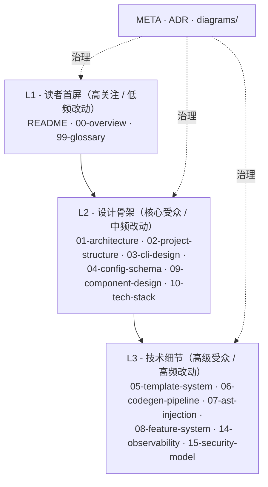

# META. linctl 规划演进路线（Meta-Roadmap）

> 本文档是 linctl **设计文档自身的演进追溯**，不是产品路线图（产品路线图见 [11-implementation-plan.md](./11-implementation-plan.md)）。
> 在每一次"对设计文档做较大补充/重构"时，**先**更新本文档，**后**修订对应文档。这样形成"决策可追溯、改动可回滚"的设计治理闭环。

## 0. 阅读路径

| 你想…… | 看哪一节 |
| --- | --- |
| 看本仓库当前所有文档的状态 | [§1 文档全景图](#1-文档全景图) |
| 知道为什么要新增/重构某文档 | [§2 差距分析（Gap Analysis）](#2-差距分析gap-analysis) |
| 看下一步做什么、什么时候做 | [§3 完善路线图（4 个 Batch）](#3-完善路线图4-个-batch) |
| 看每篇文档的"产出标准（DoD）" | [§4 文档质量标准（Doc DoD）](#4-文档质量标准doc-dod) |
| 看历次重大变更 | [§5 修订历史](#5-修订历史) |

---

## 1. 文档全景图

### 1.1 文档分级

linctl 文档按"读者关心度 × 演进频率"分为三层：



### 1.2 当前清单（按编号）

| 编号 | 文档 | 状态 | 层级 | 字数估算 | 最后更新 |
| --- | --- | --- | --- | --- | --- |
| - | `README.md` | ✅ | L1 | ~700 | 2026-04-25 |
| 00 | `00-overview.md` | ✅ | L1 | ~3000 | 2026-04-25 |
| 01 | `01-architecture.md` | ✅ | L2 | ~7000 | 2026-04-25 |
| 02 | `02-project-structure.md` | ✅ | L2 | ~8000 | 2026-04-25 |
| 03 | `03-cli-design.md` | ✅ | L2 | ~7000 | 2026-04-25 |
| 04 | `04-config-schema.md` | ✅ | L2 | ~9000 | 2026-04-25 |
| 05 | `05-template-system.md` | ✅ | L3 | ~7500 | 2026-04-25 |
| 06 | `06-codegen-pipeline.md` | ✅ + 待增补 | L3 | ~8500 | 2026-04-25 |
| 07 | `07-ast-injection.md` | ✅ | L3 | ~8000 | 2026-04-25 |
| 08 | `08-feature-system.md` | ✅ | L3 | ~9000 | 2026-04-25 |
| 09 | `09-component-design.md` | 🚧 计划 Batch 1 | L2 | 目标 ~6000 | - |
| 10 | `10-tech-stack.md` | 🚧 计划 Batch 1 | L2 | 目标 ~5000 | - |
| 11 | `11-implementation-plan.md` | 🚧 计划 Batch 1 | L2 | 目标 ~7000 | - |
| 12 | `12-testing-strategy.md` | 🚧 计划 Batch 1 | L3 | 目标 ~6000 | - |
| 13 | `13-coding-standards.md` | 🚧 计划 Batch 1 | L3 | 目标 ~5000 | - |
| 14 | `14-observability.md` | 🚧 计划 Batch 2 | L3 | 目标 ~4000 | - |
| 15 | `15-security-model.md` | 🚧 计划 Batch 2 | L3 | 目标 ~5000 | - |
| 16 | `16-ai-integration.md` | 🚧 计划 Batch 3 | L2 | - | - |
| 17 | `17-enterprise-platform.md` | 🚧 计划 Batch 3 | L2 | - | - |
| 18 | `18-release-governance.md` | 🚧 计划 Batch 4 | L2 | - | - |
| 19 | `19-docs-site.md` | 🚧 计划 Batch 4 | L3 | - | - |
| 20 | `20-import-algorithm.md` | 🚧 计划 Batch 3 | L3 | - | - |
| 99 | `99-glossary.md` | ✅ | L1 | ~3000 | 2026-04-25 |
| - | `META-roadmap.md` | ✅（本文档） | META | - | 2026-04-25 |
| - | `adr/README.md` + `adr/000-template.md` + `adr/001-005*.md`（5 个 ADR：001-use-dst-not-goast, 002-use-embed-not-statik, 003-use-protocompile-for-proto, 004-plan-apply-pattern, 005-feature-as-first-class） | ✅ Batch 1 已交付 | META | - | 2026-04-25 |
| - | `diagrams/*.mmd` × 10 | 🚧 计划 Batch 1 | META | - | - |

> 状态符号：✅ 已完成 · 🚧 计划中 · ⚠️ 需要重构 · ❌ 已废弃

---

## 2. 差距分析（Gap Analysis）

> 完成时间：2026-04-25。识别基于"00-08 已交付文档" vs "一款生产级开源 CLI 工具的应有规划"做对照。

### 2.1 已规划但未交付（README 列出）

| 文档 | 缺失原因 | 影响 |
| --- | --- | --- |
| `09-component-design.md` | 时间不足 | Component 接口契约不清晰 → Feature 与组件的边界模糊 |
| `10-tech-stack.md` | 同上 | 依赖选型没有显式记录 → 后续选型决策无依据 |
| `11-implementation-plan.md` | 同上 | 无法启动开发，资源调度无依据 |
| `12-testing-strategy.md` | 同上 | 缺少质量保证手段，难以达成"覆盖率 ≥70%"目标 |
| `13-coding-standards.md` | 同上 | 贡献者无明确约束 → PR 风格不统一 |

### 2.2 关键架构盲点（资深架构师视角）

| # | 盲点 | 为什么重要 | 建议补充 |
| --- | --- | --- | --- |
| C1 | **可观测性与诊断** | 用户报"add api 卡住了"时，无法快速定位是 template render 还是 AST 注入慢 | `14-observability.md` |
| C2 | **安全模型** | hooks/插件执行可能被恶意命令利用；模板 SSTI 风险；author email 泄漏 | `15-security-model.md` |
| C3 | **并发与一致性** | 团队/CI 同时跑 `apply` 时文件可能损坏 | 06 文档增补一节 |
| C4 | **AI/LLM 协作** | 错过了"AI 生成业务代码 + linctl 强制规范"的趋势窗口 | `16-ai-integration.md` (Batch 3) |
| C5 | **企业/平台化** | 内部模板分发、Feature 私有市场缺位 | `17-enterprise-platform.md` (Batch 3) |
| C6 | **i18n 国际化** | CLI 输出/错误消息只考虑中文 | 并入 `13-coding-standards.md` |

### 2.3 落地配套缺失（开源运营必需）

| # | 缺失 | 后果 | 解决 |
| --- | --- | --- | --- |
| D1 | 发布与版本治理 | SemVer 承诺不清晰 → 用户不敢升级 | `18-release-governance.md` (Batch 4) |
| D2 | CI/CD 工作流 | 缺少自动化 → 质量退化 | 并入 `12-testing-strategy.md` |
| D3 | 贡献指南 | 社区门槛高 → PR 数量稀少 | `CONTRIBUTING.md` (仓库根) |
| D4 | 文档站点 | 文档只能在 GitHub 看 → 搜索体验差 | `19-docs-site.md` (Batch 4) |

### 2.4 osbuilder 迁移路径未深入

| # | 缺失 | 后果 | 解决 |
| --- | --- | --- | --- |
| E1 | `linctl import` 算法细节 | 老用户迁移失败率高 → 流失 | `20-import-algorithm.md` (Batch 3) |
| E2 | `migrate-from-osbuilder` 兼容层 | 项目跑不起来 | 并入 20 |

---

## 3. 完善路线图（4 个 Batch）

### Batch 1：必须有（解锁开发）—— 当前批次 ✅

> **触发条件**：当前进度  
> **预估**：5 篇核心文档 + 10 张图 + ADR 机制 + Glossary

| 文档 | 状态 | 说明 |
| --- | --- | --- |
| `99-glossary.md` | ✅ | 术语表（已完成，是后续文档基准） |
| `META-roadmap.md` | ✅ | 本文档 |
| `adr/README.md` + `adr/000-template.md` + `adr/001-005*.md` | ✅ 已交付 | ADR 机制 + 5 项关键决策（001-use-dst-not-goast / 002-use-embed-not-statik / 003-use-protocompile-for-proto / 004-plan-apply-pattern / 005-feature-as-first-class） |
| `10-tech-stack.md` | 🚧 进行中 | 技术栈选型（09/11/12/13 的前提） |
| `09-component-design.md` | 🚧 进行中 | 组件接口与三种内置实现 |
| `11-implementation-plan.md` | 🚧 进行中 | 5 Phase × 详细任务拆分 |
| `12-testing-strategy.md` | 🚧 进行中 | 单测/集成/snapshot/E2E + CI 矩阵 |
| `13-coding-standards.md` | 🚧 进行中 | 命名/错误/日志/i18n 规范 |
| `diagrams/*.mmd` × 10 | 🚧 进行中 | 抽离 README 列出的所有 Mermaid 图 |
| `README.md` 更新 | 🚧 进行中 | 索引 + 双向引用 |

### Batch 2：架构盲点（生产级）—— 当前批次 ✅

| 文档 | 状态 | 说明 |
| --- | --- | --- |
| `14-observability.md` | 🚧 计划 | 内部 trace、`--debug=*` 模块化、`linctl profile` |
| `15-security-model.md` | ✅ 已完成 | Hook 执行策略（三级 + CI 强制）、模板 SSTI、插件信任、敏感字段脱敏 |
| `06-codegen-pipeline.md` 增补 | 🚧 计划 | 6.14 节：并发 apply 的 flock + CI 幂等 |
| `13-coding-standards.md` 增补 | 🚧 计划 | i18n 一节：错误码 → 多语言映射 |

### Batch 3：差异化与生态（暂未启动）

| 文档 | 触发条件 |
| --- | --- |
| `16-ai-integration.md` | Batch 1 + 2 完成后 |
| `17-enterprise-platform.md` | 同上 |
| `20-import-algorithm.md` | 同上 |

### Batch 4：开源运营（暂未启动）

| 文档 | 触发条件 |
| --- | --- |
| `18-release-governance.md` | 即将发布 v1.0 时 |
| `19-docs-site.md` | 文档总量 > 30 篇时 |
| `CONTRIBUTING.md` 等 | 准备开源前 |

---

## 4. 文档质量标准（Doc DoD）

任何 linctl 设计文档**必须**满足：

### 4.1 内容要求

- [ ] **首段定位**：用 ≤ 100 字说清楚"本文档解答什么问题"。
- [ ] **章节编号**：按 `X.Y.Z` 三级编号；每篇 ≤ 12 个一级章节。
- [ ] **代码示例**：所有抽象都至少配一个可执行的代码示例。
- [ ] **对照表**：与 osbuilder 等同类工具的差异对比。
- [ ] **决策记录**：关键决策追溯到对应的 ADR（见 [§4.3](#43-adr-引用)）。
- [ ] **Open Questions**：结尾列出已知未决问题。
- [ ] **下一步阅读**：明确告诉读者继续看哪篇。

### 4.2 引用与术语

- [ ] **术语统一**：所有高频名词必须在 [99-glossary.md](./99-glossary.md) 中有定义；首次出现时**用粗体**且包含 anchor 链接（如 `**[Pair](./99-glossary.md#pair)**`）。
- [ ] **跨文档引用双向化**：A 引用 B，则 B 也应在恰当处引用 A。
- [ ] **图表分离**：Mermaid 图同时维护内嵌版本与 `diagrams/*.mmd` 独立文件版本。

### 4.3 ADR 引用

- 重大设计决策（影响接口/数据格式/依赖选型）必须以 [Architecture Decision Record (ADR)](./adr/) 形式记录。
- 文档中引用 ADR 用：`> 参见 [ADR-001 选用 dst 而非 go/ast](./adr/001-use-dst-not-goast.md)`

### 4.4 元数据头（可选但推荐）

每篇文档可在顶部加 YAML 元数据：

```markdown
---
docId: 09-component-design
status: draft | reviewing | stable
version: 0.1
authors: [@clin211]
reviewers: []
lastReviewed: 2026-04-25
---
```

---

## 5. 修订历史

| 日期 | 版本 | 变更摘要 | 作者 |
| --- | --- | --- | --- |
| 2026-04-25 | 0.1 | 初始版本：完成 00-08 文档；建立 META + Glossary | @clin211 |
| 2026-04-25 | 0.2 | Batch 1 启动：09-13 + ADR + diagrams | @clin211 |
| 2026-04-25 | 0.3 | Batch 2 启动：14-15 + 06 增补 + 13 增补 i18n | @clin211 |
| - | - | Batch 3 启动：16, 17, 20 | - |
| - | - | Batch 4 启动：18, 19, CONTRIBUTING | - |

---

## 6. 关键决策一览（导引到 ADR）

> 完整内容见 [adr/README.md](./adr/README.md)。本节仅作快速索引。

| ADR ID | 标题 | 状态 | 影响范围 |
| --- | --- | --- | --- |
| [ADR-001](./adr/001-use-dst-not-goast.md) | 用 `dave/dst` 替代 `go/ast` | ✅ Accepted | `internal/ast/` |
| [ADR-002](./adr/002-use-embed-not-statik.md) | 用 `//go:embed` 替代 `rakyll/statik` | ✅ Accepted | `internal/template/` |
| [ADR-003](./adr/003-use-protocompile-for-proto.md) | Proto 修改用 `bufbuild/protocompile` 替代字符串扫描 | ✅ Accepted | `internal/ast/proto_inject.go` |
| [ADR-004](./adr/004-plan-apply-pattern.md) | 引入 Plan/Apply 两阶段（Terraform 模式） | ✅ Accepted | `internal/codegen/`、`internal/orchestrator/` |
| [ADR-005](./adr/005-feature-as-first-class.md) | Feature 提升为一等公民（接口 + Registry） | ✅ Accepted | `internal/feature/` |

---

## 7. 反馈机制

- **小修订**（typo / 链接 / 单点遗漏）：直接 PR。
- **结构性修订**（新增章节 / 重构 / 删除）：先在本文档加一行待办，并打开 issue 讨论，达成共识后修订。
- **新增完整文档**：先在 [§3 路线图](#3-完善路线图4-个-batch)中加占位行，估算字数，然后开 issue 邀请评审。

---

> "**好的设计文档不是一次性写完，而是被使用、被质疑、被修订的活物。**"

_Last reviewed: 2026-04-25_
