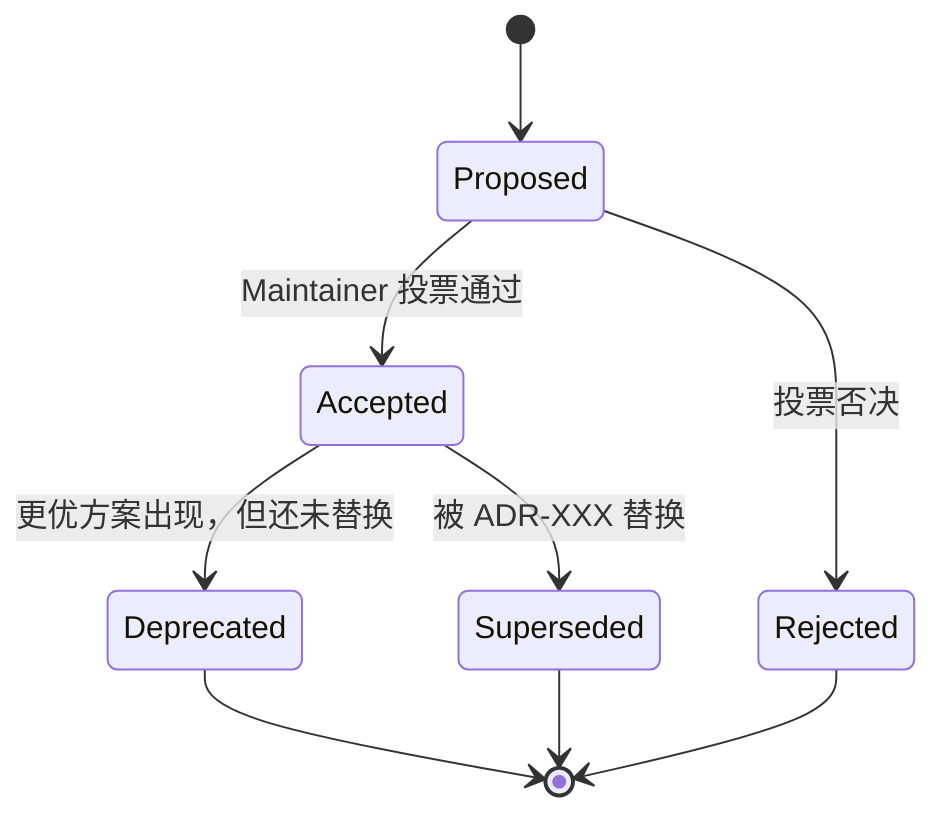

# Architecture Decision Records (ADR)

> ADR 是 linctl **关键架构决策的不可变记录**。一旦决策被 Accept，原文不可修改；如要变更需新增 ADR 并将旧 ADR 状态改为 `Superseded by ADR-XXX`。

## 为什么写 ADR

| 没有 ADR | 有 ADR |
| --- | --- |
| 半年后没人记得"为什么用 dst 而不是 go/ast" | 翻 [ADR-001](./001-use-dst-not-goast.md) 就有完整 context + alternatives + rationale |
| 新成员问"为什么 Plan/Apply 两阶段" | 给一个链接就能让 ta 自己看完 |
| 决策被反复推翻 | 推翻必须写新 ADR 说明原因 |
| 设计文档越改越乱 | 文档讲"是什么/怎么用"，ADR 讲"为什么这么选" |

参考：[Documenting Architecture Decisions - Michael Nygard](https://cognitect.com/blog/2011/11/15/documenting-architecture-decisions)

## ADR 状态流转



## 索引

| ID | 标题 | 状态 | 决策日期 | 影响范围 |
| --- | --- | --- | --- | --- |
| [000](./000-template.md) | ADR 模板（不计入正式编号） | - | - | - |
| [001](./001-use-dst-not-goast.md) | 用 `dave/dst` 替代 `go/ast` | ✅ Accepted | 2026-04-25 | `internal/ast/` |
| [002](./002-use-embed-not-statik.md) | 用 `//go:embed` 替代 `rakyll/statik` | ✅ Accepted | 2026-04-25 | `internal/template/`、`templates/` |
| [003](./003-use-protocompile-for-proto.md) | Proto AST 用 `bufbuild/protocompile` | ✅ Accepted | 2026-04-25 | `internal/ast/proto_inject.go` |
| [004](./004-plan-apply-pattern.md) | 引入 Plan/Apply 两阶段流水线 | ✅ Accepted | 2026-04-25 | `internal/codegen/`、`internal/orchestrator/` |
| [005](./005-feature-as-first-class.md) | Feature 提升为一等公民 | ✅ Accepted | 2026-04-25 | `internal/feature/` |

## 编写流程

1. **复制模板**：`cp adr/000-template.md adr/00X-<short-name>.md`
2. **填充内容**：按模板的所有 section 填充。
3. **状态设为 `Proposed`**，开 PR 邀请评审。
4. **达成共识后**，状态改为 `Accepted`，merge PR。
5. **通过本 README 的索引表登记**。

## 命名规范

- 文件名：`<3 位编号>-<kebab-case 短描述>.md`
- 编号：从 `001` 开始递增，不复用、不留空。
- 短描述：≤ 5 个英文单词，凸显决策点。
  - ✅ 好：`use-dst-not-goast`、`plan-apply-pattern`、`opt-in-telemetry`
  - ❌ 差：`ast-decision`、`pattern`、`how-we-do-template`

## 修改 vs 新增

- **不改原文**：ADR 一经 Accept，原文不可修改（除 typo / 链接）。
- **要变更决策**：新增一个 ADR，**清楚地引用要替换的旧 ADR**，并把旧 ADR 顶部状态改为 `Superseded by ADR-XXX`。
- **示例**：未来如果发现 dst 不再维护，写 ADR-020 提议换 `tools/go/ast/astutil`，将 ADR-001 改为 `Superseded`。

## 不属于 ADR 的事项

ADR 仅记录**架构级别**的决策。以下不写 ADR：

- 单个函数的实现细节（写代码注释）
- 重命名一个变量（直接 PR）
- bug fix（写 commit message）
- 新增一个内置 Feature（属于 Feature 设计，写在 [08-feature-system.md](../08-feature-system.md)）
- 调整 Mermaid 图的颜色（直接 PR）

## 与设计文档的协作关系

| 维度 | ADR | 设计文档（00-XX） |
| --- | --- | --- |
| 回答的问题 | **Why** 我们这么选 | **What** 这个东西是 + **How** 怎么用 |
| 修改频率 | 写完后**几乎不改** | 随实现演进**频繁更新** |
| 受众 | 想理解决策原因的人（含未来的自己） | 用工具的人 / 写代码的人 |
| 长度 | 短（< 500 字） | 长（数千字） |
| 示例 | 「为什么用 dst 而不是 go/ast」 | 「dst 怎么调用」 |

设计文档应在涉及到核心决策处**链接**到对应的 ADR：

```markdown
linctl 的 Go AST 注入基于 [`dave/dst`](https://github.com/dave/dst)。
> 决策原因详见 [ADR-001](./adr/001-use-dst-not-goast.md)。
```

---

> **黄金原则**：当你发现自己在 PR review 中重复说同一个理由时，应该把它升格成 ADR。

---

_Last reviewed: 2026-04-25_
