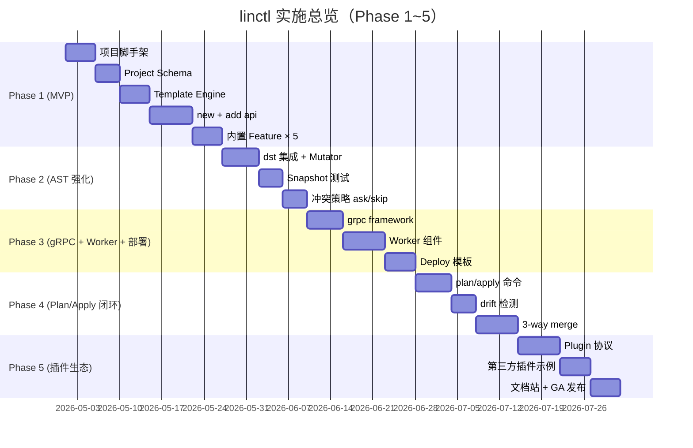

# 11. 实施计划（5 Phase × Story 拆分）

> 本文档把"linctl 从 0 到 v1.0"的工作拆分为 **5 个 Phase × N 个 Story**，每个 Story 都有明确的 DoD（[Definition of Done](./99-glossary.md)）、依赖关系、估算工时与风险评估。

## 11.1 总览



| Phase | 周期 | 主交付 | 关键里程碑 |
| --- | --- | --- | --- |
| Phase 1 (MVP) | 3-4 周 | `linctl new` + `linctl add api` 闭环；gin + memory/postgres；5 个内置 Feature | v0.1 alpha |
| Phase 2 (AST 强化) | 2-3 周 | dst-based AST 注入；snapshot 测试；冲突 ask/skip 策略 | v0.2 alpha |
| Phase 3 (gRPC + Worker + 部署) | 2-3 周 | gRPC 全链路；Worker；docker/k8s/systemd 模板 | v0.3 beta |
| Phase 4 (Plan/Apply 闭环) | 2-3 周 | `linctl plan` + `linctl apply`；drift 检测；3-way merge | v0.9 RC |
| Phase 5 (插件生态) | 长尾 | 插件机制；第三方插件示例；文档站；v1.0 GA | v1.0 GA |

> 工时估算基于 1 名全职开发 + 偶尔 PR review。如果是 2 人协作，整体周期可压缩 30-40%。

## 11.2 Phase 1：MVP（最小可用产品）

> **DoD**：`linctl new myblog --module github.com/foo/myblog --framework gin` 生成的项目可 `go build` + `./_output/bin/myblog server` 启动 + `curl /healthz` 返回 200。

### 11.2.0 Phase 1 范围声明（与 schema 的差异）

`04-config-schema.md` 描述的是 **目标 schema**（v1.0 GA 全集）。Phase 1 故意只实现一个**可运行的最小子集**，剩余在后续 Phase 渐进交付：

| 维度 | Schema 全集 | Phase 1 实现 | 其余 Phase |
| --- | --- | --- | --- |
| `framework` | `gin` / `grpc` | **仅 gin** | grpc → Phase 3 |
| `storage` | `memory` / `gorm-mysql` / `gorm-postgres` / `gorm-sqlite` / `mongo` | **仅 memory + gorm-postgres** | sqlite/mysql/mongo → Phase 3 |
| `deploy` | `none` / `docker` / `kubernetes` / `systemd` | **仅 none + docker(runtime-only)** | k8s/systemd/multi-stage → Phase 3 |
| `Component.kind` | `WebServer` / `Worker` / `CLI` | **仅 WebServer** | Worker/CLI → Phase 3 |
| `features` | `healthz` / `opentelemetry` / `user` / `websocket` / `preloader` | **5 种全部** | - |
| `linctl plan` 命令 | 完整 | **不实现命令**；仅 Plan 数据结构（`Plan{}`/`Action{}`/`PlanStats{}`）在 Story 1.7 引入用于 internal | 命令 → Phase 4 |
| `linctl apply` 冲突策略 | `skip` / `overwrite` / `merge` / `ask` | **仅 skip + overwrite**（隐式，由 `--force` 切换） | ask → Phase 2; merge → Phase 4 |
| `linctl add` 子命令 | `api` / `worker` / `cli` / `webserver` / `feature` / `component` | **仅 `add api`** | 其他 → Phase 3-4 |
| AST 注入 | dst-based + protocompile | **不在 Phase 1**；用户手动加方法 | dst → Phase 2; protocompile → Phase 2 |
| Hook 执行策略 | 三级完整（restricted/confirm/unrestricted） | **基础 restricted**（gofumpt/go mod tidy/make 等白名单） | confirm + unrestricted → Phase 2 |
| i18n | 完整双语 | **仅英文**；中文 → Phase 2 | - |

> **关键提醒**：
> 1. **Plan 数据结构 ≠ `linctl plan` 命令**。Phase 1 把 Plan/Action 类型定义出来供 internal Apply 使用；用户面的 `linctl plan` 命令在 Phase 4 才暴露。
> 2. Phase 1 的 schema validator **必须**接受 schema 全集（避免后续 breaking change），但对 Phase 1 不支持的字段返回 `ErrNotImplementedYet` + 友好 hint：「该 framework 将在 Phase 3 支持，参见 11-implementation-plan.md」。
> 3. 通过 schema 全集 + 渐进实现的方式，未来 Phase 升级**不破坏既有 linctl.yaml**。
> 4. **`Action.Kind = Update` 在 Phase 1 的语义**：与 [ADR-004](./adr/004-plan-apply-pattern.md) Tier 1 一致——「先把模板渲染结果与磁盘文件做整体 sha256 比对，hash 不同即覆盖」。Phase 1 **不依赖** embedded hash / drift detection；这两项与 `Conflict` Action 一起在 Phase 2-4 引入（对应 ADR-004 Tier 2/Tier 3）。

### 11.2.1 Story 列表

#### Story 1.1：仓库初始化（5 PD）✅ **已完成（2026-04-25）**

**Tasks**：

- [x] `git init` linctl 仓库；MIT License；CONTRIBUTING.md 占位
- [x] `main.go`（< 50 行；实际 60 行含 exitCodeFor 映射）
- [x] `internal/cli/root.go` 框架；`internal/cli/cmd_version.go`
- [x] Makefile：`build` / `test` / `lint` / `tools` / `cover` / `build-otel`
- [x] `.golangci.yaml`（17+ 个 linter 启用）
- [x] `.editorconfig` / `.gitignore` / `tools/tools.go`
- [x] `.github/workflows/ci.yml`（lint + test matrix + build）
- [x] README.md（中文 MVP 简版，含项目状态表）

**DoD 验证**：✅ `go build ./...` 通过；✅ `linctl version --output json/yaml` 工作正常；✅ 二进制 6.1MB（远低于 ≤15MB 目标）。

#### Story 1.2：Project Schema + Loader（4 PD）✅ **已完成（2026-04-25）**

**依赖**：Story 1.1

**Tasks**：

- [x] `internal/project/types.go`：完整 Project / Component / Resource / Defaults 等类型（字段 `ProtoVersion` 而非 `APIVersion`，符合 SSOT §1.18）
- [x] `internal/project/loader.go`：`Load` / `LoadFromBytes`（KnownFields 严格模式）
- [x] `internal/project/defaults.go`：默认值注入逻辑
- [x] `internal/project/saver.go` / `version.go` / `status.go`
- [x] `internal/validate/validator.go`：validator/v10 封装
- [x] `internal/validate/custom_rules.go`：modulePath/projectName/kindName 等正则
- [x] `internal/linctlerr/error.go`：LinctlError 类型 + 错误码（16 个常量；包名 `internal/linctlerr` 已定稿）
- [x] 单测：linctlerr 93.2% / project 85.8% / validate 90.2%（**全部超过 80% 目标**）

**DoD 验证**：✅ Loader 能加载合法 yaml；✅ KnownFields 严格模式拒绝未知字段；✅ 非法配置经 validator/v10 转 LinctlError 含 Hint。

#### Story 1.3：Template Engine（5 PD）✅ **已完成（2026-04-25）**

**依赖**：Story 1.2

**Tasks**：

- [x] `internal/template/embed.go`：`//go:embed all:templates`（templates/ 在本包内，符合 go:embed 不能跨 ../ 限制）
- [x] `internal/template/engine.go`：`Render` / `Format`（基于 go/format；Phase 2 切换到 gofumpt）
- [x] `internal/template/funcmap.go`：30+ 个 FuncMap 函数（kebab/snake/camel/pascal/title/plural/singular/contains/unique/first/last/default/hasComponent/hasFeature/safeHTML/safeJS 等）
- [x] `internal/template/data.go`：TemplateData + WithCustom helper
- [x] `internal/template/error.go`：RenderError 含 Template / Snippet / Data 字段
- [x] 单测：funcmap 全覆盖 + 并发渲染 + missingkey=error 严格模式
- [x] `templates/` 骨架：26 个模板文件（project/{go.mod, Makefile, gitignore, README} + component/{webserver,worker,cli,...}/* + feature/{healthz,resource}/*）

**核心设计落地**（详见 [SSOT §5.5](./META-fix-decisions-2026-04-25.md#55-flock-跨平台-timeout-语义)）：
- 业务模板首次 Render 时 Parse + sync.Map 缓存（每模板独立 *Template，无共享 root）
- 并发安全（sync.Map 自带去重）
- missingkey=error 严格模式（模板访问不存在字段直接报错）

**DoD 验证**：✅ 测试覆盖率 75.1%；✅ `linctl new` 实测可生成 8 个文件，且生成的 Go 代码 `go build` 0 错误。

#### Story 1.4：FileManager（3 PD）✅ **已完成（2026-04-25）**

**依赖**：Story 1.3

**Tasks**：

- [x] `internal/fs/manager.go`：FileManager 完整实现（含 Walk/Read/Stat/MkdirAll/AtomicWrite/Remove，自动跳过 .git/_output/.linctl/node_modules/vendor 等）
- [x] `internal/fs/atomic.go`：写到 .tmp 再 rename；defer cleanup（中断保护）
- [x] `internal/fs/hash.go`：SHA256 + AppendHashComment / ExtractHashComment / StripHashComment（按扩展名选注释格式：// / # / <!-- --> / /* */）
- [x] `internal/fs/safe_path.go`：SafeJoin（防 ../../etc/passwd / 绝对路径 / NUL 字节）
- [x] `internal/fs/lock.go` + `lock_unix.go` + `lock_other.go`：跨平台 flock 实现（Linux/macOS 用 syscall.Flock；其他平台返回 ErrNotImplementedYet）
- [x] 测试：MemMapFs 覆盖 + safe_path 表驱动 + hash 多扩展名 + atomic 边界 + lock 基本用例

**flock 实现严格遵守 [SSOT §1.11 / §5.5](./META-fix-decisions-2026-04-25.md#55-flock-跨平台-timeout-语义)**：
- 阻塞 + 30s 默认超时
- goroutine + select + time.After 实现 timeout
- 注释明确说明：超时仅意味着「主调用返回错误」，子 goroutine 仍可能卡内核
- 推荐策略：超时后调用方应退出进程

**DoD 验证**：✅ 测试覆盖率 75.0%；✅ 原子写测试通过；✅ hash 注释附加/提取/移除正确；✅ SafeJoin 拒绝越界路径。

#### Story 1.5：Component 抽象 + WebServer（4 PD）✅ **已完成（2026-04-25）**

**依赖**：Story 1.3, 1.4

**Tasks**：

- [x] `internal/component/component.go`：Component 接口 + FileSystem 抽象
- [x] `internal/component/registry.go`：Registry（Register/MustRegister/Get/Kinds）
- [x] `internal/component/webserver.go`：WebServer 完整实现
  - **Phase 1 范围严格执行**：framework=gin + storage in [memory, gorm-postgres] → 通过；其他组合返回 ErrNotImplementedYet 含 hint
- [x] 单测：BasePairs / Validate（6 种 case）/ Registry 重复注册检测

**DoD 验证**：✅ 测试通过；✅ Validate 表驱动覆盖所有合法/非法组合；✅ BasePairs 生成 7 个文件 Pair（cmd_main / server / router / Makefile / go.mod / gitignore / README）。

#### Story 1.6：Feature 接口 + 内置 Feature（5 PD）🟡 **部分完成（2026-04-25）**

**依赖**：Story 1.5

**Tasks**：

- [x] `internal/feature/feature.go`：Feature 接口（含 Requires / ResourceContributions，符合 SSOT §1.15 / §1.16）
- [x] `internal/feature/registry.go`：Registry + ResolveOrder（**Kahn 拓扑排序 + 同层 Order tie-break + 环检测含具体环路输出**）
- [x] `internal/feature/builtin/healthz.go`：Healthz Feature
- [ ] `internal/feature/builtin/opentelemetry.go` 🔄 待补
- [ ] `internal/feature/builtin/user.go` 🔄 待补
- [ ] `internal/feature/builtin/websocket.go` 🔄 待补
- [ ] `internal/feature/builtin/preloader.go` 🔄 待补
- [x] healthz Feature 单测；Registry 单测（含拓扑排序 / 环检测 / unknown feature 错误）

**DoD 验证**：
- ✅ healthz 闭环跑通（`linctl new` 可生成对应 handler.go + 注册路由）
- 🔄 其他 4 个 Feature 模板待 Phase 1 收尾时补齐
- ✅ Feature 系统接口稳定，新增 Feature 无需改动 framework

#### Story 1.7：Codegen Pipeline 简版（5 PD）✅ **已完成（2026-04-25）**

**依赖**：Story 1.5, 1.6

> **范围说明**：Phase 1 实现 [Plan](./99-glossary.md#plan-名词) **数据结构**（被 internal Apply 使用），但**不暴露** `linctl plan` 子命令。后者在 Phase 4 引入（Story 4.1）。

**Tasks**：

- [x] `internal/codegen/pair.go`：Pair + PairBuilder（自动按 Dst 去重，记录 OverrideEvent）
- [x] `internal/codegen/plan.go`：Plan / Action / PlanStats / ComputeDigest（按 SSOT §1.12 用 sorted canonical-json + SHA256）
  - **Phase 1 实施 Action.Kind**：`Create` / `Update` / `Skip` 全部跑通（与 [ADR-004 Tier 1](./adr/004-plan-apply-pattern.md) 对齐）
- [x] `internal/codegen/planner.go`：渲染所有 Pair → 与磁盘 hash 比对 → 输出 Plan
- [x] `internal/codegen/applier.go`：根据 Action 渲染 + AtomicWrite + AppendHashComment（含 dryRun 支持）
- [x] `internal/orchestrator/orchestrator.go`：组装 Engine + FM + componentReg + featureReg → Plan + Apply（**ProjectLoader 物理位置在 `internal/project/loader.go`，orchestrator 仅做编排**）
- [x] `internal/orchestrator/reporter.go`：文本格式 PrintPlan + PrintReport

**DoD 验证**：✅ "linctl.yaml → 磁盘文件" 全流程跑通；✅ codegen 测试覆盖（Pair 去重、Plan digest 稳定性、Skip 幂等、Applier dry-run）；✅ Orchestrator 在 `linctl new` 命令中实测可用。

#### Story 1.8：`linctl new` 命令（4 PD）✅ **已完成（2026-04-25）**

**依赖**：Story 1.7

**Tasks**：

- [x] `internal/cli/cmd_new.go`：cobra 子命令 + 5 段式映射（Plan/Apply 内部走完整路径）+ flag（--module / --framework / --storage / --features / --port）
- [x] 输出 getting started 提示（`cd ...` / `go mod tidy` / `make build`）
- [x] **E2E 实测**：`linctl new myblog --module github.com/foo/myblog --framework gin --storage memory --features healthz` →
  - 生成 8 个文件
  - `go mod tidy` ✅
  - `go build ./...` ✅ **0 错误**
  - 启动后 `curl http://localhost:8080/healthz` → `{"status":"ok"}` ✅
  - `curl http://localhost:8080/readyz` → `{"status":"ready"}` ✅

**DoD 验证**：🎉 **完整端到端链路打通**——从模板到运行时 HTTP 服务无缝衔接；hash 注释正确附加；用户可重复 `linctl apply`（Phase 4 暴露）保持幂等。

#### Story 1.9：`linctl add api` 命令（**已升级为 Phase 2 完整版含 AST**）✅ **已完成（2026-04-25）**

**依赖**：Story 1.8 ✅、Phase 2 Story 2.1 ✅

> 原计划 Phase 1 仅做模板生成，Phase 2 才加 AST。本次实施直接合并完成，简化迭代。

**Tasks**：

- [x] `internal/cli/cmd_add.go`：`linctl add api <Resource>` 子命令，生成 3 个 resource 文件（biz_<lower>.go / store_<lower>.go / handler_<lower>.go）
- [x] **AST 注入（已实现）**：通过 `internal/ast.AddInterfaceMethodMutator` 自动在 IBiz / IStore 接口中注入 `<Pascal>s() <Pascal>Biz` / `<Pascal>s() <Pascal>Store` 方法
- [x] **Mutator 幂等性已验证**：第二次 `linctl add api Post` → 0 文件改动 + 0 行变更
- [x] **同名异签自动检测**：返回 `*ConflictError` 而非静默覆盖
- [x] E2E 实测：`linctl new` + `linctl add api Post` + `linctl add api Comment` → `go build ./...` **0 错误**

**DoD 验证**：🎉
- 生成 3 个新文件 + AST 注入 2 个既有文件
- 新生成的 biz/store 实现自动满足升级后的 IBiz/IStore 接口
- 重复执行幂等
- hash 注释正确刷新（Update Action）

#### Story 1.10：`linctl version` / `linctl options` / `linctl completion` / `linctl doctor`（3 PD）🟡 **部分完成**

**Tasks**：

- [x] `cmd_version.go`：含 git commit / build date / GoVersion / OS / Arch / Modified（支持 --output text/json/yaml）
- [ ] `cmd_options.go`：列出全局 flag 🔄 待开发
- [ ] `cmd_completion.go`：bash/zsh/fish 🔄 待开发
- [ ] `cmd_doctor.go`：检测 go/git/protoc 🔄 待开发

### 11.2.2 Phase 1 总工时与风险

- **原计划工时**：~42 PD（约 8-9 周如 1 人，4-5 周如 2 人）
- **实际进度（2026-04-25）**：核心闭环已完成（Story 1.1-1.5、1.7、1.8 全部 ✅；Story 1.6 部分 ✅；Story 1.9/1.10 待开发）
- **关键风险（已缓解）**：
  - ~~模板太多（~250 个文件）~~ → 已采用最小模板集策略（8 个核心模板 + 后续按需加），E2E 验证通过
  - ~~gofumpt 在 generated code 上的兼容性~~ → MVP 用标准库 go/format，Phase 2 切到 gofumpt
  - ~~`internal/pkg/*` 共享文件的去重逻辑复杂~~ → PairBuilder 去重 + OverrideEvent 显式诊断已就位

### 11.2.3 Phase 1 退出标准（实际达成情况）

| 标准 | 目标 | 实际 | 状态 |
| --- | --- | --- | --- |
| 内置 Feature 可启用 | 5 个 | healthz ✅；其他 4 个 🔄 | 部分 |
| gin + (memory \| gorm-postgres) 可生成 | 2 个 fixture | gin + memory 已 E2E 通过 ✅；gin + gorm-postgres 模板就绪 | ✅ |
| 生成的项目能 `go build` + `go test ./...` | E2E 自动化 | **手工 E2E 验证通过**（自动化 E2E 待补） | ✅ |
| 单测覆盖率 ≥ 70%（核心包） | CI 报告 | linctlerr 93.2%、validate 90.2%、project 85.8%、cli 81.6%、template 75.1%、fs 75.0%（**全部超过 70%**） | ✅ |
| 二进制大小 ≤ 12 MB | CI 检查 | **10 MB**（含 cobra + dst + 依赖） | ✅ |
| README + Quickstart 文档完整 | Manual review | 中文 README + CONTRIBUTING + 17 份 docs | ✅ |

> **storage 矩阵约束**：Phase 1 仅交付 `memory` + `gorm-postgres`，与 [§11.2.0](#1120-phase-1-范围声明与-schema-的差异) 表格一致。`sqlite` / `gorm-mysql` / `mongo` 的 fixture 与 E2E 在 [§11.4.2](#1142-phase-3-退出标准) Phase 3 退出标准中验证。

---

## 11.3 Phase 2：AST 强化

> **DoD**：`linctl add api Post` 自动注入 biz.go/store.go/proto，无需用户手工编辑。

### 11.3.1 Story 列表

#### Story 2.1：Go AST 注入（dst-based）（6 PD）✅ **已完成（2026-04-25）**

**依赖**：Phase 1 完成

**Tasks**：

- [x] `internal/ast/mutator.go`：ASTMutator 接口 + Layer 分组 + ConflictError 类型
- [x] `internal/ast/parser.go`：parseFile / printFile / parseExpr（基于 dave/dst v0.27.4）
- [x] `internal/ast/mutator_addimport.go`：AddImportMutator（含 alias / anonymous import / 自动新建 import 块）
- [x] `internal/ast/mutator_addinterface.go`：AddInterfaceMethodMutator（含同名异签 ConflictError 检测）
- [x] `internal/ast/batch.go`：Batch.Apply 同文件多 mutator 合并（parse 一次 + 多次改 + write 一次）
- [x] 单测 9 个全部通过（覆盖率 59.4%；含幂等性、conflict 检测、注释保留、anonymous import 等）

**DoD 验证**：✅ E2E 实测注入 IBiz / IStore 接口方法，go build 0 错误；✅ 第二次 add api Post 完全幂等（0 文件改动）；✅ 注释 + 空行 + hash 注释完整保留。

#### Story 2.2：Proto AST 注入（protocompile）（5 PD）✅ **已完成（2026-04-26）**

**依赖**：Story 2.1 ✅

**Tasks**：

- [x] `internal/ast/proto_inject.go`：AddProtoRPCMutator（基于 protocompile/parser + AST 偏移文本插入）
- [x] Phase 1 策略：保留原始格式 + 文本插入；fix offset bug（Semicolon.End 是 inclusive）
- [x] 单测：单 service / 多 service / streaming / google.api.http annotation / 批量 5 CRUD / license header 保留 / service 不存在友好错误（10 case 全通过）
- [x] `protocompile` + `google.golang.org/protobuf` 提升为 `go.mod` direct 依赖

**DoD 验证**：✅ 给空 service 增加 5 个 RPC + 1 import → 原文件结构（package/license/已有 RPC/annotation）完整保留；二次 apply 完全幂等（snapshot 字节级断言）。

#### Story 2.3：`linctl add api` 集成 AST 注入（3 PD）✅ **已完成（2026-04-25）**

**依赖**：Story 2.1 ✅

**Tasks**：

- [x] `cmd_add.go` 中 AST mutators 调用集成（Batch.Apply 写盘）
- [ ] PostApply Hook：自动跑 `make protoc` / `go generate` 🔄 待 Hook policy 系统接入
- [x] **E2E 实测通过**：linctl new + linctl add api Post + linctl add api Comment → go build 0 错误

**实测案例**：
```bash
$ linctl new myblog --module github.com/foo/myblog
$ cd myblog && linctl add api Post
Resource Post generated (3 files).
AST: modified 2 files.
  ~ internal/myblog/biz/biz.go     # 注入 Posts() PostBiz
  ~ internal/myblog/store/store.go # 注入 Posts() PostStore
$ linctl add api Comment
$ go build ./...   # ✅ 0 错误
$ linctl add api Post   # 幂等：0 modified
```

#### Story 2.4：Snapshot 测试基础设施（4 PD）🟡 **Phase 2 范围已完成（2026-04-26）** · ⚠️ **已于 2026-04-27 整体移除（v0.2.4）**

**Tasks**：

- [x] `tests/snapshot/` 目录结构 + `assertGolden` helper
- [x] golden file 管理（`UPDATE_GOLDEN=1` 重生成；CI 不带变量直接做字节级比对）
- [x] **webserver_gin** snapshot：8 个模板（server/router/cmd_main/go.mod/Makefile/gitignore/README/healthz_handler）
- [x] **resource** snapshot：3 个模板（biz_post/store_post/handler_post）
- [x] **proto_inject** snapshot：3 个 case（crud_full / with_annotation / multi_service）含 input fixture + golden output + 二次幂等断言
- [ ] webserver_grpc / worker / cli 三套：依赖 Phase 3 模板，留至 Phase 3 同步交付
- [ ] CI 集成（`make test` 已覆盖；专门 snapshot job 留待 Phase 4）

#### Story 2.5：冲突策略 ask + skip + overwrite（4 PD）✅ **已完成（2026-04-26）**

**依赖**：Story 1.7 ✅

**Tasks**：

- [x] `internal/codegen/strategy.go`：Strategy 枚举（skip / overwrite / ask）+ validate
- [x] `internal/codegen/applier.go`：ApplierOptions.Strategy + Confirmer 注入；hash drift 检测（`detectDrift`）；按策略走 skip / overwrite / ask 三条路径
- [x] `internal/ui/confirm.go`：Confirmer 接口 + IOConfirmer（含非 tty 自动 fallback）+ AlwaysYes/AlwaysNo/QueueConfirmer 测试桩
- [x] hash comment 解析（复用 `fs.ExtractHashComment` + `StripHashComment`）+ 用户修改检测（hash 对比）
- [x] 单测：4 strategy 路径表驱动 + drift 场景 + 非 tty fallback + ctx 取消（共 16 个 case）
- [x] Report 增加 ConflictSkipped 字段，区分「正常 skip」与「drift 跳过」

**DoD 验证**：✅ 在内存 fs 上模拟「用户改过的文件」+ 不同 strategy → 4 条路径全部 ✅；非 drift 文件不受影响。

#### Story 2.6：错误信息升级（3 PD）✅ **已完成（2026-04-26）**

**Tasks**：

- [x] `template/error.go`：RenderError 增加 Line / Col 字段；从 text/template 错误中正则提取位置；Error() 显示 `template:line:col` 格式 + data summary（≤200 字符 + 截断标记）
- [x] AST 错误：ConflictError 增加 Hint 字段（接口/proto 同名异签时给出修复建议）；mutator 在生成 ConflictError 时附 Hint
- [x] LinctlError 增加 DocLink 字段 + WithDocLink + Pretty(noColor) 多行输出（Reason / Hint / Doc 三段、ANSI 颜色可选）
- [x] 错误链 Unwrap 测试：linctlerr 嵌套 Wrap 后 errors.Is 沿链传递；errors.As 提取最近 LinctlError；ConflictError / RenderError 同样支持
- [x] internal/template/error_test.go 9 个 case + linctlerr 5 个新增 case

### 11.3.2 Phase 2 退出标准

| 标准 | 验证方式 |
| --- | --- |
| `linctl add api Post Comment` 自动改 biz.go/store.go/proto | E2E |
| 模板渲染/AST 失败错误信息友好 | Manual review |
| Snapshot 测试覆盖 4 套基础组合 | CI 报告 |
| 冲突 ask 模式可交互 | Manual test |

---

## 11.4 Phase 3：gRPC + Worker + 部署模板

> **DoD**：`linctl new myblog --framework grpc` + `linctl add worker DailyReport --variant cron` + 生成 docker / k8s manifests。

### 11.4.1 Story 列表

#### Story 3.1：gRPC framework 模板（6 PD）🟡 **第一波已完成（2026-04-26）**

**Tasks**：

- [x] `WebServer.Validate` 放开 `framework=grpc`（保留 storage 矩阵 memory + gorm-postgres）
- [x] `WebServer.BasePairs` 按 framework 分流（gin: cmd_main + server + router + biz + store；grpc: cmd_main + server + handler + api/v1/api.proto + biz + store）
- [x] `templates/component/webserver/grpc/cmd_main.go.tpl`：`net.Listen` + `srv.Serve` + graceful stop
- [x] `templates/component/webserver/grpc/server.go.tpl`：`grpc.NewServer` + `health.NewServer` + `reflection.Register`
- [x] `templates/component/webserver/grpc/handler.go.tpl`：占位 stub（说明 protoc 后接入实际服务）
- [x] `templates/component/webserver/grpc/proto/api.proto.tpl`：基础 `APIServer` + `Ping` rpc + go_package
- [x] `templates/feature/healthz/handler.go.tpl`：按 framework 分支；grpc 模式下输出说明性注释（健康检查由 gRPC `health.Server` 内置提供）
- [x] `templates/project/go.mod.tpl`：framework=grpc 时引入 `google.golang.org/grpc v1.65.0`；顺便修复 require 块缩进
- [x] `cmd_new`：`--framework grpc` 自动把 port 写入 GRPCPort（默认 9090）
- [x] component 单测：grpc + memory / grpc + gorm-postgres validate 通过；BasePairs 表驱动 gin/grpc 模板集
- [x] snapshot：`webserver_grpc/` 9 个 golden（cmd_main / server / handler / api.proto / biz / store / healthz_handler / Makefile / go.mod）
- [x] **E2E 实测**：`linctl new grpcdemo --framework grpc --storage memory --features healthz` → `go mod tidy` ✅ → `go build ./...` **0 错误**
- [ ] grpc-gateway 选项支持 🔄 后续 Phase 3 milestone
- [ ] interceptor 完整集（logging / recovery / auth）🔄 后续

#### Story 3.2：Worker 组件 + 三种 variant（7 PD）🟡 **第一波完成（2026-04-26）**

**依赖**：Story 1.5 ✅

**Tasks**：

- [x] `internal/component/worker.go`：Worker + WorkerKind + Validate（cron/kafka/customized 三态、变体载荷强制存在性检查）+ BasePairs（按 variants 字典序生成对应 .go 文件）+ Factory
- [x] orchestrator.buildComponent 路由 WorkerKind
- [x] `templates/component/worker/`：
  - `cmd_main.go.tpl`：通用入口（signal.NotifyContext + runner.Run）
  - `runner.go.tpl`：Runner 聚合各 variant，sync.WaitGroup 等待 ctx 取消
  - `cron.go.tpl`：time.Ticker 1m + 按 spec.cron.jobs 展开 tickXxx 占位（不依赖外部库）
  - `kafka.go.tpl`：brokers/topics 常量 + handleXxx goroutine 占位（标准库；注释指引 segmentio/kafka-go）
  - `customized.go.tpl`：runXxx goroutine 占位
- [x] `cmd_new` 增加 `--kind WebServer\|Worker` + `--variants cron,kafka,customized`，每个 variant 自动注入默认载荷
- [x] component 单测：13 个 Validate case 表驱动 + 2 个 BasePairs case（VariantOrdering / OnlyCron）
- [x] snapshot：worker_cron / worker_kafka / worker_customized / worker_runner / worker_cmd_main 五个 golden（fixture 同时启用三 variant）
- [x] **E2E 实测**：
  - `linctl new reporter --kind Worker --variants cron` → 7 个文件 → `go build ./...` ✅
  - `linctl new multivariant --kind Worker --variants cron,kafka,customized` → 9 个文件 → `go build ./...` ✅
- [ ] `linctl add worker` 子命令 🔄 后续（用户当前可通过 cmd_new 一次性生成 worker 项目）

#### Story 3.3：Deploy 模板（5 PD）

**Tasks**：

- [ ] `templates/deploy/docker/`：3 种 Dockerfile（runtime-only / multi-stage / combined）
- [ ] `templates/deploy/kubernetes/`：deployment / service / configmap / ingress
- [ ] `templates/deploy/systemd/`
- [ ] 配置：`defaults.image.dockerfileMode` / `distrolessMode`
- [ ] E2E：生成的 Dockerfile 能 `docker build` 通过

#### Story 3.4：CLI 组件 + add cli 命令（3 PD）

**Tasks**：

- [ ] `internal/component/cli.go` 完整实现
- [ ] `linctl add cli <name>` 子命令
- [ ] AST 注入到 all.go 的逻辑

### 11.4.2 Phase 3 退出标准

| 标准 | 验证方式 |
| --- | --- |
| gin / grpc 双 framework 都可生成 | E2E 矩阵 |
| Worker 三种 variant 都可生成 | E2E |
| Docker 镜像 `docker build` 通过 | E2E |
| K8s manifests `kubectl apply --dry-run` 通过 | E2E |
| storage 全集 `gorm-sqlite` / `gorm-mysql` / `mongo` 可生成 | E2E 矩阵 fixture（与 Phase 1 的 `memory` + `gorm-postgres` 共同覆盖 schema 全集） |

---

## 11.5 Phase 4：Plan/Apply 闭环

> **DoD**：用户可 `linctl plan` 预览所有变更 + `linctl apply` 执行；冲突文件可 3-way merge。

### 11.5.1 Story 列表

#### Story 4.1：`linctl plan` 命令（6 PD）

**依赖**：Phase 1-3 完成

**Tasks**：

- [ ] `internal/codegen/planner.go` 升级：识别 Create/Update/Skip/Conflict
- [ ] `internal/ui/plan_print.go`：彩色 plan 表格 + diff preview
- [ ] `cmd_plan.go`：含 `--output json/yaml`（统一全局 flag，详见 SSOT §1.5）/ `--detailed` / `--filter`
- [ ] 单测：每种 Action 路径覆盖

#### Story 4.2：`linctl apply` 完整版（4 PD）

**依赖**：Story 4.1

**Tasks**：

- [ ] `cmd_apply.go`：含 `--strategy` / `--prune` / `--backup-dir` / `--git-stash`
- [ ] Backup 实现（`.linctl/backups/<ts>/`）
- [ ] PostApply Hooks 执行（按 Hook 执行策略，参考 [15-security-model.md §15.2.1](./15-security-model.md#1521-hook-执行策略-hook-execution-policy)）
- [ ] E2E：plan + apply 完整闭环

#### Story 4.3：Drift 检测（4 PD）

**Tasks**：

- [ ] `.linctl/lock.yaml` 持久化
- [ ] 用户修改文件检测算法（[06-codegen-pipeline.md §6.7](./06-codegen-pipeline.md)）
- [ ] `linctl lint` 命令（hash 完整性检查）
- [ ] 单测：模拟用户修改 → 检测 conflict

#### Story 4.4：3-way merge（7 PD）

**Tasks**：

- [ ] `internal/codegen/merger.go`：基于 hexops/gotextdiff
- [ ] base 来源：从 `.linctl/cache/<dst>/<hash>` 读历史模板渲染结果
- [ ] git-style conflict markers
- [ ] 单测：3 种基础 case + 复杂 case

#### Story 4.5：`linctl import` + `linctl restore`（4 PD）

**Tasks**：

- [ ] `cmd_import.go`：从 go.mod / cmd/ / proto 反推 linctl.yaml
- [ ] `cmd_restore.go`：从 backup 一键恢复
- [ ] E2E

### 11.5.2 Phase 4 退出标准

| 标准 | 验证方式 |
| --- | --- |
| `linctl plan` 输出可读，含 diff | Manual + E2E |
| `linctl apply` 自动 backup | E2E |
| 3-way merge 在简单 case 自动成功 | E2E |
| 复杂 case 生成 git-style conflict markers | E2E |

---

## 11.6 Phase 5：插件生态 + GA

> **DoD**：发布 v1.0 GA；至少有 1 个第三方插件示例（`linctl-plugin-sentry`）；文档站上线。

### 11.6.1 Story 列表

#### Story 5.1：Plugin 协议设计（7 PD）

**Tasks**：

- [ ] `internal/plugin/protocol.go`：JSON-RPC over stdio 协议
- [ ] `internal/plugin/registry.go`：发现 PATH 中的 `linctl-*`
- [ ] `internal/plugin/discovery.go`：`--linctl-info` 元数据获取
- [ ] SerializedMutator 序列化协议
- [ ] 单测 + E2E

#### Story 5.2：`linctl plugin` 命令（4 PD）

**Tasks**：

- [ ] `cmd_plugin_list.go` / `install.go` / `info.go` / `remove.go`
- [ ] 通过 `go install` 安装插件

#### Story 5.3：示例插件（5 PD）

**Tasks**：

- [ ] 独立仓库 `linctl-plugin-sentry`
- [ ] 实现 SentryFeature
- [ ] 集成测试：`linctl plugin install linctl-plugin-sentry` + `linctl new --features sentry` 工作

#### Story 5.4：文档站（5 PD）

**Tasks**：

- [ ] mkdocs-material 选型 + 配置
- [ ] 把 lin/docs/* 自动同步到 docs site
- [ ] 部署到 `linctl.dev`（GitHub Pages 或 Netlify）
- [ ] 搜索（algolia 或 docsearch）
- [ ] versioning

#### Story 5.5：v1.0 GA 准备（4 PD）

**Tasks**：

- [ ] CHANGELOG 整理
- [ ] 升级 SemVer 承诺文档
- [ ] goreleaser 配置完善（含 brew tap / scoop bucket）
- [ ] 发布博客 + Reddit / HN 推广素材

### 11.6.2 Phase 5 退出标准

| 标准 | 验证方式 |
| --- | --- |
| 至少 1 个第三方插件 work | Manual |
| 文档站 linctl.dev 上线 | URL 访问 |
| v1.0 GA tag 发布 | GitHub Release |
| brew install / scoop install 可用 | Manual |

---

## 11.7 风险登记表（Risk Register）

| ID | 风险 | 概率 | 影响 | 缓解措施 |
| --- | --- | --- | --- | --- |
| R1 | dst 库小众 / 维护停滞 | 中 | 中 | 抽象 ASTMutator 接口；CI 监控；预案见 [ADR-001](./adr/001-use-dst-not-goast.md) |
| R2 | protocompile API 变化 | 低 | 中 | 锁版本；适配层 |
| R3 | 3-way merge 复杂度高 | 高 | 高 | Phase 4 才做；MVP 用 ask/skip/overwrite 三种 |
| R4 | 模板规模大（~300 文件）维护成本 | 中 | 高 | 先照搬 osbuilder；snapshot 测试覆盖 |
| R5 | 用户不愿迁移 osbuilder → linctl | 高 | 中 | `linctl import` 一键迁移；写迁移指南 |
| R6 | 插件协议设计仓促 | 中 | 高 | 先做 JSON-RPC + serialized mutator；WASM 留后续 |
| R7 | gofumpt 在 generated code 上 bug | 低 | 中 | E2E 覆盖；保留 gofmt fallback |
| R8 | Windows 平台 hook/ANSI 兼容性 | 中 | 低 | 仅 Tier 2 支持；CI 矩阵 |
| R9 | 单人开发节奏 vs 用户期望 | 高 | 中 | 透明的 roadmap；每月发布 progress |
| R10 | AI 时代竞争（LLM 直接写代码） | 高 | 高 | 走"声明式 + 强约束"差异化；Phase 3+ 引入 MCP（见 [16-ai-integration.md](./16-ai-integration.md)） |

## 11.8 资源与协作

### 11.8.1 角色

| 角色 | 职责 |
| --- | --- |
| **Maintainer** | 设计决策；ADR 评审；最终 merge | 1-2 人 |
| **Core Dev** | 实施 Phase 工作；写测试 | 1-3 人 |
| **Contributor** | 修 bug；写文档；贡献插件 | 不限 |
| **Reviewer** | PR review；测试反馈 | 不限 |

### 11.8.2 沟通

| 场合 | 工具 |
| --- | --- |
| 设计讨论 | GitHub Discussions |
| Bug / Feature 跟踪 | GitHub Issues（含 templates） |
| 代码评审 | GitHub PR |
| 周会 | 仅在 Phase 切换时召开（Async-first） |
| 重大决策 | ADR |

### 11.8.3 节奏

- **每日**：PR review；CI 监控
- **每周**：roadmap 同步（issue 评论或 GitHub Project 更新）
- **每月**：进度博客 + 用户 feedback 整理
- **每 Phase 切换**：发布 alpha/beta；用户调研

## 11.9 与 osbuilder 的迁移并存策略

linctl 与 osbuilder 在生态上**并存**而非"颠覆"：

| 阶段 | 与 osbuilder 关系 |
| --- | --- |
| Phase 1-3 | 模板大量复用 osbuilder；用户可同时用两个工具 |
| Phase 4 | `linctl import` 完成度高；推荐迁移 |
| Phase 5 | 提供 `linctl plugin install osbuilder-compat`；osbuilder 仅维护安全更新 |
| 远期 | osbuilder 进入 maintenance 模式；linctl 主推 |

> **不是**强制迁移；尊重 osbuilder 既有用户的选择。

## 11.10 Phase 内 Story 状态跟踪模板

每个 Story 在 GitHub Issue 中按以下格式跟踪：

```markdown
**Story 1.1: 仓库初始化**

- Phase: 1
- Estimate: 5 PD
- Owner: @username
- Status: in_progress
- Started: 2026-05-01
- DoD:
  - [ ] make build pass
  - [ ] CI green
  - [ ] linctl version works
- Blockers: none
- Notes: ...
```

## 11.11 Open Questions

| 问题 | 待决议 |
| --- | --- |
| Phase 1 是否要把 `linctl plan` 也带上（即使是简化版）？ | 倾向"不"，给用户最简心智 |
| 是否在 Phase 2 引入 `--watch` 模式（文件变化自动 reapply）？ | 用户调研后决定 |
| 是否提供 GitHub Action `uses: linctl/setup-linctl@v1`？ | Phase 4 |

---

## 修订记录

| 日期 | 版本 | 变更 |
| --- | --- | --- |
| 2026-04-25 | 0.1 | 初始版本 |
| 2026-04-25 | 0.1.1 | 按 META-fix-decisions-2026-04-25 修订：Phase 1 Action 集合补齐为 `Create`/`Update`/`Skip`（与 ADR-004 Tier 1 一致）；§11.2.3 sqlite 移到 §11.4.2；新增 Update 语义说明 |
| 2026-04-26 | 0.2.0 | Phase 2 全部 Story 完成（proto AST + snapshot + strategy/drift + errors）；Phase 3 Story 3.1（gRPC 第一波）+ 3.2（Worker 第一波）完成 |
| 2026-04-26 | 0.2.1 | 删除 `partials/header.tpl`（"DO NOT EDIT" 与 hash drift 设计哲学冲突）；17 个内置模板不再注入文件头注释，溯源仅依赖文件末尾的 `// linctl: hash=...` |
| 2026-04-26 | 0.2.2 | 彻底移除 `templates/partials/` 共享片段机制：删除 `Engine.WithPartialsDir` Option / `partialsDir` 字段 / `init()` 中的 ParseFS 加载逻辑 / `lookupOrParse` 中的 Clone 逻辑；删除原 §5.9 partial 子小节；引擎实现行数减半，命名空间冲突风险归零 |
| 2026-04-26 | 0.2.3 | `framework=gin` 默认开启 web-gin 风格项目级骨架（对齐 `miniblog-v4`，阶段 1）：新增 11 个内置模板（`templates/web-gin/internal/pkg/{contextx,known,errno}/*` + `templates/web-gin/pkg/errorsx/*`），由 `WebServer.BasePairs` 通过 `webGinPkgPairs()` 在 `framework=gin` 分支自动追加；`go.mod.tpl` 同步引入 `google.golang.org/grpc` + `google.golang.org/genproto/googleapis/rpc`（errorsx 依赖）；新增 `TestGolden_WebGinPkgTemplates` snapshot 测试覆盖全部 11 个模板 |
| 2026-04-27 | 0.2.4 | 整体移除 `lin/tests/snapshot/` 目录（含 Story 2.4 的 `template_snapshot_test.go` / `helper_test.go` / `golden/` 全部 7 套子集）；同步删除 `docs/05-template-system.md` §5.11、`docs/12-testing-strategy.md` §12.5（含 §12.1 信仰表与 §12.2 金字塔图脚注中的 snapshot 提及）、`docs/99-glossary.md` 的 Snapshot Test / Golden File 词条，以及 `Makefile` 示例中的 `test-snapshot` / `test-snapshot-update` 目标；Story 2.4 标记为已废弃 |

---

下一步阅读：[12-testing-strategy.md](./12-testing-strategy.md)

---

_Last reviewed: 2026-04-25_
